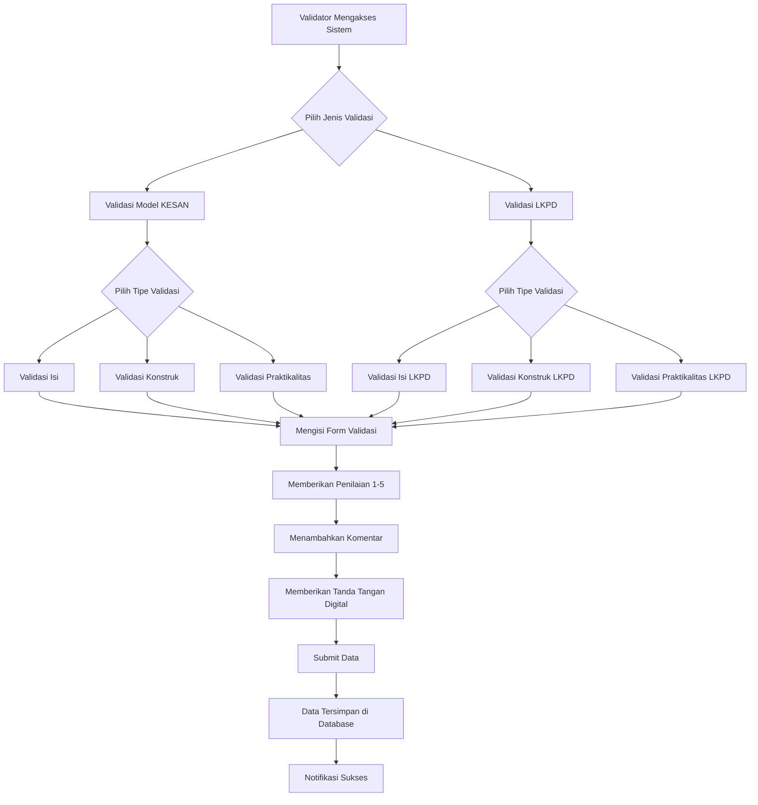

# Bab 2: Gambaran Umum Sistem

## Pendahuluan

Sistem Validasi Instrumen Model KESAN adalah aplikasi web berbasis Next.js yang dirancang khusus untuk memfasilitasi proses validasi instrumen penelitian dalam bidang pendidikan IPA. Sistem ini mengintegrasikan teknologi modern dengan metodologi penelitian untuk menyediakan platform yang efisien dan user-friendly bagi para validator dalam menilai kelayakan instrumen Model KESAN (Konektivitas Etnosains-Sains).

## Tujuan Bisnis

Sistem ini dikembangkan untuk mencapai beberapa tujuan bisnis utama:

1. **Digitalisasi Proses Validasi**: Mengubah proses validasi instrumen dari bentuk kertas/manual menjadi sistem digital yang terintegrasi
2. **Efisiensi Proses**: Mempercepat proses validasi melalui otomasi pengumpulan dan penyimpanan data
3. **Aksesibilitas**: Memungkinkan validator untuk melakukan penilaian dari mana saja dengan akses internet
4. **Integritas Data**: Menjamin keamanan dan keutuhan data validasi melalui sistem yang terstruktur
5. **Analisis Data**: Memfasilitasi proses analisis data validasi untuk keperluan penelitian

## Manfaat Utama Bagi Pengguna

### Bagi Peneliti
- **Pengumpulan Data Terstruktur**: Data validasi terkumpul secara terstruktur dan terorganisir
- **Akses Real-time**: Memantau progres validasi secara real-time
- **Analisis Mudah**: Data yang terkumpul siap untuk dianalisis lebih lanjut
- **Dokumentasi Otomatis**: Semua proses validasi terdokumentasi dengan baik

### Bagi Validator
- **Kemudahan Akses**: Dapat melakukan validasi kapan saja dan di mana saja
- **Antarmuka Intuitif**: Desain user-friendly yang memudahkan proses penilaian
- **Referensi Langsung**: Dapat melihat instrumen yang dinilai secara langsung di sisi form
- **Proses Efisien**: Tidak perlu mencetak atau mengirimkan dokumen fisik

### Bagi Administrator Sistem
- **Manajemen Terpusat**: Semua data tersimpan dalam satu sistem terpusat
- **Keamanan Terjamin**: Data terenkripsi dan tersimpan dengan aman
- **Backup Otomatis**: Data dapat di-backup dan dipulihkan dengan mudah
- **Monitoring Sistem**: Dapat memantau kesehatan dan performa sistem

## Lingkup Fungsionalitas Sistem

Sistem Validasi Instrumen Model KESAN memiliki dua lingkup fungsionalitas utama:

### 1. Validasi Model KESAN
Sistem menyediakan tiga jenis validasi untuk Model KESAN:

#### a. Validasi Isi
- Menilai kesesuaian konten dengan kurikulum
- Mengukur akurasi konseptual materi
- Mengevaluasi integrasi etnosains-sains
- Aspek yang dinilai:
  - Validitas Konstruk Instrumen
  - Relevansi dan Kepentingan Item
  - Kejelasan dan Bahasa
  - Sistematika dan Format

#### b. Validasi Konstruk
- Menilai kerangka teoretis model pembelajaran
- Mengevaluasi struktur internal Model KESAN
- Aspek yang dinilai:
  - Kecukupan Dimensi
  - Ketepatan Indikator
  - Relevansi Item
  - Kelengkapan Item
  - Kejelasan Bahasa
  - Sistematika dan Format

#### c. Validasi Praktikalitas
- Menilai kemudahan penggunaan dari dua perspektif:
  - **Praktikalitas Guru**: Kemudahan penggunaan oleh pendidik
  - **Praktikalitas Siswa**: Kemudahan pemahaman oleh peserta didik

### 2. Validasi LKPD Model KESAN
Sistem menyediakan validasi untuk Lembar Kerja Peserta Didik (LKPD) yang dikembangkan berdasarkan Model KESAN:

#### a. Validasi Isi LKPD
- Menilai kesesuaian materi dengan Kompetensi Dasar (KD)
- Mengukur keakuratan konten LKPD

#### b. Validasi Konstruk LKPD
- Mengevaluasi kelengkapan komponen LKPD
- Menilai sistematika penyusunan LKPD

#### c. Validasi Praktikalitas LKPD
- **Praktikalitas Guru**: Penilaian kemudahan penggunaan LKPD oleh guru
- **Praktikalitas Siswa**: Penilaian kemudahan pemahaman LKPD oleh siswa

## Alur Kerja Sistem

## Karakteristik Sistem

### Desain Responsif
Sistem dirancang dengan pendekatan mobile-first untuk memastikan pengalaman pengguna yang optimal di berbagai perangkat:
- **Desktop**: Tampilan split-view dengan instrumen di kiri dan form di kanan
- **Tablet**: Layout yang disesuaikan untuk layar medium
- **Mobile**: Layout vertikal dengan navigasi yang dioptimalkan

### Antarmuka Intuitif
- Desain modern dengan gradien warna yang menarik
- Ikon dan visualisasi yang jelas untuk memudahkan navigasi
- Feedback visual interaktif untuk meningkatkan pengalaman pengguna

### Keamanan Data
- Enkripsi data transmisi melalui HTTPS
- Autentikasi melalui Supabase Authentication
- Row Level Security (RLS) untuk kontrol akses data
- Validasi input di sisi klien dan server

### Skalabilitas
- Arsitektur yang mendukung penambahan fitur baru
- Database yang dapat menangani pertumbuhan data
- API yang terstruktur untuk integrasi masa depan

## Performa Sistem

Sistem dioptimalkan untuk memberikan performa terbaik:
- **Loading Time**: Halaman dimuat dalam waktu kurang dari 3 detik
- **Response Time**: Respon form dan interaksi pengguna dalam waktu kurang dari 1 detik
- **Optimasi Gambar**: Gambar dioptimalkan untuk loading cepat
- **Caching**: Implementasi caching untuk meningkatkan performa akses berulang

## Rangkuman

Sistem Validasi Instrumen Model KESAN merupakan solusi komprehensif untuk digitalisasi proses validasi instrumen penelitian. Dengan fitur-fitur yang lengkap, desain yang intuitif, dan arsitektur yang modern, sistem ini memberikan nilai signifikan bagi peneliti, validator, dan administrator. Pada bab berikutnya, kita akan membahas secara mendalam tentang arsitektur sistem yang menjadi fondasi dari implementasi aplikasi ini.
