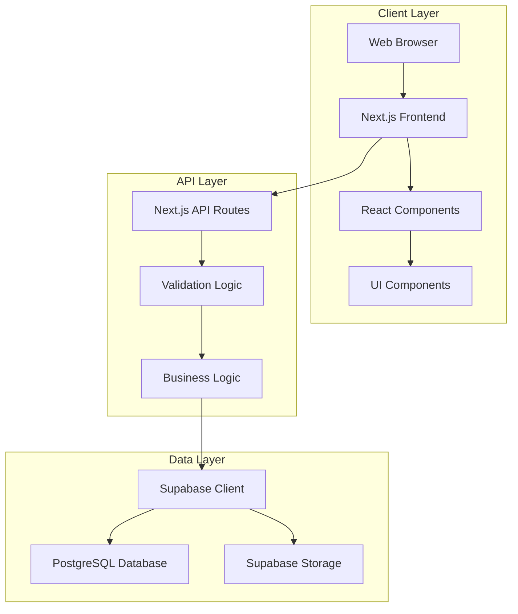
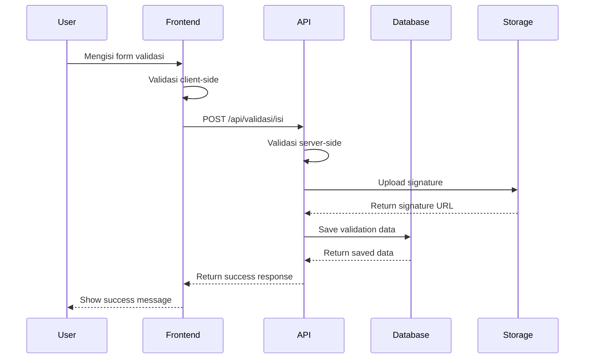

# Bab 3: Arsitektur Sistem

## Pendahuluan

Sistem Validasi Instrumen Model KESAN dibangun dengan arsitektur modern yang menggabungkan kekuatan teknologi frontend terkini dengan backend yang andal. Arsitektur ini dirancang untuk memberikan performa tinggi, skalabilitas, dan kemudahan dalam pemeliharaan. Bab ini akan menjelaskan secara mendalam tentang arsitektur sistem, pola desain yang digunakan, dan alasan di balik pemilihan arsitektur tersebut.

## Arsitektur Tingkat Tinggi

Sistem ini mengadopsi arsitektur **Client-Server** dengan pendekatan **JAMstack (JavaScript, APIs, and Markup)**. Arsitektur ini memisahkan frontend dan backend secara jelas, memungkinkan pengembangan yang lebih modular dan efisien.



## Komponen Arsitektur

### 1. Frontend Layer (Client-Side)

Frontend layer bertanggung jawab untuk semua aspek visual dan interaksi pengguna. Layer ini dibangun menggunakan:

- **Next.js 15**: Framework React yang menyediakan Server-Side Rendering (SSR) dan Static Site Generation (SSG)
- **React 19**: Library untuk membangun antarmuka pengguna yang interaktif
- **TypeScript**: Bahasa pemrograman yang menambahkan tipe statis pada JavaScript
- **Tailwind CSS**: Framework CSS untuk styling yang responsif dan konsisten

#### Struktur Frontend:
```
app/
├── layout.tsx          # Layout root aplikasi
├── page.tsx            # Halaman utama
├── globals.css         # CSS global
├── validasi-isi/       # Halaman validasi isi
├── validasi-konstruk/  # Halaman validasi konstruk
├── validasi-praktikalitas/  # Halaman validasi praktikalitas
├── lkpd/               # Halaman validasi LKPD
└── api/                # API routes
```

### 2. API Layer (Server-Side)

API layer berfungsi sebagai jembatan antara frontend dan database. Layer ini mengimplementasikan:

- **Next.js API Routes**: Endpoints untuk menangani request dari frontend
- **Validasi Input**: Memastikan data yang diterima valid dan aman
- **Business Logic**: Mengimplementasikan logika bisnis aplikasi
- **Error Handling**: Menangani error dengan cara yang konsisten

#### Struktur API:
```
app/api/
├── validasi/
│   ├── isi/route.ts
│   ├── konstruk/route.ts
│   ├── praktikalitas-guru/route.ts
│   └── praktikalitas-siswa/route.ts
├── lkpd-isi/route.ts
├── lkpd-konstruk/route.ts
├── lkpd-praktikalitas-guru/route.ts
├── lkpd-praktikalitas-siswa/route.ts
└── admin/
    └── data/route.ts
```

### 3. Data Layer

Data layer bertanggung jawab untuk penyimpanan dan pengelolaan data. Layer ini menggunakan:

- **Supabase**: Backend-as-a-Service yang menyediakan database dan autentikasi
- **PostgreSQL**: Database relational untuk menyimpan data terstruktur
- **Supabase Storage**: Object storage untuk menyimpan file (tanda tangan digital)

## Pola Desain yang Digunakan

### 1. Component-Based Architecture

Sistem mengadopsi arsitektur berbasis komponen yang memungkinkan:

- **Reusability**: Komponen dapat digunakan kembali di berbagai bagian aplikasi
- **Maintainability**: Perubahan pada satu komponen tidak mempengaruhi komponen lain
- **Testability**: Setiap komponen dapat diuji secara terisolasi

#### Contoh Komponen:
- `RatingScale.tsx`: Komponen untuk skala penilaian 1-5
- `SignaturePad.tsx`: Komponen untuk tanda tangan digital

### 2. Server-Client Pattern

Sistem memisahkan logika server dan client dengan jelas:

- **Server-Side**: Menangani validasi data, business logic, dan operasi database
- **Client-Side**: Menangani rendering UI, interaksi pengguna, dan state management

### 3. Repository Pattern

Untuk interaksi dengan database, sistem menggunakan repository pattern:

```typescript
// lib/supabase.ts
export const supabase = createClient(supabaseUrl, supabaseAnonKey);
export const supabaseAdmin = createClient(supabaseUrl, serviceRoleKey);
```

### 4. API Route Pattern

API routes diorganisir berdasarkan fitur dan entitas:

```typescript
// app/api/validasi/isi/route.ts
export async function POST(request: NextRequest) {
  // Validasi input
  // Upload signature
  // Simpan data ke database
  // Return response
}
```

## Aliran Data dalam Sistem



## Keputusan Arsitektural dan Alasannya

### 1. Menggunakan Next.js 15 dengan App Router

**Alasan:**
- **Performance**: Server Components mengurangi bundle size client-side
- **SEO**: Server-side rendering meningkatkan SEO
- **Developer Experience**: File-based routing yang intuitif
- **Flexibility**: Mendukung SSR, SSG, dan CSR dalam satu aplikasi

### 2. Menggunakan Supabase sebagai Backend

**Alasan:**
- **Rapid Development**: Backend-as-a-Service mempercepat pengembangan
- **Real-time**: Mendukung real-time subscriptions
- **Authentication**: Sistem autentikasi yang built-in
- **Security**: Row Level Security (RLS) untuk kontrol akses data

### 3. Menggunakan TypeScript

**Alasan:**
- **Type Safety**: Mengurangi bug pada runtime
- **Developer Experience**: IntelliSense dan refactoring yang lebih baik
- **Documentation**: Types berfungsi sebagai dokumentasi
- **Maintainability**: Code lebih mudah dipelihara

### 4. Menggunakan Tailwind CSS

**Alasan:**
- **Consistency**: Design system yang konsisten
- **Performance**: CSS yang dihasilkan hanya untuk class yang digunakan
- **Customization**: Mudah dikustomisasi
- **Developer Experience**: Development yang lebih cepat

## Skalabilitas Arsitektur

### Horizontal Scaling

Arsitektur ini mendukung horizontal scaling melalui:

- **Stateless API**: API routes tidak menyimpan state, memungkinkan scaling horizontal
- **Database Connection Pooling**: Supabase mengelola koneksi database secara efisien
- **CDN Integration**: Static assets dapat disajikan melalui CDN

### Vertical Scaling

Arsitektur ini juga mendukung vertical scaling:

- **Component Isolation**: Komponen dapat dioptimalkan secara individual
- **Lazy Loading**: Komponen dimuat hanya saat dibutuhkan
- **Code Splitting**: Application dibagi menjadi bundle yang lebih kecil

## Keamanan Arsitektur

### 1. Input Validation

- **Client-Side**: Validasi untuk feedback langsung ke pengguna
- **Server-Side**: Validasi untuk keamanan dan integritas data

### 2. Data Encryption

- **In Transit**: HTTPS untuk semua komunikasi
- **At Rest**: Supabase mengenkripsi data di database

### 3. Access Control

- **Row Level Security (RLS)**: Kontrol akses data di level database
- **API Key Management**: Pengelolaan API key yang aman

## Performa Arsitektur

### 1. Frontend Optimization

- **Code Splitting**: Memisahkan code menjadi bundle yang lebih kecil
- **Image Optimization**: Optimasi gambar otomatis
- **Caching**: Strategi caching yang efektif

### 2. Backend Optimization

- **Database Indexing**: Index pada kolom yang sering diquery
- **Connection Pooling**: Manajemen koneksi database yang efisien
- **API Response Compression**: Mengompresi response API

## Rangkuman

Arsitektur Sistem Validasi Instrumen Model KESAN dirancang dengan pendekatan modern yang memisahkan frontend dan backend secara jelas. Penggunaan Next.js 15 dengan App Router, Supabase sebagai backend, dan pola desain yang terstruktur memberikan fondasi yang kuat untuk aplikasi yang scalable, maintainable, dan secure. Arsitektur ini tidak hanya memenuhi kebutuhan saat ini tetapi juga siap untuk pengembangan di masa depan.
