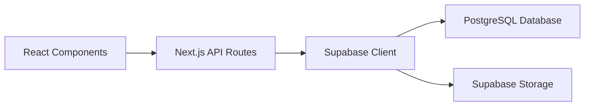

# Bab 4: Stack Teknologi

## Pendahuluan

Sistem Validasi Instrumen Model KESAN dibangun menggunakan stack teknologi modern yang dipilih secara hati-hati untuk memenuhi kebutuhan performa, skalabilitas, dan kemudahan pengembangan. Bab ini akan menjelaskan secara detail tentang setiap teknologi yang digunakan, versinya, peran dalam sistem, dan alasan pemilihannya.

## Stack Teknologi Lengkap

### Frontend Stack

| Teknologi | Versi | Peran | Alasan Pemilihan |
|-----------|-------|-------|------------------|
| Next.js | 15.5.4 | Framework React | Server-side rendering, performa tinggi, SEO friendly |
| React | 19.1.0 | Library UI | Component-based architecture, ekosistem luas |
| TypeScript | 5.x | Bahasa Pemrograman | Type safety, developer experience, maintainability |
| Tailwind CSS | 4.x | Framework CSS | Utility-first, konsistensi desain, responsive design |
| Lucide React | 0.544.0 | Icon Library | Modern, konsisten, lightweight |
| React Signature Canvas | 1.1.0-alpha.2 | Tanda Tangan Digital | Fungsionalitas tanda tangan yang kaya |

### Backend & Database Stack

| Teknologi | Versi | Peran | Alasan Pemilihan |
|-----------|-------|-------|------------------|
| Node.js | 20.x | Runtime Environment | Ekosistem JavaScript yang luas, performa tinggi |
| Supabase | Latest | Backend-as-a-Service | Real-time, autentikasi built-in, PostgreSQL |
| PostgreSQL | Latest | Database | Relational, ACID compliance, scalability |

### Development & Deployment Stack

| Teknologi | Versi | Peran | Alasan Pemilihan |
|-----------|-------|-------|------------------|
| Vercel | Latest | Platform Deployment | Integrasi native dengan Next.js, CI/CD otomatis |
| ESLint | 9.x | Linting | Code quality, consistency |
| PostCSS | Latest | CSS Processing | Plugin ecosystem, optimasi CSS |

## Detail Teknologi

### 1. Next.js 15.5.4

**Peran dalam Sistem:**
- Framework utama untuk aplikasi web
- Menyediakan server-side rendering (SSR)
- Mengelola routing berbasis file
- Menyediakan API routes untuk backend

**Fitur Kunci yang Digunakan:**
- **App Router**: Routing modern dengan nested layouts
- **Server Components**: Komponen yang di-render di server
- **API Routes**: Endpoints untuk backend logic
- **Image Optimization**: Optimasi gambar otomatis
- **Font Optimization**: Optimasi font otomatis

**Alasan Pemilihan:**
- Performa tinggi dengan SSR dan SSG
- Developer experience yang excellent
- SEO-friendly
- Ekosistem yang matang
- Integrasi mudah dengan berbagai layanan

### 2. React 19.1.0

**Peran dalam Sistem:**
- Library untuk membangun antarmuka pengguna
- Mengelola state komponen
- Menyediakan lifecycle methods

**Fitur Kunci yang Digunakan:**
- **Hooks**: State management dan side effects
- **Context API**: State management global
- **Component Composition**: Membangun UI yang modular

**Alasan Pemilihan:**
- Component-based architecture
- Ekosistem library yang luas
- Performa yang optimal
- Community support yang kuat

### 3. TypeScript 5.x

**Peran dalam Sistem:**
- Bahasa pemrograman dengan tipe statis
- Compile-time type checking
- Improved developer experience

**Fitur Kunci yang Digunakan:**
- **Type Safety**: Mencegah bug pada runtime
- **Interfaces**: Kontrak untuk data structures
- **Generics**: Code yang reusable dan type-safe
- **Enums**: Nilai konstan yang type-safe

**Alasan Pemilihan:**
- Mengurangi bug dan error
- Code documentation yang otomatis
- Refactoring yang lebih aman
- IntelliSense dan auto-completion

### 4. Tailwind CSS 4.x

**Peran dalam Sistem:**
- Framework CSS untuk styling
- Design system yang konsisten
- Responsive design utilities

**Fitur Kunci yang Digunakan:**
- **Utility Classes**: Classes untuk styling cepat
- **Responsive Design**: Breakpoints untuk berbagai ukuran layar
- **Dark Mode**: Support untuk tema gelap (meskipun tidak digunakan)
- **Customization**: Konfigurasi desain yang mudah

**Alasan Pemilihan:**
- Development speed yang tinggi
- Konsistensi desain
- Bundle size yang kecil
- Tidak perlu menulis CSS kustom

### 5. Supabase

**Peran dalam Sistem:**
- Backend-as-a-Service (BaaS)
- Database management
- Authentication
- File storage

**Fitur Kunci yang Digunakan:**
- **PostgreSQL Database**: Database relational yang powerful
- **Row Level Security (RLS)**: Kontrol akses data
- **Storage**: Object storage untuk file
- **Real-time Subscriptions**: Update data real-time (tidak digunakan saat ini)

**Alasan Pemilihan:**
- Rapid development
- Backend yang scalable
- Fitur security yang built-in
- Open source

### 6. Lucide React 0.544.0

**Peran dalam Sistem:**
- Icon library untuk UI
- Visual consistency
- Lightweight alternative ke icon libraries lain

**Fitur Kunci yang Digunakan:**
- **Consistent Style**: Icon dengan gaya visual yang konsisten
- **Tree Shakable**: Hanya icon yang digunakan yang di-include
- **Customizable**: Warna dan ukuran dapat dikustomisasi

**Alasan Pemilihan:**
- Modern dan clean design
- Performa yang baik
- Mudah digunakan dengan React
- Open source

### 7. React Signature Canvas 1.1.0-alpha.2

**Peran dalam Sistem:**
- Komponen untuk tanda tangan digital
- Canvas-based drawing
- Export ke gambar

**Fitur Kunci yang Digunakan:**
- **Drawing Canvas**: Area untuk menggambar tanda tangan
- **Export Functionality**: Export ke base64 atau blob
- **Clear Function**: Menghapus tanda tangan
- **Responsive**: Bekerja di berbagai ukuran layar

**Alasan Pemilihan:**
- Fungsionalitas lengkap
- Mudah diintegrasikan dengan React
- Support untuk touch devices
- Customizable

## Konfigurasi Teknologi

### Next.js Configuration

```typescript
// next.config.ts
const nextConfig: NextConfig = {
  images: {
    remotePatterns: [
      {
        protocol: 'https',
        hostname: 'lkuksddrbsoutwboyhon.supabase.co',
      },
    ],
  },
};
```

### TypeScript Configuration

```json
// tsconfig.json
{
  "compilerOptions": {
    "target": "ES2017",
    "lib": ["dom", "dom.iterable", "esnext"],
    "allowJs": true,
    "skipLibCheck": true,
    "strict": true,
    "noEmit": true,
    "esModuleInterop": true,
    "module": "esnext",
    "moduleResolution": "bundler",
    "resolveJsonModule": true,
    "isolatedModules": true,
    "jsx": "preserve",
    "incremental": true,
    "paths": {
      "@/*": ["./*"]
    }
  }
}
```

### Tailwind CSS Configuration

```javascript
// tailwind.config.js
module.exports = {
  content: [
    './pages/**/*.{js,ts,jsx,tsx,mdx}',
    './components/**/*.{js,ts,jsx,tsx,mdx}',
    './app/**/*.{js,ts,jsx,tsx,mdx}',
  ],
  theme: {
    extend: {
      colors: {
        primary: {
          50: '#eff6ff',
          500: '#3b82f6',
          600: '#2563eb',
          700: '#1d4ed8',
        },
      },
    },
  },
  plugins: [],
}
```

## Integrasi Antar Teknologi

### Frontend-Backend Integration



### Data Flow

1. **User Interaction**: React components menangani interaksi pengguna
2. **API Request**: Next.js API routes menerima request
3. **Validation**: Data divalidasi di API routes
4. **Database Operation**: Supabase client melakukan operasi database
5. **Storage Operation**: File di-upload ke Supabase Storage
6. **Response**: Response dikirim kembali ke client

## Performa dan Optimasi

### Bundle Optimization

- **Code Splitting**: Next.js otomatis memisahkan code
- **Tree Shaking**: Hanya code yang digunakan yang di-include
- **Dynamic Imports**: Komponen dimuat hanya saat dibutuhkan

### Image Optimization

- **Next.js Image Component**: Optimasi gambar otomatis
- **WebP Support**: Konversi ke format WebP untuk browser yang support
- **Lazy Loading**: Gambar dimuat saat masuk viewport

### CSS Optimization

- **PurgeCSS**: Hanya CSS yang digunakan yang di-include
- **Critical CSS**: CSS untuk above-the-fold content
- **Minification**: CSS di-minify untuk produksi

## Keterbatasan dan Alternatif

### Keterbatasan Stack Saat Ini

1. **Tidak ada Testing Framework**: Belum ada unit test atau integration test
2. **Tidak ada State Management Global**: Mengandalkan React state lokal
3. **Tidak ada Monitoring**: Belum ada error tracking atau performance monitoring

### Alternatif untuk Pengembangan Masa Depan

1. **Testing**: Jest + React Testing Library untuk unit testing
2. **State Management**: Zustand atau Redux Toolkit untuk state global
3. **Monitoring**: Sentry untuk error tracking
4. **Analytics**: Vercel Analytics atau Google Analytics

## Rangkuman

Stack teknologi yang digunakan dalam Sistem Validasi Instrumen Model KESAN dipilih dengan hati-hati untuk memenuhi kebutuhan performa, skalabilitas, dan kemudahan pengembangan. Kombinasi Next.js, React, TypeScript, dan Supabase memberikan fondasi yang kuat untuk aplikasi web modern. Stack ini tidak hanya memenuhi kebutuhan saat ini tetapi juga siap untuk pengembangan dan skala di masa depan.
