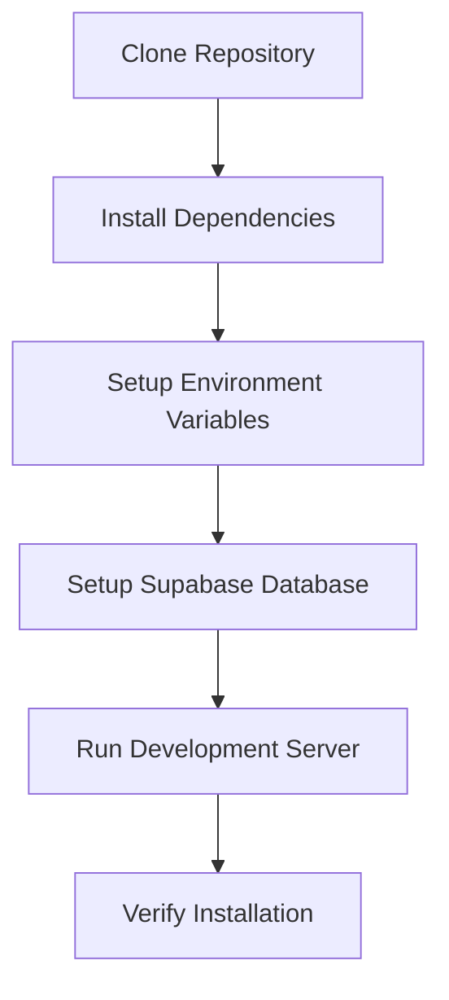

# Bab 6: Panduan Instalasi dan Setup

## Pendahuluan

Bab ini akan memberikan panduan langkah demi langkah untuk menginstal dan mengkonfigurasi Sistem Validasi Instrumen Model KESAN di lingkungan pengembangan lokal. Panduan ini mencakup semua proses dari clone repository hingga menjalankan aplikasi untuk pertama kali.

## Alur Instalasi



## Langkah 1: Clone Repository

### 1.1 Clone dari GitHub

Jika Anda memiliki akses ke repository GitHub:

```bash
# Clone repository
git clone https://github.com/username/validasi-app.git

# Masuk ke direktori project
cd validasi-app
```

### 1.2 Alternatif: Download ZIP

Jika Anda tidak menggunakan Git:

1. Download ZIP dari GitHub
2. Ekstrak file ke direktori yang diinginkan
3. Buka terminal/CMD di direktori tersebut

## Langkah 2: Install Dependencies

### 2.1 Install dengan npm

```bash
# Install semua dependencies
npm install
```

### 2.2 Install dengan yarn (opsional)

```bash
# Jika Anda lebih suka menggunakan yarn
yarn install
```

### 2.3 Install dengan pnpm (opsional)

```bash
# Jika Anda lebih suka menggunakan pnpm
pnpm install
```

**Expected Output**:
```
added 1500 packages in 45s

230 packages are looking for funding
  run `npm fund` for details

found 0 vulnerabilities
```

### Troubleshooting Dependencies

**Masalah**: npm install gagal
```bash
# Clear npm cache
npm cache clean --force

# Delete node_modules dan package-lock.json
rm -rf node_modules package-lock.json

# Install ulang
npm install
```

## Langkah 3: Setup Environment Variables

### 3.1 Buat File Environment

Copy file template environment:

```bash
# Jika ada file .env.example
cp .env.example .env.local

# Jika tidak ada, buat file baru
touch .env.local
```

### 3.2 Konfigurasi Supabase

Edit file `.env.local` dan tambahkan konfigurasi Supabase:

```env
# Supabase Configuration
NEXT_PUBLIC_SUPABASE_URL=https://your-project-id.supabase.co
NEXT_PUBLIC_SUPABASE_ANON_KEY=your-anon-key-here
SUPABASE_SERVICE_ROLE_KEY=your-service-role-key-here
```

**Cara Mendapatkan Kredensial Supabase**:

1. Login ke [dashboard.supabase.com](https://dashboard.supabase.com)
2. Pilih project Anda
3. Navigasi ke Settings → API
4. Copy Project URL
5. Copy Anon public key
6. Copy Service role key (secret key)

### 3.3 Validasi Environment Variables

Pastikan file `.env.local` Anda mengandung:
- `NEXT_PUBLIC_SUPABASE_URL` (required)
- `NEXT_PUBLIC_SUPABASE_ANON_KEY` (required)
- `SUPABASE_SERVICE_ROLE_KEY` (required)

## Langkah 4: Setup Supabase Database

### 4.1 Buat Project Supabase

Jika Anda belum memiliki project Supabase:

1. Sign up di [supabase.com](https://supabase.com)
2. Klik "New Project"
3. Pilih organization
4. Isi detail project:
   - Project name: `validasi-app`
   - Database password: Buat password yang kuat
   - Region: Pilih region terdekat
5. Klik "Create new project"

### 4.2 Setup Database Schema

1. Buka Supabase Dashboard
2. Navigasi ke SQL Editor
3. Klik "New query"
4. Copy seluruh isi file `supabase-schema.sql`
5. Paste ke SQL Editor
6. Klik "Run" untuk mengeksekusi query

**Verifikasi Setup Database**:
Setelah menjalankan query, verifikasi tabel yang dibuat:
1. Navigasi ke Table Editor
2. Pastikan tabel berikut ada:
   - `validasi_isi`
   - `validasi_konstruk`
   - `validasi_praktikalitas_guru`
   - `validasi_praktikalitas_siswa`

### 4.3 Setup Storage Bucket

Schema SQL seharusnya sudah membuat storage bucket, tapi untuk verifikasi:

1. Navigasi ke Storage
2. Pastikan bucket `signatures` ada
3. Jika tidak ada, buat manual:
   - Klik "New bucket"
   - Bucket name: `signatures`
   - Public bucket: Ya

### 4.4 Setup Row Level Security (RLS)

Schema SQL seharusnya sudah mengatur RLS policies. Untuk verifikasi:

1. Navigasi ke Authentication → Policies
2. Pastikan policies ada untuk semua tabel
3. Pastikan policies ada untuk storage bucket `signatures`

## Langkah 5: Prepare File Assets

### 5.1 Verifikasi File PDF

Pastikan file instrumen PDF ada di direktori `public/`:

- `Instrumen_Model_Valid_Isi.pdf`
- `Instrumen_Model_Valid_Konstruk.pdf`
- `Instrumen_Praktikalitas_Guru.pdf`
- `Instrumen_praktikalitas_siswa.pdf`

### 5.2 Verifikasi File Gambar

Pastikan file gambar ada di direktori `public/`:

- `og-image.png`
- `favicon.ico`
- `favicon.svg`

## Langkah 6: Run Development Server

### 6.1 Start Development Server

```bash
# Dengan npm
npm run dev

# Dengan yarn
yarn dev

# Dengan pnpm
pnpm dev
```

### 6.2 Expected Output

```
   ▲ Next.js 15.5.4
   - Local:        http://localhost:3000
   - Environments: .env.local

 ✓ Starting...
 ✓ Ready in 2.5s
```

### 6.3 Akses Aplikasi

Buka browser dan akses: [http://localhost:3000](http://localhost:3000)

## Langkah 7: Verifikasi Instalasi

### 7.1 Checklist Verifikasi

- [ ] Development server berjalan tanpa error
- [ ] Halaman utama (dashboard) terload dengan benar
- [ ] Semua tombol navigasi berfungsi
- [ ] Halaman validasi isi dapat diakses
- [ ] Halaman validasi konstruk dapat diakses
- [ ] Halaman validasi praktikalitas dapat diakses
- [ ] Halaman validasi LKPD dapat diakses
- [ ] PDF instrumen dapat ditampilkan
- [ ] Form validasi dapat diisi
- [ ] Tanda tangan digital berfungsi
- [ ] Submit form berhasil (test dengan data dummy)

### 7.2 Test Submit Form

Untuk testing submit form:

1. Buka halaman [http://localhost:3000/validasi-isi](http://localhost:3000/validasi-isi)
2. Isi form dengan data dummy:
   - Nama: Test User
   - Institusi: Test Institution
   - Keahlian: Test Expertise
   - Isi semua rating (1-5)
   - Tambahkan komentar
   - Pilih keputusan validasi
   - Berikan tanda tangan
3. Klik "Simpan Data Validasi"
4. Verifikasi data tersimpan di Supabase:
   - Buka Supabase Dashboard
   - Navigasi ke Table Editor
   - Cek tabel `validasi_isi`

## Panduan Instalasi untuk Lingkungan Khusus

### Instalasi di Windows

```powershell
# Gunakan PowerShell atau Command Prompt
# Clone repository
git clone https://github.com/username/validasi-app.git
cd validasi-app

# Install dependencies
npm install

# Setup environment (buka dengan Notepad)
notepad .env.local

# Run development server
npm run dev
```

### Instalasi di macOS

```bash
# Install Homebrew jika belum ada
/bin/bash -c "$(curl -fsSL https://raw.githubusercontent.com/Homebrew/install/HEAD/install.sh)"

# Install Node.js
brew install node

# Clone repository
git clone https://github.com/username/validasi-app.git
cd validasi-app

# Install dependencies
npm install

# Setup environment
nano .env.local

# Run development server
npm run dev
```

### Instalasi di Linux (Ubuntu/Debian)

```bash
# Update package list
sudo apt update

# Install Node.js
curl -fsSL https://deb.nodesource.com/setup_20.x | sudo -E bash -
sudo apt-get install -y nodejs

# Install Git
sudo apt-get install git

# Clone repository
git clone https://github.com/username/validasi-app.git
cd validasi-app

# Install dependencies
npm install

# Setup environment
nano .env.local

# Run development server
npm run dev
```

## Troubleshooting Instalasi

### Masalah 1: Port 3000 Sudah Digunakan

**Error**: `Error: listen EADDRINUSE: address already in use :::3000`

**Solusi**:
```bash
# Find process using port 3000
lsof -i :3000

# Kill process (replace PID with actual process ID)
kill -9 PID

# Atau gunakan port lain
npm run dev -- -p 3001
```

### Masalah 2: Module Not Found

**Error**: `Module not found: Can't resolve 'module-name'`

**Solusi**:
```bash
# Clear npm cache
npm cache clean --force

# Delete node_modules
rm -rf node_modules

# Install ulang
npm install
```

### Masalah 3: Supabase Connection Error

**Error**: `Network error: Failed to fetch`

**Solusi**:
1. Verifikasi URL Supabase di `.env.local`
2. Pastikan project Supabase aktif
3. Cek RLS policies
4. Pastikan API keys benar

### Masalah 4: TypeScript Compilation Error

**Error**: TypeScript compilation errors

**Solusi**:
```bash
# Check TypeScript version
npx tsc --version

# Clear Next.js cache
rm -rf .next

# Rebuild
npm run build
```

### Masalah 5: PDF Not Loading

**Error**: PDF tidak dapat dimuat

**Solusi**:
1. Verifikasi file PDF ada di `public/`
2. Check file permissions
3. Verify file path in component

## Tips dan Best Practices

### Development Tips

1. **Hot Reload**: Next.js memiliki hot reload otomatis
2. **Error Handling**: Buka browser dev tools untuk debugging
3. **Environment Variables**: Restart server setelah mengubah `.env.local`

### Performance Tips

1. **Node Modules**: Jangan commit `node_modules` ke Git
2. **Cache**: Clear cache jika mengalami masalah aneh
3. **Browser Cache**: Clear browser cache jika UI tidak update

### Security Tips

1. **API Keys**: Jangan expose service role key di client-side
2. **Environment Variables**: Jangan commit `.env.local` ke Git
3. **Database**: Gunakan RLS policies untuk keamanan data

## Rangkuman

Proses instalasi Sistem Validasi Instrumen Model KESAN melibatkan beberapa langkah kunci: clone repository, install dependencies, setup environment variables, konfigurasi Supabase database, dan menjalankan development server. Setelah mengikuti panduan ini, Anda seharusnya memiliki aplikasi yang berjalan di lingkungan pengembangan lokal dan siap untuk digunakan.

Pada bab berikutnya, kita akan membahas konfigurasi sistem yang lebih mendalam untuk mengoptimalkan performa dan fungsi aplikasi.
