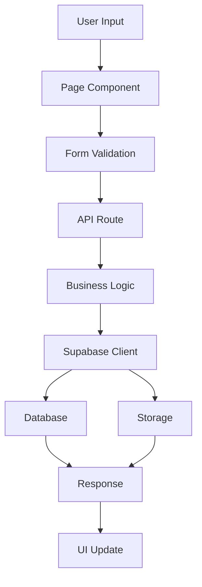

# Bab 8: Struktur Proyek dan Kode

## Pendahuluan

Struktur proyek yang baik adalah fondasi untuk aplikasi yang maintainable, scalable, dan mudah dipahami. Sistem Validasi Instrumen Model KESAN menggunakan struktur proyek yang mengikuti konvensi Next.js 15 dengan App Router. Bab ini akan menjelaskan secara detail struktur direktori, peran setiap folder, dan organisasi file dalam proyek.

## Struktur Direktori Utama

```
validasi-app/
├── app/                          # Next.js App Router
│   ├── (admin)/                  # Route group untuk admin
│   ├── api/                      # API routes
│   ├── globals.css               # CSS global
│   ├── layout.tsx                # Root layout
│   ├── page.tsx                  # Halaman utama
│   ├── validasi-isi/             # Halaman validasi isi
│   ├── validasi-konstruk/        # Halaman validasi konstruk
│   ├── validasi-praktikalitas/   # Halaman validasi praktikalitas
│   └── lkpd/                     # Halaman validasi LKPD
├── components/                   # Reusable components
│   ├── RatingScale.tsx           # Komponen skala penilaian
│   └── SignaturePad.tsx          # Komponen tanda tangan
├── lib/                          # Library dan utilities
│   └── supabase.ts               # Supabase client
├── types/                        # TypeScript type definitions
│   └── validation.ts             # Type definitions untuk validasi
├── public/                       # Static assets
│   ├── Instrumen_*.pdf           # File instrumen PDF
│   ├── og-image.png              # Open Graph image
│   └── favicon.ico               # Favicon
├── .env.local                    # Environment variables (local)
├── .env.example                  # Template environment variables
├── .gitignore                    # Git ignore file
├── next.config.ts                # Next.js configuration
├── package.json                  # Dependencies dan scripts
├── tsconfig.json                 # TypeScript configuration
└── README.md                     # Dokumentasi proyek
```

## Penjelasan Struktur Direktori

### 8.1 Direktori `app/`

Direktori `app/` adalah inti dari Next.js 15 App Router. Berisi semua halaman, layouts, dan API routes.

#### Struktur Lengkap `app/`:

```
app/
├── (admin)/
│   └── page.tsx                  # Halaman admin
├── api/
│   ├── admin/
│   │   └── data/
│   │       └── route.ts          # API untuk data admin
│   ├── debug/
│   │   └── route.ts              # API untuk debugging
│   └── validasi/
│       ├── isi/
│       │   └── route.ts          # API untuk validasi isi
│       ├── konstruk/
│       │   └── route.ts          # API untuk validasi konstruk
│       ├── lkpd-isi/
│       │   └── route.ts          # API untuk LKPD validasi isi
│       ├── lkpd-konstruk/
│       │   └── route.ts          # API untuk LKPD validasi konstruk
│       ├── lkpd-praktikalitas-guru/
│       │   └── route.ts          # API untuk LKPD praktikalitas guru
│       ├── lkpd-praktikalitas-siswa/
│       │   └── route.ts          # API untuk LKPD praktikalitas siswa
│       ├── praktikalitas-guru/
│       │   └── route.ts          # API untuk praktikalitas guru
│       └── praktikalitas-siswa/
│       │   └── route.ts          # API untuk praktikalitas siswa
├── favicon.ico                   # Favicon
├── favicon.svg                   # SVG favicon
├── globals.css                   # CSS global
├── layout.tsx                    # Root layout
├── og-image.png                  # Open Graph image
├── page.tsx                      # Halaman utama
├── validasi-isi/
│   └── page.tsx                  # Halaman validasi isi
├── validasi-konstruk/
│   └── page.tsx                  # Halaman validasi konstruk
├── validasi-praktikalitas/
│   ├── page.tsx                  # Halaman utama validasi praktikalitas
│   ├── guru/
│   │   └── page.tsx              # Halaman validasi praktikalitas guru
│   └── siswa/
│       └── page.tsx              # Halaman validasi praktikalitas siswa
└── lkpd/
    ├── isi/
    │   └── page.tsx              # Halaman LKPD validasi isi
    ├── konstruk/
    │   └── page.tsx              # Halaman LKPD validasi konstruk
    └── praktikalitas/
        ├── guru/
        │   └── page.tsx          # Halaman LKPD praktikalitas guru
        └── siswa/
            └── page.tsx          # Halaman LKPD praktikalitas siswa
```

#### File Penting di `app/`:

1. **`layout.tsx`**: Root layout yang membungsel semua halaman
   ```typescript
   // app/layout.tsx
   export default function RootLayout({
     children,
   }: Readonly<{
     children: React.ReactNode;
   }>) {
     return (
       <html lang="id">
         <body className={`${geistSans.variable} ${geistMono.variable} antialiased`}>
           {children}
         </body>
       </html>
     );
   }
   ```

2. **`page.tsx`**: Halaman utama (dashboard)
   ```typescript
   // app/page.tsx
   export default function Home() {
     return (
       <main className="min-h-screen bg-gradient-to-br from-blue-50 via-indigo-50 to-purple-50">
         {/* Dashboard content */}
       </main>
     );
   }
   ```

3. **`globals.css`**: CSS global dan Tailwind imports
   ```css
   /* app/globals.css */
   @tailwind base;
   @tailwind components;
   @tailwind utilities;
   ```

### 8.2 Direktori `components/`

Direktori `components/` berisi semua reusable components yang digunakan di seluruh aplikasi.

#### Struktur `components/`:

```
components/
├── RatingScale.tsx               # Komponen skala penilaian 1-5
└── SignaturePad.tsx              # Komponen tanda tangan digital
```

#### Komponen Penting:

1. **`RatingScale.tsx`**: Komponen untuk skala penilaian
   ```typescript
   // components/RatingScale.tsx
   interface RatingScaleProps {
     id: string;
     label: string;
     value: number;
     onChange: (value: number) => void;
     required?: boolean;
   }
   
   export default function RatingScale({ label, value, onChange, required = true }: RatingScaleProps) {
     // Implementation
   }
   ```

2. **`SignaturePad.tsx`**: Komponen untuk tanda tangan digital
   ```typescript
   // components/SignaturePad.tsx
   interface SignaturePadProps {
     value?: string;
     onChange: (signature: string) => void;
     label?: string;
   }
   
   export default function SignaturePad({ value, onChange, label = 'Tanda Tangan' }: SignaturePadProps) {
     // Implementation
   }
   ```

### 8.3 Direktori `lib/`

Direktori `lib/` berisi library, utilities, dan helper functions.

#### Struktur `lib/`:

```
lib/
└── supabase.ts                   # Supabase client configuration
```

#### File Penting:

1. **`supabase.ts`**: Konfigurasi Supabase client
   ```typescript
   // lib/supabase.ts
   import { createClient } from '@supabase/supabase-js';
   
   const supabaseUrl = process.env.NEXT_PUBLIC_SUPABASE_URL!;
   const supabaseAnonKey = process.env.NEXT_PUBLIC_SUPABASE_ANON_KEY!;
   
   export const supabase = createClient(supabaseUrl, supabaseAnonKey);
   
   // Server-side client with service role
   export const supabaseAdmin = createClient(
     supabaseUrl,
     process.env.SUPABASE_SERVICE_ROLE_KEY!
   );
   ```

### 8.4 Direktori `types/`

Direktori `types/` berisi semua TypeScript type definitions.

#### Struktur `types/`:

```
types/
└── validation.ts                 # Type definitions untuk validasi
```

#### File Penting:

1. **`validation.ts`**: Type definitions untuk data validasi
   ```typescript
   // types/validation.ts
   export interface ValidatorIdentity {
     nama: string;
     institusi: string;
     keahlian: string;
     tanggal_validasi?: string;
   }
   
   export interface RatingScale {
     [key: string]: number; // 1-5 rating
   }
   
   export interface ValidationComments {
     general_comments?: string;
     suggestions?: string;
   }
   
   export interface ValidationDecision {
     decision: 'tidak-layak' | 'layak-revisi-besar' | 'layak-revisi-kecil' | 'layak-tanpa-revisi';
   }
   ```

### 8.5 Direktori `public/`

Direktori `public/` berisi semua static assets yang dapat diakses publik.

#### Struktur `public/`:

```
public/
├── Instrumen_Model_Valid_Isi.pdf            # Instrumen validasi isi
├── Instrumen_Model_Valid_Konstruk.pdf       # Instrumen validasi konstruk
├── Instrumen_Praktikalitas_Guru.pdf         # Instrumen praktikalitas guru
├── Instrumen_praktikalitas_siswa.pdf        # Instrumen praktikalitas siswa
├── book-icon.svg                            # Icon untuk buku
├── file.svg                                 # Icon untuk file
├── globe.svg                                # Icon untuk globe
├── ivan.png                                 # Gambar profil
├── next.svg                                 # Next.js logo
├── og-image.png                             # Open Graph image
├── og-image.svg                             # Open Gambar SVG
├── vercel.svg                               # Vercel logo
└── window.svg                               # Icon untuk window
```

## Konvensi Penamaan File dan Folder

### 8.6 Konvensi Penamaan

1. **Folder**: Menggunakan `kebab-case` (huruf kecil, dipisahkan dengan dash)
   - `validasi-isi/`
   - `validasi-praktikalitas/`

2. **Component Files**: Menggunakan `PascalCase`
   - `RatingScale.tsx`
   - `SignaturePad.tsx`

3. **API Routes**: Menggunakan `kebab-case` dengan `route.ts`
   - `validasi/isi/route.ts`
   - `validasi/konstruk/route.ts`

4. **Type Files**: Menggunakan `camelCase`
   - `validation.ts`

5. **Utility Files**: Menggunakan `camelCase`
   - `supabase.ts`

### 8.7 Konvensi Struktur File

1. **Page Components**: Selalu export default function
   ```typescript
   export default function ValidasiIsiPage() {
     // Implementation
   }
   ```

2. **API Routes**: Export HTTP methods functions
   ```typescript
   export async function POST(request: NextRequest) {
     // Implementation
   }
   
   export async function GET(request: NextRequest) {
     // Implementation
   }
   ```

3. **Components**: Export default dengan nama yang deskriptif
   ```typescript
   export default function RatingScale({ ... }: RatingScaleProps) {
     // Implementation
   }
   ```

## Organisasi Import dan Export

### 8.8 Import Statements

1. **External Libraries** (di atas):
   ```typescript
   import { NextRequest, NextResponse } from 'next/server';
   import { createClient } from '@supabase/supabase-js';
   ```

2. **Internal Components** (di tengah):
   ```typescript
   import RatingScale from '@/components/RatingScale';
   import SignaturePad from '@/components/SignaturePad';
   ```

3. **Types and Interfaces** (di bawah):
   ```typescript
   import type { ValidatorIdentity } from '@/types/validation';
   ```

### 8.9 Export Statements

1. **Named Exports** untuk utilities:
   ```typescript
   export const supabase = createClient(supabaseUrl, supabaseAnonKey);
   export const supabaseAdmin = createClient(supabaseUrl, serviceRoleKey);
   ```

2. **Default Exports** untuk components dan pages:
   ```typescript
   export default function HomePage() {
     // Implementation
   }
   ```

## Path Aliases

### 8.10 Konfigurasi Path Aliases

Sistem menggunakan path aliases untuk mempermudah import:

```json
// tsconfig.json
{
  "compilerOptions": {
    "paths": {
      "@/*": ["./*"],
      "@/components/*": ["./components/*"],
      "@/lib/*": ["./lib/*"],
      "@/types/*": ["./types/*"],
      "@/app/*": ["./app/*"]
    }
  }
}
```

### 8.11 Penggunaan Path Aliases

```typescript
// Contoh penggunaan
import { supabase } from '@/lib/supabase';
import RatingScale from '@/components/RatingScale';
import type { ValidatorIdentity } from '@/types/validation';
```

## Struktur Data dan Flow

### 8.12 Data Flow Architecture



### 8.13 Component Hierarchy

```
app/layout.tsx (Root Layout)
├── app/page.tsx (Dashboard)
│   ├── Navigation Components
│   └── Card Components
├── app/validasi-isi/page.tsx (Validasi Isi)
│   ├── Form Components
│   ├── RatingScale Component
│   └── SignaturePad Component
├── app/validasi-konstruk/page.tsx (Validasi Konstruk)
│   ├── Form Components
│   ├── RatingScale Component
│   └── SignaturePad Component
└── app/validasi-praktikalitas/page.tsx (Validasi Praktikalitas)
    ├── Form Components
    ├── RatingScale Component
    └── SignaturePad Component
```

## Best Practices untuk Struktur Proyek

### 8.14 Organisasi File

1. **Co-location**: Tempatkan file yang terkait bersama
   - Component, styles, dan tests dalam satu folder

2. **Consistent Naming**: Gunakan konvensi penamaan yang konsisten
   - `kebab-case` untuk folders
   - `PascalCase` untuk components

3. **Logical Grouping**: Kelompokkan file berdasarkan fitur
   - Semua file validasi dalam folder `validasi/`

### 8.15 Code Organization

1. **Separation of Concerns**: Pisahkan logic, presentation, dan data
   - Components untuk UI
   - API routes untuk business logic
   - Types untuk data structures

2. **Reusable Components**: Buat components yang dapat digunakan kembali
   - `RatingScale` untuk semua jenis penilaian
   - `SignaturePad` untuk semua form

3. **Type Safety**: Gunakan TypeScript untuk semua file
   - Definisikan types untuk semua data structures
   - Gunakan type guards untuk validasi runtime

## Troubleshooting Struktur Proyek

### 8.16 Masalah Umum

#### Import Path Errors

**Gejala**: `Cannot find module` atau `Module not found`

**Solusi**:
1. Periksa path aliases di `tsconfig.json`
2. Pastikan file ada di lokasi yang benar
3. Restart TypeScript server

#### Component Not Found

**Gejala**: Component tidak render atau error

**Solusi**:
1. Pastikan export default benar
2. Periksa nama file dan import path
3. Verifikasi component syntax

#### API Route Not Working

**Gejala**: API returns 404 atau error

**Solusi**:
1. Pastikan struktur folder `route.ts` benar
2. Periksa HTTP method exports
3. Verifikasi API route syntax

## Rangkuman

Struktur proyek yang terorganisir dengan baik adalah kunci untuk maintainability dan scalability aplikasi. Sistem Validasi Instrumen Model KESAN menggunakan struktur yang mengikuti konvensi Next.js 15 dengan App Router, memisahkan concerns dengan jelas, dan menggunakan TypeScript untuk type safety. Dengan memahami struktur ini, pengembang dapat dengan mudah menavigasi, memodifikasi, dan menambah fitur ke aplikasi.

Pada bab berikutnya, kita akan membahas modul dan komponen inti secara lebih mendalam untuk memahami implementasi detail dari setiap bagian sistem.
