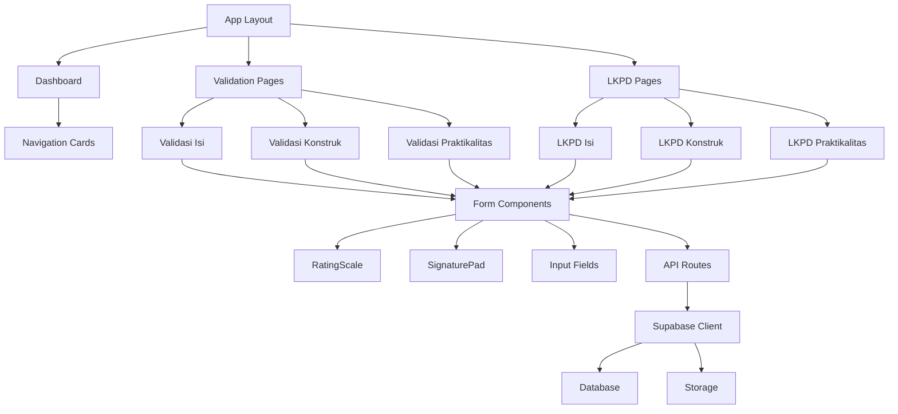

# Bab 9: Modul dan Komponen Inti

## Pendahuluan

Sistem Validasi Instrumen Model KESAN terdiri dari beberapa modul dan komponen inti yang bekerja sama untuk menyediakan fungsionalitas lengkap. Bab ini akan membahas secara mendalam tentang setiap modul, tanggung jawabnya, dependensi, dan antarmuka yang digunakan. Pemahaman tentang komponen-komponen ini akan membantu pengembang dalam memodifikasi atau menambah fitur baru.

## Arsitektur Komponen



## 9.1 Modul Layout (app/layout.tsx)

### Tanggung Jawab
- Menyediakan struktur HTML dasar untuk seluruh aplikasi
- Mengkonfigurasi metadata dan SEO
- Mengelola font dan styling global

### Implementasi
```typescript
// app/layout.tsx
import type { Metadata } from "next";
import { Geist, Geist_Mono } from "next/font/google";
import "./globals.css";

const geistSans = Geist({
  variable: "--font-geist-sans",
  subsets: ["latin"],
});

const geistMono = Geist_Mono({
  variable: "--font-geist-mono",
  subsets: ["latin"],
});

export const metadata: Metadata = {
  title: "Validasi Instrumen - Irfan",
  description: "Sistem Validasi Instrumen Model KESAN...",
  // Konfigurasi metadata lengkap
};

export default function RootLayout({
  children,
}: Readonly<{
  children: React.ReactNode;
}>) {
  return (
    <html lang="id">
      <body className={`${geistSans.variable} ${geistMono.variable} antialiased`}>
        {children}
      </body>
    </html>
  );
}
```

### Dependensi
- Tidak ada dependensi eksternal
- Menggunakan font dari Next.js font optimization

## 9.2 Modul Dashboard (app/page.tsx)

### Tanggung Jawab
- Menampilkan halaman utama dengan navigasi ke berbagai jenis validasi
- Menyediakan antarmuka yang intuitif untuk memilih jenis validasi
- Menampilkan informasi dasar tentang sistem

### Implementasi
```typescript
// app/page.tsx
import Link from 'next/link';
import { FileText, Users, ClipboardCheck, Shield, BookOpen } from 'lucide-react';

export default function Home() {
  return (
    <main className="min-h-screen bg-gradient-to-br from-blue-50 via-indigo-50 to-purple-50">
      {/* Header */}
      <div className="bg-gradient-to-r from-blue-600 via-indigo-600 to-purple-600 text-white py-8">
        {/* Header content */}
      </div>

      {/* Main Content */}
      <div className="container mx-auto px-4 py-12">
        {/* Section 1: Validasi Model KESAN */}
        <div className="mb-12">
          <h2 className="text-2xl font-bold text-gray-800 mb-6">
            Validasi Model KESAN
          </h2>
          <div className="grid md:grid-cols-2 lg:grid-cols-3 gap-8">
            {/* Validasi Isi Card */}
            <Link href="/validasi-isi" className="group">
              <div className="bg-white rounded-2xl shadow-lg hover:shadow-2xl transition-all">
                {/* Card content */}
              </div>
            </Link>
            {/* Other validation cards */}
          </div>
        </div>

        {/* Section 2: Validasi LKPD */}
        <div className="mb-12">
          <h2 className="text-2xl font-bold text-gray-800 mb-6">
            Validasi LKPD Model KESAN
          </h2>
          {/* LKPD validation cards */}
        </div>
      </div>

      {/* Footer */}
      <footer className="bg-gray-800 text-white py-6">
        {/* Footer content */}
      </footer>
    </main>
  );
}
```

### Dependensi
- `lucide-react`: Untuk icons
- `next/link`: Untuk navigasi antar halaman

## 9.3 Modul Validasi

### 9.3.1 Validasi Isi (app/validasi-isi/page.tsx)

#### Tanggung Jawab
- Menampilkan form validasi untuk instrumen isi
- Menangani pengisian form oleh validator
- Menyimpan data validasi ke database

#### Struktur Komponen
```typescript
// app/validasi-isi/page.tsx
'use client';

import { useState } from 'react';
import { ArrowLeft, Save, CheckCircle } from 'lucide-react';
import Link from 'next/link';
import { useRouter } from 'next/navigation';
import SignaturePad from '@/components/SignaturePad';
import RatingScale from '@/components/RatingScale';

export default function ValidasiIsiPage() {
  const router = useRouter();
  const [loading, setLoading] = useState(false);
  const [success, setSuccess] = useState(false);

  const [formData, setFormData] = useState({
    // Identitas
    nama: '',
    institusi: '',
    keahlian: '',
    
    // Ratings
    a1: 0, a2: 0, b1: 0, b2: 0, c1: 0, c2: 0, c3: 0, d1: 0, d2: 0,
    
    // Comments
    comments: '',
    suggestions: '',
    
    // Decision
    decision: '' as 'tidak-layak' | 'layak-revisi-besar' | 'layak-revisi-kecil' | 'layak-tanpa-revisi' | '',
    
    // Signature
    signature: '',
  });

  const handleSubmit = async (e: React.FormEvent) => {
    // Form submission logic
  };

  if (success) {
    return (
      <div className="min-h-screen bg-gradient-to-br from-blue-50 to-indigo-50 flex items-center justify-center">
        {/* Success message */}
      </div>
    );
  }

  return (
    <main className="min-h-screen bg-gradient-to-br from-blue-50 via-indigo-50 to-purple-50 pb-12">
      {/* Header */}
      <div className="bg-gradient-to-r from-blue-600 via-indigo-600 to-purple-600 text-white py-6">
        {/* Header content */}
      </div>

      <div className="container mx-auto px-4 py-4 md:py-8">
        <div className="grid lg:grid-cols-2 gap-4 md:gap-8">
          {/* Left: PDF Viewer */}
          <div className="bg-white rounded-xl shadow-lg p-4 md:p-6 border-t-4 border-blue-500 lg:sticky lg:top-24 h-fit">
            <h2 className="text-xl md:text-2xl font-bold text-gray-800 mb-3 md:mb-4">
              📄 Instrumen Validasi Isi
            </h2>
            <div className="w-full" style={{ height: '50vh', minHeight: '400px' }}>
              <iframe
                src="/Instrumen_Model_Valid_Isi.pdf"
                className="w-full h-full rounded-lg border-2 border-gray-200"
                title="Instrumen Validasi Isi"
              />
            </div>
          </div>

          {/* Right: Form Validasi */}
          <div className="bg-white rounded-xl shadow-lg p-8 border-t-4 border-indigo-500">
            <h2 className="text-2xl font-bold text-gray-800 mb-6">✍️ Form Penilaian</h2>
            
            <form onSubmit={handleSubmit} className="space-y-6">
              {/* A. Identitas Validator */}
              <div className="bg-indigo-50 p-6 rounded-lg space-y-4">
                <h3 className="text-xl font-bold text-indigo-900 mb-4">A. Identitas Validator</h3>
                {/* Identity fields */}
              </div>

              {/* D. Tabel Instrumen Validasi */}
              <div className="space-y-4">
                <h3 className="text-xl font-bold text-gray-800 mb-4">D. Penilaian Instrumen</h3>
                
                {/* Rating scales for each aspect */}
                <div className="bg-blue-50 p-4 rounded-lg">
                  <h4 className="font-bold text-blue-900 mb-3">A. VALIDITAS KONSTRUK INSTRUMEN</h4>
                  <div className="space-y-3">
                    <RatingScale
                      id="a1"
                      label="A.1 - Kecukupan Dimensi: Apakah dimensi yang dinilai sudah komprehensif dan tepat?"
                      value={formData.a1}
                      onChange={(v) => setFormData({...formData, a1: v})}
                    />
                    {/* More rating scales */}
                  </div>
                </div>
                
                {/* More rating sections */}
              </div>

              {/* E. Komentar / Saran */}
              <div className="bg-gray-50 p-6 rounded-lg space-y-4">
                <h3 className="text-xl font-bold text-gray-800 mb-4">E. Komentar / Saran</h3>
                {/* Comment fields */}
              </div>

              {/* F. Keputusan Validasi */}
              <div className="bg-indigo-50 p-6 rounded-lg">
                <h3 className="text-xl font-bold text-indigo-900 mb-4">
                  F. Keputusan Validasi <span className="text-red-500">*</span>
                </h3>
                {/* Decision radio buttons */}
              </div>

              {/* Tanda Tangan */}
              <div className="bg-gray-50 p-6 rounded-lg">
                <SignaturePad
                  value={formData.signature}
                  onChange={(sig) => setFormData({...formData, signature: sig})}
                  label="Tanda Tangan Validator"
                />
              </div>

              {/* Submit Button */}
              <div className="flex gap-4">
                <button
                  type="submit"
                  disabled={loading}
                  className="flex-1 bg-gradient-to-r from-blue-600 to-indigo-600 text-white py-4 px-6 rounded-xl font-bold text-lg hover:from-blue-700 hover:to-indigo-700 transition-all duration-200 shadow-lg hover:shadow-xl disabled:opacity-50 disabled:cursor-not-allowed flex items-center justify-center gap-2"
                >
                  {loading ? (
                    <>
                      <div className="animate-spin rounded-full h-6 w-6 border-b-2 border-white"></div>
                      Menyimpan...
                    </>
                  ) : (
                    <>
                      <Save className="w-6 h-6" />
                      Simpan Data Validasi
                    </>
                  )}
                </button>
              </div>
            </form>
          </div>
        </div>
      </div>
    </main>
  );
}
```

#### Dependensi
- `@/components/SignaturePad`: Komponen tanda tangan
- `@/components/RatingScale`: Komponen skala penilaian
- `lucide-react`: Icons
- `next/navigation`: Navigasi Next.js

### 9.3.2 Validasi Konstruk (app/validasi-konstruk/page.tsx)

Struktur serupa dengan Validasi Isi, tetapi dengan:
- PDF yang berbeda: `Instrumen_Model_Valid_Konstruk.pdf`
- Aspek penilaian yang berbeda sesuai instrumen validasi konstruk
- API endpoint: `/api/validasi/konstruk`

### 9.3.3 Validasi Praktikalitas (app/validasi-praktikalitas/)

Modul ini memiliki sub-halaman untuk:
- Guru (`app/validasi-praktikalitas/guru/page.tsx`)
- Siswa (`app/validasi-praktikalitas/siswa/page.tsx`)

Masing-masing sub-halaman memiliki:
- PDF instrumen yang berbeda
- Aspek penilaian yang sesuai
- API endpoint yang berbeda

## 9.4 Modul Validasi LKPD

### 9.4.1 Struktur LKPD Pages

Modul LKPD memiliki struktur yang mirip dengan modul validasi utama:
- `app/lkpd/isi/page.tsx`: Validasi isi LKPD
- `app/lkpd/konstruk/page.tsx`: Validasi konstruk LKPD
- `app/lkpd/praktikalitas/guru/page.tsx`: Validasi praktikalitas LKPD untuk guru
- `app/lkpd/praktikalitas/siswa/page.tsx`: Validasi praktikalitas LKPD untuk siswa

### 9.4.2 Perbedaan dengan Modul Validasi Utama

1. **PDF Instrumen**: Menggunakan PDF LKPD bukan instrumen model
2. **Aspek Penilaian**: Disesuaikan dengan konteks LKPD
3. **API Endpoints**: Menggunakan endpoint LKPD (`/api/validasi/lkpd-*`)

## 9.5 Komponen Reusable

### 9.5.1 RatingScale Component

#### Tanggung Jawab
- Menyediakan antarmuka untuk skala penilaian 1-5
- Menangani interaksi pengguna dengan skala penilaian
- Menampilkan visual feedback untuk pilihan pengguna

#### Implementasi
```typescript
// components/RatingScale.tsx
'use client';

import React from 'react';

interface RatingScaleProps {
  id: string;
  label: string;
  value: number;
  onChange: (value: number) => void;
  required?: boolean;
}

const scales = [
  { value: 1, label: 'Sangat Tidak Layak', color: 'red', shortLabel: 'STL' },
  { value: 2, label: 'Tidak Layak', color: 'orange', shortLabel: 'TL' },
  { value: 3, label: 'Cukup Layak', color: 'yellow', shortLabel: 'CL' },
  { value: 4, label: 'Layak', color: 'blue', shortLabel: 'L' },
  { value: 5, label: 'Sangat Layak', color: 'green', shortLabel: 'SL' },
];

export default function RatingScale({ label, value, onChange, required = true }: RatingScaleProps) {
  return (
    <div className="bg-white p-3 md:p-4 rounded-lg shadow-sm border border-gray-200 hover:border-indigo-300 transition-colors">
      <label className="block text-sm font-medium text-gray-800 mb-3">
        {label}
        {required && <span className="text-red-500 ml-1">*</span>}
      </label>
      
      {/* Desktop & Tablet: 5 columns horizontal */}
      <div className="hidden sm:grid sm:grid-cols-5 gap-2">
        {scales.map((scale) => (
          <button
            key={scale.value}
            type="button"
            onClick={() => onChange(scale.value)}
            className={`px-2 py-3 rounded-lg border-2 transition-all duration-200 ${
              value === scale.value
                ? `border-${scale.color}-500 bg-${scale.color}-50 ring-2 ring-${scale.color}-200`
                : 'border-gray-300 hover:border-gray-400 bg-white'
            }`}
          >
            <div className="text-center">
              <div className={`font-bold text-lg mb-1 ${value === scale.value ? `text-${scale.color}-700` : 'text-gray-600'}`}>
                {scale.value}
              </div>
              <div className={`text-xs leading-tight ${value === scale.value ? `text-${scale.color}-700` : 'text-gray-600'}`}>
                {scale.label}
              </div>
            </div>
          </button>
        ))}
      </div>

      {/* Mobile: 2 rows layout for better readability */}
      <div className="sm:hidden space-y-2">
        {/* Row 1: Options 1-3 */}
        <div className="grid grid-cols-3 gap-2">
          {scales.slice(0, 3).map((scale) => (
            <button
              key={scale.value}
              type="button"
              onClick={() => onChange(scale.value)}
              className={`px-2 py-2.5 rounded-lg border-2 transition-all duration-200 ${
                value === scale.value
                  ? `border-${scale.color}-500 bg-${scale.color}-50 ring-2 ring-${scale.color}-200`
                  : 'border-gray-300 hover:border-gray-400 bg-white'
              }`}
            >
              <div className="text-center">
                <div className={`font-bold text-base mb-0.5 ${value === scale.value ? `text-${scale.color}-700` : 'text-gray-600'}`}>
                  {scale.value}
                </div>
                <div className={`text-[10px] leading-tight ${value === scale.value ? `text-${scale.color}-700` : 'text-gray-600'}`}>
                  {scale.label}
                </div>
              </div>
            </button>
          ))}
        </div>
        {/* Row 2: Options 4-5 centered */}
        <div className="grid grid-cols-2 gap-2 max-w-[66%] mx-auto">
          {scales.slice(3, 5).map((scale) => (
            <button
              key={scale.value}
              type="button"
              onClick={() => onChange(scale.value)}
              className={`px-2 py-2.5 rounded-lg border-2 transition-all duration-200 ${
                value === scale.value
                  ? `border-${scale.color}-500 bg-${scale.color}-50 ring-2 ring-${scale.color}-200`
                  : 'border-gray-300 hover:border-gray-400 bg-white'
              }`}
            >
              <div className="text-center">
                <div className={`font-bold text-base mb-0.5 ${value === scale.value ? `text-${scale.color}-700` : 'text-gray-600'}`}>
                  {scale.value}
                </div>
                <div className={`text-[10px] leading-tight ${value === scale.value ? `text-${scale.color}-700` : 'text-gray-600'}`}>
                  {scale.label}
                </div>
              </div>
            </button>
          ))}
        </div>
      </div>

      <div className="mt-3 flex justify-between text-[10px] sm:text-xs text-gray-500">
        <span>1 = Sangat Tidak Layak</span>
        <span>5 = Sangat Layak</span>
      </div>
    </div>
  );
}
```

#### Dependensi
- Tidak ada dependensi eksternal
- Murni React component

### 9.5.2 SignaturePad Component

#### Tanggung Jawab
- Menyediakan canvas untuk tanda tangan digital
- Menangani drawing events
- Mengkonversi tanda tangan ke format yang dapat disimpan

#### Implementasi
```typescript
// components/SignaturePad.tsx
'use client';

import React, { useRef, useEffect } from 'react';
import SignatureCanvas from 'react-signature-canvas';

interface SignaturePadProps {
  value?: string;
  onChange: (signature: string) => void;
  label?: string;
}

export default function SignaturePad({ value, onChange, label = 'Tanda Tangan' }: SignaturePadProps) {
  const sigPadRef = useRef<SignatureCanvas>(null);

  useEffect(() => {
    if (value && sigPadRef.current) {
      sigPadRef.current.fromDataURL(value);
    }
  }, [value]);

  const clear = () => {
    sigPadRef.current?.clear();
    onChange('');
  };

  const handleEnd = () => {
    if (sigPadRef.current) {
      const signature = sigPadRef.current.toDataURL();
      onChange(signature);
    }
  };

  return (
    <div className="space-y-2">
      <label className="block text-sm font-medium text-gray-700">
        {label} <span className="text-red-500">*</span>
      </label>
      <div className="border-2 border-gray-300 rounded-lg overflow-hidden bg-white">
        <SignatureCanvas
          ref={sigPadRef}
          canvasProps={{
            className: 'signature-canvas w-full h-48',
            style: { width: '100%', height: '192px' }
          }}
          onEnd={handleEnd}
        />
      </div>
      <button
        type="button"
        onClick={clear}
        className="mt-2 px-4 py-2 text-sm bg-red-500 text-white rounded-lg hover:bg-red-600 transition-colors"
      >
        Hapus Tanda Tangan
      </button>
    </div>
  );
}
```

#### Dependensi
- `react-signature-canvas`: Library untuk signature pad

## 9.6 Modul API Routes

### 9.6.1 Validasi Isi API (app/api/validasi/isi/route.ts)

#### Tanggung Jawab
- Menangani POST request untuk data validasi isi
- Validasi input data
- Upload tanda tangan ke Supabase Storage
- Simpan data validasi ke database

#### Implementasi
```typescript
// app/api/validasi/isi/route.ts
import { NextRequest, NextResponse } from 'next/server';
import { supabase } from '@/lib/supabase';

export async function POST(request: NextRequest) {
  try {
    // Validate environment variables
    if (!process.env.NEXT_PUBLIC_SUPABASE_URL || !process.env.NEXT_PUBLIC_SUPABASE_ANON_KEY) {
      console.error('Missing Supabase environment variables');
      return NextResponse.json({ 
        error: 'Server configuration error: Missing Supabase credentials' 
      }, { status: 500 });
    }

    const data = await request.json();
    console.log('Received validation data for:', data.nama);
    
    // Upload signature to Supabase Storage
    const signatureBlob = await fetch(data.signature).then(r => r.blob());
    const fileName = `signature-${Date.now()}.png`;
    
    const { error: uploadError } = await supabase.storage
      .from('signatures')
      .upload(fileName, signatureBlob, {
        contentType: 'image/png',
        cacheControl: '3600',
      });

    if (uploadError) {
      console.error('Upload error:', uploadError);
      return NextResponse.json({ 
        error: 'Failed to upload signature', 
        details: uploadError.message 
      }, { status: 500 });
    }

    // Get public URL
    const { data: { publicUrl } } = supabase.storage
      .from('signatures')
      .getPublicUrl(fileName);

    // Save validation data
    const { data: validationData, error: dbError } = await supabase
      .from('validasi_isi')
      .insert([
        {
          validator_nama: data.nama,
          validator_institusi: data.institusi,
          validator_keahlian: data.keahlian,
          ratings: {
            a1: data.a1,
            a2: data.a2,
            b1: data.b1,
            b2: data.b2,
            c1: data.c1,
            c2: data.c2,
            c3: data.c3,
            d1: data.d1,
            d2: data.d2,
          },
          general_comments: data.comments,
          suggestions: data.suggestions,
          decision: data.decision,
          signature_url: publicUrl,
        }
      ])
      .select();

    if (dbError) {
      console.error('Database error:', dbError);
      return NextResponse.json({ 
        error: 'Failed to save data', 
        details: dbError.message 
      }, { status: 500 });
    }

    return NextResponse.json({ success: true, data: validationData });
  } catch (error) {
    console.error('Error:', error);
    const errorMessage = error instanceof Error ? error.message : 'Unknown error';
    return NextResponse.json({ 
      error: 'Internal server error', 
      details: errorMessage 
    }, { status: 500 });
  }
}
```

#### Dependensi
- `@/lib/supabase`: Supabase client
- `next/server`: Next.js server utilities

### 9.6.2 API Routes Lainnya

Struktur serupa untuk:
- `app/api/validasi/konstruk/route.ts`: Validasi konstruk
- `app/api/validasi/praktikalitas-guru/route.ts`: Validasi praktikalitas guru
- `app/api/validasi/praktikalitas-siswa/route.ts`: Validasi praktikalitas siswa
- `app/api/validasi/lkpd-*/route.ts`: Validasi LKPD

## 9.7 Modul Supabase Client (lib/supabase.ts)

### Tanggung Jawab
- Menyediakan konfigurasi Supabase client
- Mengelola koneksi ke Supabase
- Menyediakan client untuk client-side dan server-side

### Implementasi
```typescript
// lib/supabase.ts
import { createClient } from '@supabase/supabase-js';

const supabaseUrl = process.env.NEXT_PUBLIC_SUPABASE_URL!;
const supabaseAnonKey = process.env.NEXT_PUBLIC_SUPABASE_ANON_KEY!;

export const supabase = createClient(supabaseUrl, supabaseAnonKey);

// Server-side client with service role
export const supabaseAdmin = createClient(
  supabaseUrl,
  process.env.SUPABASE_SERVICE_ROLE_KEY!
);
```

### Dependensi
- `@supabase/supabase-js`: Supabase JavaScript library

## 9.8 Modul Type Definitions (types/validation.ts)

### Tanggung Jawab
- Mendefinisikan tipe data untuk validasi
- Menyediakan interface untuk data structures
- Memastikan type safety di seluruh aplikasi

### Implementasi
```typescript
// types/validation.ts
export interface ValidatorIdentity {
  nama: string;
  institusi: string;
  keahlian: string;
  tanggal_validasi?: string;
}

export interface RatingScale {
  [key: string]: number; // 1-5 rating
}

export interface ValidationComments {
  general_comments?: string;
  suggestions?: string;
}

export interface ValidationDecision {
  decision: 'tidak-layak' | 'layak-revisi-besar' | 'layak-revisi-kecil' | 'layak-tanpa-revisi';
}

export interface ValidasiIsi {
  id?: string;
  validator: ValidatorIdentity;
  ratings: RatingScale;
  comments: ValidationComments;
  decision: ValidationDecision;
  signature_url: string;
  created_at?: string;
}

// Similar interfaces for other validation types
```

## Best Practices untuk Komponen dan Modul

### 9.9 Component Design Patterns

1. **Single Responsibility**: Setiap komponen memiliki satu tanggung jawab yang jelas
2. **Reusable Components**: Buat components yang dapat digunakan kembali
3. **Props Interface**: Definisikan interface untuk props dengan jelas
4. **Error Handling**: Tangani error dengan graceful degradation

### 9.10 Code Organization

1. **Co-location**: Tempatkan file yang terkait bersama
2. **Consistent Naming**: Gunakan konvensi penamaan yang konsisten
3. **Type Safety**: Gunakan TypeScript untuk semua components
4. **Documentation**: Tambahkan komentar untuk logika kompleks

## Rangkuman

Modul dan komponen inti Sistem Validasi Instrumen Model KESAN dirancang dengan arsitektur yang modular dan reusable. Setiap modul memiliki tanggung jawab yang jelas, dengan dependensi yang minimal antar modul. Penggunaan TypeScript memastikan type safety, sementara komponen reusable seperti RatingScale dan SignaturePad mempermudah pengembangan dan maintenance.

Pemahaman tentang modul dan komponen ini akan membantu pengembang dalam memodifikasi, menambah fitur, atau melakukan troubleshooting pada sistem. Pada bab berikutnya, kita akan membahas tentang manajemen data secara lebih mendalam.
