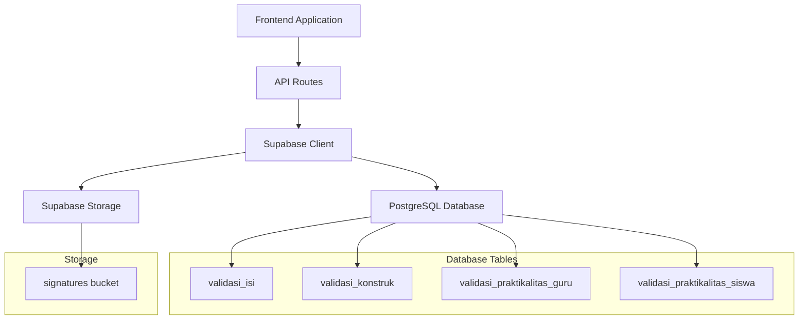

# Bab 10: Manajemen Data

## Pendahuluan

Manajemen data adalah aspek krusial dalam Sistem Validasi Instrumen Model KESAN. Sistem ini menggunakan Supabase sebagai backend yang menyediakan database PostgreSQL dan storage untuk file. Bab ini akan menjelaskan secara mendalam tentang skema database, model data, strategi migrasi, dan cara aplikasi berinteraksi dengan database.

## Arsitektur Data



## 10.1 Skema Database

### 10.1.1 Tabel validasi_isi

Tabel untuk menyimpan data validasi instrumen isi.

```sql
CREATE TABLE IF NOT EXISTS validasi_isi (
  id UUID DEFAULT uuid_generate_v4() PRIMARY KEY,
  validator_nama TEXT NOT NULL,
  validator_institusi TEXT NOT NULL,
  validator_keahlian TEXT NOT NULL,
  validator_tanggal TEXT,
  
  -- Ratings stored as JSONB for flexibility
  ratings JSONB NOT NULL,
  
  -- Comments
  general_comments TEXT,
  suggestions TEXT,
  
  -- Decision
  decision TEXT NOT NULL CHECK (decision IN ('tidak-layak', 'layak-revisi-besar', 'layak-revisi-kecil', 'layak-tanpa-revisi')),
  
  -- Signature
  signature_url TEXT NOT NULL,
  
  -- Timestamps
  created_at TIMESTAMP WITH TIME ZONE DEFAULT TIMEZONE('utc', NOW()),
  updated_at TIMESTAMP WITH TIME ZONE DEFAULT TIMEZONE('utc', NOW())
);
```

**Struktur Data JSONB untuk ratings**:
```json
{
  "a1": 5,
  "a2": 4,
  "b1": 4,
  "b2": 5,
  "c1": 4,
  "c2": 5,
  "c3": 4,
  "d1": 5,
  "d2": 4
}
```

### 10.1.2 Tabel validasi_konstruk

Tabel untuk menyimpan data validasi instrumen konstruk.

```sql
CREATE TABLE IF NOT EXISTS validasi_konstruk (
  id UUID DEFAULT uuid_generate_v4() PRIMARY KEY,
  validator_nama TEXT NOT NULL,
  validator_institusi TEXT NOT NULL,
  validator_keahlian TEXT NOT NULL,
  validator_tanggal TEXT,
  
  ratings JSONB NOT NULL,
  general_comments TEXT,
  suggestions TEXT,
  decision TEXT NOT NULL CHECK (decision IN ('tidak-layak', 'layak-revisi-besar', 'layak-revisi-kecil', 'layak-tanpa-revisi')),
  signature_url TEXT NOT NULL,
  
  created_at TIMESTAMP WITH TIME ZONE DEFAULT TIMEZONE('utc', NOW()),
  updated_at TIMESTAMP WITH TIME ZONE DEFAULT TIMEZONE('utc', NOW())
);
```

### 10.1.3 Tabel validasi_praktikalitas_guru

Tabel untuk menyimpan data validasi praktikalitas dari perspektif guru.

```sql
CREATE TABLE IF NOT EXISTS validasi_praktikalitas_guru (
  id UUID DEFAULT uuid_generate_v4() PRIMARY KEY,
  validator_nama TEXT NOT NULL,
  validator_institusi TEXT NOT NULL,
  validator_keahlian TEXT NOT NULL,
  validator_tanggal TEXT,
  
  ratings JSONB NOT NULL,
  general_comments TEXT,
  suggestions TEXT,
  decision TEXT NOT NULL CHECK (decision IN ('tidak-layak', 'layak-revisi-besar', 'layak-revisi-kecil', 'layak-tanpa-revisi')),
  signature_url TEXT NOT NULL,
  
  created_at TIMESTAMP WITH TIME ZONE DEFAULT TIMEZONE('utc', NOW()),
  updated_at TIMESTAMP WITH TIME ZONE DEFAULT TIMEZONE('utc', NOW())
);
```

### 10.1.4 Tabel validasi_praktikalitas_siswa

Tabel untuk menyimpan data validasi praktikalitas dari perspektif siswa.

```sql
CREATE TABLE IF NOT EXISTS validasi_praktikalitas_siswa (
  id UUID DEFAULT uuid_generate_v4() PRIMARY KEY,
  validator_nama TEXT NOT NULL,
  validator_institusi TEXT NOT NULL,
  validator_keahlian TEXT NOT NULL,
  validator_tanggal TEXT,
  
  ratings JSONB NOT NULL,
  general_comments TEXT,
  suggestions TEXT,
  decision TEXT NOT NULL CHECK (decision IN ('tidak-layak', 'layak-revisi-besar', 'layak-revisi-kecil', 'layak-tanpa-revisi')),
  signature_url TEXT NOT NULL,
  
  created_at TIMESTAMP WITH TIME ZONE DEFAULT TIMEZONE('utc', NOW()),
  updated_at TIMESTAMP WITH TIME ZONE DEFAULT TIMEZONE('utc', NOW())
);
```

### 10.1.5 Indeks Database

Indeks untuk meningkatkan performa query:

```sql
-- Indexes for better query performance
CREATE INDEX idx_validasi_isi_created_at ON validasi_isi(created_at DESC);
CREATE INDEX idx_validasi_isi_validator_nama ON validasi_isi(validator_nama);
CREATE INDEX idx_validasi_isi_decision ON validasi_isi(decision);

CREATE INDEX idx_validasi_konstruk_created_at ON validasi_konstruk(created_at DESC);
CREATE INDEX idx_validasi_konstruk_validator_nama ON validasi_konstruk(validator_nama);
CREATE INDEX idx_validasi_konstruk_decision ON validasi_konstruk(decision);

CREATE INDEX idx_validasi_praktikalitas_guru_created_at ON validasi_praktikalitas_guru(created_at DESC);
CREATE INDEX idx_validasi_praktikalitas_guru_validator_nama ON validasi_praktikalitas_guru(validator_nama);
CREATE INDEX idx_validasi_praktikalitas_guru_decision ON validasi_praktikalitas_guru(decision);

CREATE INDEX idx_validasi_praktikalitas_siswa_created_at ON validasi_praktikalitas_siswa(created_at DESC);
CREATE INDEX idx_validasi_praktikalitas_siswa_validator_nama ON validasi_praktikalitas_siswa(validator_nama);
CREATE INDEX idx_validasi_praktikalitas_siswa_decision ON validasi_praktikalitas_siswa(decision);
```

## 10.2 Supabase Storage

### 10.2.1 Storage Bucket untuk Signatures

Bucket untuk menyimpan file tanda tangan digital:

```sql
-- Create storage bucket for signatures
INSERT INTO storage.buckets (id, name, public)
VALUES ('signatures', 'signatures', true)
ON CONFLICT (id) DO NOTHING;
```

### 10.2.2 Storage Policies

Policies untuk mengontrol akses ke storage bucket:

```sql
-- Create policy for signatures bucket (allow public read and authenticated write)
CREATE POLICY "Public Access for Signatures"
ON storage.objects FOR SELECT
TO public
USING (bucket_id = 'signatures');

CREATE POLICY "Authenticated users can upload signatures"
ON storage.objects FOR INSERT
TO public
WITH CHECK (bucket_id = 'signatures');
```

## 10.3 Row Level Security (RLS)

### 10.3.1 Enable RLS pada Semua Tabel

```sql
-- Enable Row Level Security (RLS)
ALTER TABLE validasi_isi ENABLE ROW LEVEL SECURITY;
ALTER TABLE validasi_konstruk ENABLE ROW LEVEL SECURITY;
ALTER TABLE validasi_praktikalitas_guru ENABLE ROW LEVEL SECURITY;
ALTER TABLE validasi_praktikalitas_siswa ENABLE ROW LEVEL SECURITY;
```

### 10.3.2 RLS Policies

Policies untuk mengontrol akses ke data:

```sql
-- Create policies to allow public read and insert
CREATE POLICY "Enable read access for all users" ON validasi_isi FOR SELECT TO public USING (true);
CREATE POLICY "Enable insert for all users" ON validasi_isi FOR INSERT TO public WITH CHECK (true);

CREATE POLICY "Enable read access for all users" ON validasi_konstruk FOR SELECT TO public USING (true);
CREATE POLICY "Enable insert for all users" ON validasi_konstruk FOR INSERT TO public WITH CHECK (true);

CREATE POLICY "Enable read access for all users" ON validasi_praktikalitas_guru FOR SELECT TO public USING (true);
CREATE POLICY "Enable insert for all users" ON validasi_praktikalitas_guru FOR INSERT TO public WITH CHECK (true);

CREATE POLICY "Enable read access for all users" ON validasi_praktikalitas_siswa FOR SELECT TO public USING (true);
CREATE POLICY "Enable insert for all users" ON validasi_praktikalitas_siswa FOR INSERT TO public WITH CHECK (true);
```

## 10.4 Model Data TypeScript

### 10.4.1 Interface untuk Validator Identity

```typescript
// types/validation.ts
export interface ValidatorIdentity {
  nama: string;
  institusi: string;
  keahlian: string;
  tanggal_validasi?: string;
}
```

### 10.4.2 Interface untuk Rating Scale

```typescript
export interface RatingScale {
  [key: string]: number; // 1-5 rating
}
```

### 10.4.3 Interface untuk Validation Comments

```typescript
export interface ValidationComments {
  general_comments?: string;
  suggestions?: string;
}
```

### 10.4.4 Interface untuk Validation Decision

```typescript
export interface ValidationDecision {
  decision: 'tidak-layak' | 'layak-revisi-besar' | 'layak-revisi-kecil' | 'layak-tanpa-revisi';
}
```

### 10.4.5 Interface untuk Validasi Isi

```typescript
export interface ValidasiIsi {
  id?: string;
  validator: ValidatorIdentity;
  ratings: RatingScale;
  comments: ValidationComments;
  decision: ValidationDecision;
  signature_url: string;
  created_at?: string;
}
```

### 10.4.6 Interface untuk Validasi Konstruk

```typescript
export interface ValidasiKonstruk {
  id?: string;
  validator: ValidatorIdentity;
  ratings: RatingScale;
  comments: ValidationComments;
  decision: ValidationDecision;
  signature_url: string;
  created_at?: string;
}
```

### 10.4.7 Interface untuk Validasi Praktikalitas Guru

```typescript
export interface ValidasiPraktikalitasGuru {
  id?: string;
  validator: ValidatorIdentity;
  ratings: RatingScale;
  comments: ValidationComments;
  decision: ValidationDecision;
  signature_url: string;
  created_at?: string;
}
```

### 10.4.8 Interface untuk Validasi Praktikalitas Siswa

```typescript
export interface ValidasiPraktikalitasSiswa {
  id?: string;
  validator: ValidatorIdentity;
  ratings: RatingScale;
  comments: ValidationComments;
  decision: ValidationDecision;
  signature_url: string;
  created_at?: string;
}
```

## 10.5 Interaksi dengan Database

### 10.5.1 Supabase Client Configuration

```typescript
// lib/supabase.ts
import { createClient } from '@supabase/supabase-js';

const supabaseUrl = process.env.NEXT_PUBLIC_SUPABASE_URL!;
const supabaseAnonKey = process.env.NEXT_PUBLIC_SUPABASE_ANON_KEY!;

export const supabase = createClient(supabaseUrl, supabaseAnonKey);

// Server-side client with service role
export const supabaseAdmin = createClient(
  supabaseUrl,
  process.env.SUPABASE_SERVICE_ROLE_KEY!
);
```

### 10.5.2 Menyimpan Data Validasi

Contoh implementasi untuk menyimpan data validasi isi:

```typescript
// app/api/validasi/isi/route.ts
export async function POST(request: NextRequest) {
  try {
    const data = await request.json();
    
    // Upload signature to Supabase Storage
    const signatureBlob = await fetch(data.signature).then(r => r.blob());
    const fileName = `signature-${Date.now()}.png`;
    
    const { error: uploadError } = await supabase.storage
      .from('signatures')
      .upload(fileName, signatureBlob, {
        contentType: 'image/png',
        cacheControl: '3600',
      });

    if (uploadError) {
      return NextResponse.json({ 
        error: 'Failed to upload signature', 
        details: uploadError.message 
      }, { status: 500 });
    }

    // Get public URL
    const { data: { publicUrl } } = supabase.storage
      .from('signatures')
      .getPublicUrl(fileName);

    // Save validation data
    const { data: validationData, error: dbError } = await supabase
      .from('validasi_isi')
      .insert([
        {
          validator_nama: data.nama,
          validator_institusi: data.institusi,
          validator_keahlian: data.keahlian,
          ratings: {
            a1: data.a1,
            a2: data.a2,
            b1: data.b1,
            b2: data.b2,
            c1: data.c1,
            c2: data.c2,
            c3: data.c3,
            d1: data.d1,
            d2: data.d2,
          },
          general_comments: data.comments,
          suggestions: data.suggestions,
          decision: data.decision,
          signature_url: publicUrl,
        }
      ])
      .select();

    if (dbError) {
      return NextResponse.json({ 
        error: 'Failed to save data', 
        details: dbError.message 
      }, { status: 500 });
    }

    return NextResponse.json({ success: true, data: validationData });
  } catch (error) {
    return NextResponse.json({ 
      error: 'Internal server error', 
      details: error.message 
    }, { status: 500 });
  }
}
```

### 10.5.3 Mengambil Data Validasi

Contoh implementasi untuk mengambil data validasi:

```typescript
// app/api/admin/data/route.ts
export async function GET(request: NextRequest) {
  try {
    const { searchParams } = new URL(request.url);
    const table = searchParams.get('table');
    
    let query;
    
    switch (table) {
      case 'validasi_isi':
        query = supabaseAdmin
          .from('validasi_isi')
          .select('*')
          .order('created_at', { ascending: false });
        break;
      case 'validasi_konstruk':
        query = supabaseAdmin
          .from('validasi_konstruk')
          .select('*')
          .order('created_at', { ascending: false });
        break;
      case 'validasi_praktikalitas_guru':
        query = supabaseAdmin
          .from('validasi_praktikalitas_guru')
          .select('*')
          .order('created_at', { ascending: false });
        break;
      case 'validasi_praktikalitas_siswa':
        query = supabaseAdmin
          .from('validasi_praktikalitas_siswa')
          .select('*')
          .order('created_at', { ascending: false });
        break;
      default:
        return NextResponse.json({ error: 'Invalid table' }, { status: 400 });
    }
    
    const { data, error } = await query;
    
    if (error) {
      return NextResponse.json({ error: error.message }, { status: 500 });
    }
    
    return NextResponse.json({ data });
  } catch (error) {
    return NextResponse.json({ 
      error: 'Internal server error', 
      details: error.message 
    }, { status: 500 });
  }
}
```

## 10.6 Strategi Migrasi

### 10.6.1 Database Migration dengan Supabase

Supabase menyediakan UI untuk menjalankan SQL migration:

1. Buka Supabase Dashboard
2. Navigasi ke SQL Editor
3. Paste SQL migration script
4. Klik "Run" untuk mengeksekusi

### 10.6.2 Version Control untuk Schema

Simpan semua schema changes dalam file `supabase-schema.sql`:

```sql
-- supabase-schema.sql
-- Versi: 1.0.0
-- Tanggal: 2025-01-01

-- Enable UUID extension
CREATE EXTENSION IF NOT EXISTS "uuid-ossp";

-- Create storage bucket
INSERT INTO storage.buckets (id, name, public)
VALUES ('signatures', 'signatures', true)
ON CONFLICT (id) DO NOTHING;

-- Create tables
CREATE TABLE IF NOT EXISTS validasi_isi (
  -- Table definition
);

-- Create indexes
CREATE INDEX IF NOT EXISTS idx_validasi_isi_created_at ON validasi_isi(created_at DESC);

-- Enable RLS
ALTER TABLE validasi_isi ENABLE ROW LEVEL SECURITY;

-- Create policies
CREATE POLICY IF NOT EXISTS "Enable read access for all users" ON validasi_isi FOR SELECT TO public USING (true);
```

### 10.6.3 Rollback Strategy

Untuk rollback perubahan schema:

1. Backup data sebelum migration
2. Simpan SQL rollback script
3. Test rollback di staging environment
4. Eksekusi rollback hanya jika diperlukan

## 10.7 Optimasi Performa Database

### 10.7.1 Query Optimization

Gunakan indexes untuk kolom yang sering diquery:

```sql
-- Index untuk pencarian berdasarkan nama validator
CREATE INDEX idx_validasi_isi_validator_nama ON validasi_isi(validator_nama);

-- Index untuk filter berdasarkan keputusan
CREATE INDEX idx_validasi_isi_decision ON validasi_isi(decision);

-- Composite index untuk query kompleks
CREATE INDEX idx_validasi_isi_nama_created_at ON validasi_isi(validator_nama, created_at DESC);
```

### 10.7.2 JSONB Optimization

Untuk query pada data JSONB:

```sql
-- Index untuk spesifik key dalam JSONB
CREATE INDEX idx_validasi_isi_ratings_a1 ON validasi_isi USING GIN ((ratings->'a1'));

-- Query untuk mencari rating spesifik
SELECT * FROM validasi_isi WHERE ratings->>'a1' = '5';
```

### 10.7.3 Connection Pooling

Supabase mengelola connection pooling secara otomatis. Untuk aplikasi dengan traffic tinggi:

1. Monitor connection usage di Supabase Dashboard
2. Gunakan `supabaseAdmin` hanya untuk operasi server-side
3. Implement connection timeout di client

## 10.8 Backup dan Recovery

### 10.8.1 Automated Backup

Supabase menyediakan automated backup:

1. Daily backups (retention 7 days)
2. Point-in-time recovery (PITR)
3. Physical backups untuk disaster recovery

### 10.8.2 Manual Backup

Untuk backup manual:

```sql
-- Export data ke CSV
COPY validasi_isi TO 'validasi_isi_backup.csv' WITH CSV HEADER;

-- Export schema
pg_dump --schema-only --no-owner --no-privileges > schema_backup.sql
```

### 10.8.3 Restore Data

Untuk restore data dari backup:

```sql
-- Import dari CSV
COPY validasi_isi FROM 'validasi_isi_backup.csv' WITH CSV HEADER;

-- Restore schema
psql -f schema_backup.sql
```

## 10.9 Monitoring dan Maintenance

### 10.9.1 Database Monitoring

Monitor metrik penting:

1. Connection usage
2. Query performance
3. Storage usage
4. Row count per table

### 10.9.2 Data Cleanup

Untuk data yang tidak diperlukan:

```sql
-- Hapus data lama (contoh: data lebih dari 1 tahun)
DELETE FROM validasi_isi WHERE created_at < NOW() - INTERVAL '1 year';

-- Archive data ke tabel terpisah
CREATE TABLE validasi_isi_archive AS SELECT * FROM validasi_isi WHERE created_at < NOW() - INTERVAL '1 year';
DELETE FROM validasi_isi WHERE created_at < NOW() - INTERVAL '1 year';
```

### 10.9.3 Storage Cleanup

Untuk file yang tidak diperlukan:

```sql
-- Hapus file dari storage
DELETE FROM storage.objects WHERE bucket_id = 'signatures' AND created_at < NOW() - INTERVAL '1 year';
```

## 10.10 Data Privacy dan Compliance

### 10.10.1 Data Classification

Klasifikasi data dalam sistem:

1. **Public Data**: Nama validator, institusi, keahlian
2. **Sensitive Data**: Tanda tangan digital
3. **PII (Personally Identifiable Information)**: Nama lengkap validator

### 10.10.2 Data Anonymization

Untuk analisis tanpa mengidentifikasi individu:

```sql
-- Anonymisasi nama validator
UPDATE validasi_isi SET validator_nama = 'Anonim_' || LEFT(md5(id::text), 8) WHERE validator_nama LIKE 'Test%';
```

### 10.10.3 Data Retention Policy

Tentukan kebijakan retensi data:

1. Data validasi: Disimpan selama 5 tahun
2. Tanda tangan digital: Disimpan selama 5 tahun
3. Log sistem: Disimpan selama 1 tahun

## Rangkuman

Manajemen data dalam Sistem Validasi Instrumen Model KESAN menggunakan Supabase sebagai backend yang menyediakan database PostgreSQL dan storage. Skema database dirancang dengan normalisasi yang tepat, dengan penggunaan JSONB untuk fleksibilitas data ratings. Row Level Security (RLS) diimplementasikan untuk keamanan data, sementara indeks dan optimasi query memastikan performa yang baik.

Pemahaman tentang manajemen data ini penting untuk maintenance, scaling, dan troubleshooting sistem. Pada bab berikutnya, kita akan membahas tentang API dan integrasi eksternal secara lebih mendalam.
