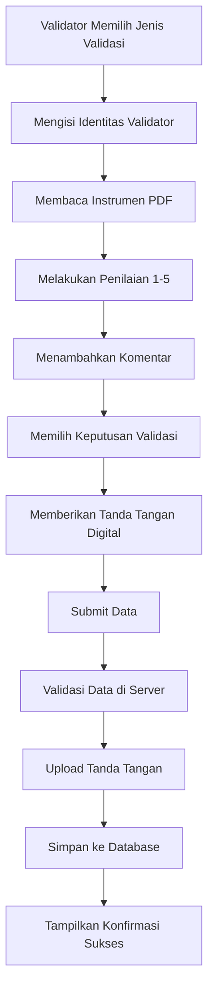

# Bab 12: Logika Bisnis

## Pendahuluan

Logika bisnis adalah inti dari Sistem Validasi Instrumen Model KESAN yang mengimplementasikan aturan-aturan dan alur kerja proses validasi. Bab ini akan menjelaskan secara mendalam tentang alur bisnis yang kompleks, aturan-aturan bisnis yang diterapkan dalam kode, dan bagaimana state management diimplementasikan untuk memastikan konsistensi data dan pengalaman pengguna yang optimal.

## Alur Bisnis Utama

### 12.1 Alur Validasi Instrumen



### 12.2 Alur Validasi LKPD

Alur validasi LKPD mirip dengan validasi instrumen, tetapi dengan fokus pada:

1. **Validasi Isi LKPD**: Kesesuaian dengan Kompetensi Dasar
2. **Validasi Konstruk LKPD**: Kelengkapan dan sistematika
3. **Validasi Praktikalitas LKPD**: Kemudahan penggunaan

## 12.3 Aturan Bisnis untuk Validasi

### 12.3.1 Aturan Penilaian

#### Skala Penilaian 1-5

Sistem menggunakan skala penilaian 5 tingkat dengan kriteria yang jelas:

| Skor | Label | Kriteria | Warna |
|------|-------|----------|-------|
| 1 | Sangat Tidak Layak (STL) | Tidak memenuhi standar sama sekali | Merah |
| 2 | Tidak Layak (TL) | Tidak memenuhi standar minimum | Orange |
| 3 | Cukup Layak (CL) | Memenuhi standar minimum | Kuning |
| 4 | Layak (L) | Memenuhi standar dengan baik | Biru |
| 5 | Sangat Layak (SL) | Melebihi standar yang diharapkan | Hijau |

#### Implementasi dalam Kode

```typescript
// components/RatingScale.tsx
const scales = [
  { value: 1, label: 'Sangat Tidak Layak', color: 'red', shortLabel: 'STL' },
  { value: 2, label: 'Tidak Layak', color: 'orange', shortLabel: 'TL' },
  { value: 3, label: 'Cukup Layak', color: 'yellow', shortLabel: 'CL' },
  { value: 4, label: 'Layak', color: 'blue', shortLabel: 'L' },
  { value: 5, label: 'Sangat Layak', color: 'green', shortLabel: 'SL' },
];
```

### 12.3.2 Aturan Keputusan Validasi

Sistem memiliki 4 kategori keputusan validasi:

1. **Tidak Layak Digunakan**: Instrumen tidak dapat digunakan sama sekali
2. **Layak dengan Revisi Besar**: Instrumen dapat digunakan setelah revisi besar
3. **Layak dengan Revisi Kecil**: Instrumen dapat digunakan setelah revisi kecil
4. **Layak Tanpa Revisi**: Instrumen dapat digunakan langsung

#### Implementasi dalam Kode

```typescript
// types/validation.ts
export interface ValidationDecision {
  decision: 'tidak-layak' | 'layak-revisi-besar' | 'layak-revisi-kecil' | 'layak-tanpa-revisi';
}
```

### 12.3.3 Aturan Validasi Form

#### Validasi Client-Side

```typescript
// app/validasi-isi/page.tsx
const handleSubmit = async (e: React.FormEvent) => {
  e.preventDefault();
  
  // Validasi identitas
  if (!formData.nama || !formData.institusi || !formData.keahlian) {
    alert('Mohon lengkapi identitas validator!');
    return;
  }
  
  // Validasi rating
  const ratings = [formData.a1, formData.a2, formData.b1, formData.b2, formData.c1, formData.c2, formData.c3, formData.d1, formData.d2];
  if (ratings.some(r => r === 0)) {
    alert('Mohon lengkapi semua penilaian!');
    return;
  }
  
  // Validasi keputusan
  if (!formData.decision) {
    alert('Mohon pilih keputusan validasi!');
    return;
  }
  
  // Validasi tanda tangan
  if (!formData.signature) {
    alert('Mohon berikan tanda tangan!');
    return;
  }
  
  // Lanjutkan submit
};
```

#### Validasi Server-Side

```typescript
// app/api/validasi/isi/route.ts
export async function POST(request: NextRequest) {
  try {
    const data = await request.json();
    
    // Validasi required fields
    if (!data.nama || !data.institusi || !data.keahlian) {
      return NextResponse.json({ 
        error: 'Validation failed', 
        details: 'Missing required fields: nama, institusi, keahlian' 
      }, { status: 400 });
    }
    
    // Validasi ratings (1-5)
    const ratingFields = ['a1', 'a2', 'b1', 'b2', 'c1', 'c2', 'c3', 'd1', 'd2'];
    for (const field of ratingFields) {
      if (!data[field] || data[field] < 1 || data[field] > 5) {
        return NextResponse.json({ 
          error: 'Validation failed', 
          details: `Invalid rating for field: ${field}` 
        }, { status: 400 });
      }
    }
    
    // Validasi decision
    const validDecisions = ['tidak-layak', 'layak-revisi-besar', 'layak-revisi-kecil', 'layak-tanpa-revisi'];
    if (!validDecisions.includes(data.decision)) {
      return NextResponse.json({ 
        error: 'Validation failed', 
        details: `Invalid decision: ${data.decision}` 
      }, { status: 400 });
    }
    
    // Lanjutkan proses
  } catch (error) {
    // Error handling
  }
}
```

## 12.4 State Management

### 12.4.1 Form State Management

Sistem menggunakan React state untuk mengelola form data:

```typescript
// app/validasi-isi/page.tsx
const [formData, setFormData] = useState({
  // Identitas
  nama: '',
  institusi: '',
  keahlian: '',
  
  // Ratings
  a1: 0,
  a2: 0,
  b1: 0,
  b2: 0,
  c1: 0,
  c2: 0,
  c3: 0,
  d1: 0,
  d2: 0,
  
  // Comments
  comments: '',
  suggestions: '',
  
  // Decision
  decision: '' as 'tidak-layak' | 'layak-revisi-besar' | 'layak-revisi-kecil' | 'layak-tanpa-revisi' | '',
  
  // Signature
  signature: '',
});
```

### 12.4.2 Loading State Management

```typescript
const [loading, setLoading] = useState(false);
const [success, setSuccess] = useState(false);

const handleSubmit = async (e: React.FormEvent) => {
  setLoading(true);
  try {
    // Submit logic
    setSuccess(true);
  } catch (error) {
    // Error handling
  } finally {
    setLoading(false);
  }
};
```

### 12.4.3 Error State Management

```typescript
const [error, setError] = useState<string | null>(null);

const handleError = (errorMessage: string) => {
  setError(errorMessage);
  setTimeout(() => setError(null), 5000); // Auto-clear after 5 seconds
};
```

## 12.5 Logika Bisnis Spesifik per Jenis Validasi

### 12.5.1 Validasi Isi

#### Aspek yang Dinilai

1. **A. Validitas Konstruk Instrumen**
   - A.1: Kecukupan Dimensi
   - A.2: Ketepatan Indikator

2. **B. Relevansi dan Kepentingan Item**
   - B.1: Relevansi Item
   - B.2: Kelengkapan Item

3. **C. Kejelasan (Clarity) dan Bahasa**
   - C.1: Bahasa Indikator
   - C.2: Kejelasan Petunjuk
   - C.3: Kesesuaian Skala

4. **D. Sistematika dan Format Instrumen**
   - D.1: Struktur
   - D.2: Tata Letak

#### Implementasi dalam Form

```typescript
// Rating scales for each aspect
<RatingScale
  id="a1"
  label="A.1 - Kecukupan Dimensi: Apakah dimensi yang dinilai sudah komprehensif dan tepat?"
  value={formData.a1}
  onChange={(v) => setFormData({...formData, a1: v})}
/>
```

### 12.5.2 Validasi Konstruk

#### Aspek yang Dinilai

1. **A. Kecukupan dan Ketepatan Konstruk**
   - A.1: Kecukupan Dimensi
   - A.2: Ketepatan Indikator

2. **B. Relevansi Konstruk**
   - B.1: Relevansi dengan Teori
   - B.2: Relevansi dengan Praktik

3. **C. Kejelasan Konstruk**
   - C.1: Bahasa Konstruk
   - C.2: Kejelasan Hubungan

4. **D. Sistematika Konstruk**
   - D.1: Struktur Konstruk
   - D.2: Logika Internal

### 12.5.3 Validasi Praktikalitas

#### Praktikalitas Guru

1. **A. Kemudahan Penggunaan**
   - A.1: Kemudahan Persiapan
   - A.2: Kemudahan Implementasi
   - A.3: Efisiensi Waktu

2. **B. Kebermanfaatan**
   - B.1: Relevansi dengan Kurikulum
   - B.2: Dampak pada Pembelajaran
   - B.3: Transferability

#### Praktikalitas Siswa

1. **A. Kemudahan Pemahaman**
   - A.1: Keterbacaan
   - A.2: Keterpahaman Instruksi
   - A.3: Keterlibatan Siswa

2. **B. Motivasi dan Engagement**
   - B.1: Minat Siswa
   - B.2: Motivasi Belajar
   - B.3: Partisipasi Aktif

## 12.6 Logika Bisnis untuk Tanda Tangan Digital

### 12.6.1 Proses Tanda Tangan

1. **Inisialisasi Canvas**: Membuat area untuk menggambar
2. **Capture Drawing**: Menangkap gerakan mouse/touch
3. **Convert to Base64**: Mengkonversi gambar ke string base64
4. **Upload to Storage**: Mengupload ke Supabase Storage
5. **Get Public URL**: Mendapatkan URL publik untuk akses

#### Implementasi

```typescript
// components/SignaturePad.tsx
import SignatureCanvas from 'react-signature-canvas';

export default function SignaturePad({ value, onChange, label = 'Tanda Tangan' }: SignaturePadProps) {
  const sigPadRef = useRef<SignatureCanvas>(null);

  const handleEnd = () => {
    if (sigPadRef.current) {
      const signature = sigPadRef.current.toDataURL();
      onChange(signature);
    }
  };

  return (
    <div className="space-y-2">
      <label className="block text-sm font-medium text-gray-700">
        {label} <span className="text-red-500">*</span>
      </label>
      <div className="border-2 border-gray-300 rounded-lg overflow-hidden bg-white">
        <SignatureCanvas
          ref={sigPadRef}
          canvasProps={{
            className: 'signature-canvas w-full h-48',
            style: { width: '100%', height: '192px' }
          }}
          onEnd={handleEnd}
        />
      </div>
      <button
        type="button"
        onClick={() => {
          sigPadRef.current?.clear();
          onChange('');
        }}
        className="mt-2 px-4 py-2 text-sm bg-red-500 text-white rounded-lg hover:bg-red-600 transition-colors"
      >
        Hapus Tanda Tangan
      </button>
    </div>
  );
}
```

### 12.6.2 Upload Tanda Tangan

```typescript
// app/api/validasi/isi/route.ts
// Upload signature to Supabase Storage
const signatureBlob = await fetch(data.signature).then(r => r.blob());
const fileName = `signature-${Date.now()}.png`;

const { error: uploadError } = await supabase.storage
  .from('signatures')
  .upload(fileName, signatureBlob, {
    contentType: 'image/png',
    cacheControl: '3600',
  });

if (uploadError) {
  return NextResponse.json({ 
    error: 'Failed to upload signature', 
    details: uploadError.message 
  }, { status: 500 });
}

// Get public URL
const { data: { publicUrl } } = supabase.storage
  .from('signatures')
  .getPublicUrl(fileName);
```

## 12.7 Logika Bisnis untuk Feedback User

### 12.7.1 Success Feedback

```typescript
// app/validasi-isi/page.tsx
if (success) {
  return (
    <div className="min-h-screen bg-gradient-to-br from-blue-50 to-indigo-50 flex items-center justify-center">
      <div className="bg-white rounded-2xl shadow-2xl p-12 text-center max-w-md">
        <CheckCircle className="w-20 h-20 text-green-500 mx-auto mb-6" />
        <h2 className="text-3xl font-bold text-gray-800 mb-4">Berhasil!</h2>
        <p className="text-gray-600 text-lg">
          Data validasi telah tersimpan. Terima kasih atas kontribusi Anda.
        </p>
      </div>
    </div>
  );
}
```

### 12.7.2 Error Feedback

```typescript
try {
  const response = await fetch('/api/validasi/isi', {
    method: 'POST',
    headers: { 'Content-Type': 'application/json' },
    body: JSON.stringify(formData),
  });

  if (!response.ok) {
    const errorData = await response.json();
    throw new Error(errorData.details || errorData.error || 'Gagal menyimpan data');
  }

  setSuccess(true);
} catch (error) {
  const errorMessage = error instanceof Error ? error.message : 'Unknown error';
  alert(`Terjadi kesalahan: ${errorMessage}`);
  console.error('Full error:', error);
}
```

## 12.8 Logika Bisnis untuk Navigasi

### 12.8.1 Navigasi Antar Halaman

```typescript
// app/page.tsx
<Link href="/validasi-isi" className="group">
  <div className="bg-white rounded-2xl shadow-lg hover:shadow-2xl transition-all duration-300 transform hover:-translate-y-2">
    {/* Card content */}
  </div>
</Link>
```

### 12.8.2 Navigasi Kembali

```typescript
// app/validasi-isi/page.tsx
<Link 
  href="/" 
  className="inline-flex items-center text-blue-100 hover:text-white mb-2 transition-colors"
>
  <ArrowLeft className="w-5 h-5 mr-2" />
  Kembali
</Link>
```

## 12.9 Logika Bisnis untuk Responsive Design

### 12.9.1 Mobile vs Desktop Layout

```typescript
// components/RatingScale.tsx
// Desktop & Tablet: 5 columns horizontal
<div className="hidden sm:grid sm:grid-cols-5 gap-2">
  {scales.map((scale) => (
    <button key={scale.value}>
      {/* Desktop button */}
    </button>
  ))}
</div>

// Mobile: 2 rows layout for better readability
<div className="sm:hidden space-y-2">
  {/* Row 1: Options 1-3 */}
  <div className="grid grid-cols-3 gap-2">
    {scales.slice(0, 3).map((scale) => (
      <button key={scale.value}>
        {/* Mobile button */}
      </button>
    ))}
  </div>
  {/* Row 2: Options 4-5 centered */}
  <div className="grid grid-cols-2 gap-2 max-w-[66%] mx-auto">
    {scales.slice(3, 5).map((scale) => (
      <button key={scale.value}>
        {/* Mobile button */}
      </button>
    ))}
  </div>
</div>
```

## 12.10 Logika Bisnis untuk Data Persistence

### 12.10.1 Auto-Save Logic (Future Enhancement)

Untuk implementasi di masa depan:

```typescript
// Auto-save logic
const [autoSaveStatus, setAutoSaveStatus] = useState<string>('');

useEffect(() => {
  const timer = setTimeout(() => {
    if (formData.nama && formData.institusi && formData.keahlian) {
      // Save to localStorage
      localStorage.setItem('validation-draft', JSON.stringify(formData));
      setAutoSaveStatus('Draft tersimpan');
    }
  }, 5000);

  return () => clearTimeout(timer);
}, [formData]);

// Load draft on mount
useEffect(() => {
  const draft = localStorage.getItem('validation-draft');
  if (draft) {
    const draftData = JSON.parse(draft);
    setFormData(draftData);
  }
}, []);
```

## 12.11 Logika Bisnis untuk Analytics

### 12.11.1 Tracking Validation Completion

```typescript
// Track validation completion
const trackValidationCompletion = (validationType: string, decision: string) => {
  // Send to analytics service
  if (typeof window !== 'undefined' && window.gtag) {
    window.gtag('event', 'validation_completed', {
      validation_type: validationType,
      decision: decision,
      timestamp: new Date().toISOString()
    });
  }
};
```

## Best Practices untuk Logika Bisnis

### 12.12 Separation of Concerns

1. **UI Logic**: Dipisahkan dari business logic
2. **Validation Logic**: Terpusat dan reusable
3. **Error Handling**: Konsisten di seluruh aplikasi

### 12.13 Testability

1. **Unit Testing**: Setiap fungsi bisnis dapat diuji secara terpisah
2. **Integration Testing**: Alur bisnis dapat diuji end-to-end
3. **Mock Data**: Data dummy untuk testing

### 12.14 Maintainability

1. **Code Documentation**: Komentar untuk logika kompleks
2. **Type Safety**: TypeScript untuk mencegah error
3. **Consistent Patterns**: Pola yang konsisten untuk implementasi serupa

## Rangkuman

Logika bisnis dalam Sistem Validasi Instrumen Model KESAN mengimplementasikan aturan-aturan validasi yang ketat, alur kerja yang jelas, dan state management yang konsisten. Sistem dirancang untuk memandu validator melalui proses validasi yang terstruktur, memastikan data yang dikumpulkan valid dan konsisten. Implementasi yang modular dan well-documented memudahkan maintenance dan pengembangan fitur baru di masa depan.

Pada bab berikutnya, kita akan membahas tentang aspek keamanan dalam sistem.
