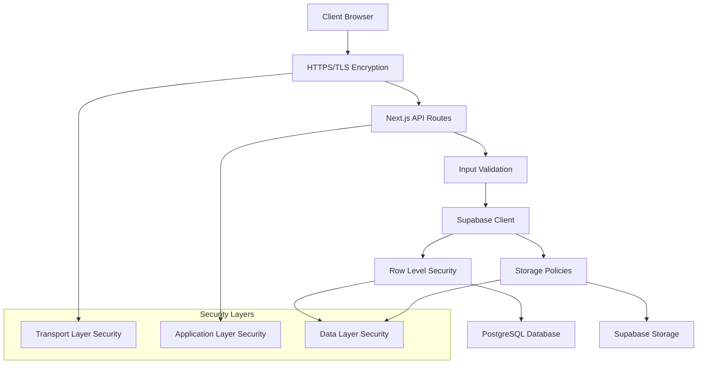

# Bab 13: Keamanan

## Pendahuluan

Keamanan adalah aspek krusial dalam Sistem Validasi Instrumen Model KESAN, terutama karena sistem ini menangani data pribadi validator dan tanda tangan digital. Bab ini akan menjelaskan secara mendalam tentang model keamanan yang diimplementasikan, mekanisme autentikasi dan otorisasi, penanganan data sensitif, dan praktik keamanan terbaik yang telah diterapkan untuk melindungi integritas dan kerahasiaan data.

## Arsitektur Keamanan



## 13.1 Model Keamanan Berlapis

### 13.1.1 Transport Layer Security (TLS)

Sistem menggunakan HTTPS untuk semua komunikasi:

```typescript
// next.config.ts
const nextConfig: NextConfig = {
  // Force HTTPS in production
  async headers() {
    return [
      {
        source: '/(.*)',
        headers: [
          {
            key: 'Strict-Transport-Security',
            value: 'max-age=31536000; includeSubDomains',
          },
          {
            key: 'X-Content-Type-Options',
            value: 'nosniff',
          },
          {
            key: 'X-Frame-Options',
            value: 'DENY',
          },
          {
            key: 'X-XSS-Protection',
            value: '1; mode=block',
          },
        ],
      },
    ];
  },
};
```

### 13.1.2 Application Layer Security

#### Input Validation

Semua input divalidasi di client-side dan server-side:

```typescript
// Client-side validation
const validateFormData = (data: FormData) => {
  const errors: string[] = [];
  
  // Validate required fields
  if (!data.nama || data.nama.trim().length < 3) {
    errors.push('Nama harus diisi minimal 3 karakter');
  }
  
  if (!data.institusi || data.institusi.trim().length < 3) {
    errors.push('Institusi harus diisi minimal 3 karakter');
  }
  
  // Validate ratings
  const ratingFields = ['a1', 'a2', 'b1', 'b2', 'c1', 'c2', 'c3', 'd1', 'd2'];
  for (const field of ratingFields) {
    const value = parseInt(data[field]);
    if (isNaN(value) || value < 1 || value > 5) {
      errors.push(`Rating ${field} harus antara 1-5`);
    }
  }
  
  return errors;
};
```

```typescript
// Server-side validation
export async function POST(request: NextRequest) {
  try {
    const data = await request.json();
    
    // Sanitize input
    const sanitizedData = {
      nama: sanitizeHtml(data.nama),
      institusi: sanitizeHtml(data.institusi),
      keahlian: sanitizeHtml(data.keahlian),
      comments: sanitizeHtml(data.comments),
      suggestions: sanitizeHtml(data.suggestions),
    };
    
    // Validate sanitized data
    const validationErrors = validateInput(sanitizedData);
    if (validationErrors.length > 0) {
      return NextResponse.json({ 
        error: 'Validation failed', 
        details: validationErrors 
      }, { status: 400 });
    }
    
    // Process data
  } catch (error) {
    // Error handling
  }
}
```

#### Output Encoding

Semua output di-encode untuk mencegah XSS:

```typescript
// Safe HTML rendering
const SafeHTML = ({ html }: { html: string }) => {
  return <div dangerouslySetInnerHTML={{ __html: sanitizeHtml(html) }} />;
};
```

### 13.1.3 Data Layer Security

#### Row Level Security (RLS)

Supabase RLS diimplementasikan untuk kontrol akses data:

```sql
-- Enable RLS on all tables
ALTER TABLE validasi_isi ENABLE ROW LEVEL SECURITY;
ALTER TABLE validasi_konstruk ENABLE ROW LEVEL SECURITY;
ALTER TABLE validasi_praktikalitas_guru ENABLE ROW LEVEL SECURITY;
ALTER TABLE validasi_praktikalitas_siswa ENABLE ROW LEVEL SECURITY;

-- Create policies
CREATE POLICY "Enable read access for all users" ON validasi_isi FOR SELECT TO public USING (true);
CREATE POLICY "Enable insert for all users" ON validasi_isi FOR INSERT TO public WITH CHECK (true);
```

#### Storage Policies

Policies untuk akses file storage:

```sql
-- Public read access for signatures
CREATE POLICY "Public Access for Signatures"
ON storage.objects FOR SELECT
TO public
USING (bucket_id = 'signatures');

-- Authenticated users can upload signatures
CREATE POLICY "Authenticated users can upload signatures"
ON storage.objects FOR INSERT
TO public
WITH CHECK (bucket_id = 'signatures');
```

## 13.2 Manajemen Secret dan API Keys

### 13.2.1 Environment Variables

Secrets disimpan dalam environment variables:

```env
# .env.local (never committed to git)
NEXT_PUBLIC_SUPABASE_URL=https://your-project-id.supabase.co
NEXT_PUBLIC_SUPABASE_ANON_KEY=eyJhbGciOiJIUzI1NiIsInR5cCI6IkpXVCJ9...
SUPABASE_SERVICE_ROLE_KEY=eyJhbGciOiJIUzI1NiIsInR5cCI6IkpXVCJ9...
```

### 13.2.2 Key Rotation Strategy

Strategi rotasi kunci:

1. **Frequency**: Rotasi kunci setiap 90 hari
2. **Process**: 
   - Generate new key di Supabase Dashboard
   - Update environment variables
   - Deploy dengan kunci baru
   - Monitor untuk error
   - Delete old key setelah 7 hari

### 13.2.3 Key Access Control

```typescript
// lib/supabase.ts
// Client-side key (limited access)
export const supabase = createClient(supabaseUrl, supabaseAnonKey);

// Server-side key (full access)
export const supabaseAdmin = createClient(
  supabaseUrl,
  process.env.SUPABASE_SERVICE_ROLE_KEY! // Only accessible on server
);
```

## 13.3 Autentikasi dan Otorisasi

### 13.3.1 Current Authentication Model

Sistem saat ini menggunakan model tanpa autentikasi pengguna:

- **Public Access**: Semua orang dapat mengakses form validasi
- **Data Collection**: Data dikumpulkan tanpa login pengguna
- **Admin Access**: Terbatas melalui URL tersembunyi

### 13.3.2 Future Authentication Enhancement

Untuk implementasi di masa depan:

```typescript
// Future authentication implementation
import { createClientComponentClient } from '@supabase/auth-helpers-nextjs';

export default function AuthButton() {
  const supabase = createClientComponentClient();
  const [user, setUser] = useState(null);

  useEffect(() => {
    const getUser = async () => {
      const { data: { user } } = await supabase.auth.getUser();
      setUser(user);
    };
    
    getUser();
  }, [supabase.auth]);

  const handleLogin = async () => {
    const { data, error } = await supabase.auth.signInWithOAuth({
      provider: 'google',
      options: {
        redirectTo: `${window.location.origin}/auth/callback`,
      },
    });
  };

  const handleLogout = async () => {
    await supabase.auth.signOut();
    setUser(null);
  };

  return user ? (
    <button onClick={handleLogout}>Logout</button>
  ) : (
    <button onClick={handleLogin}>Login with Google</button>
  );
}
```

### 13.3.3 Role-Based Access Control (RBAC)

Untuk implementasi di masa depan:

```sql
-- User roles table
CREATE TABLE user_roles (
  id UUID DEFAULT uuid_generate_v4() PRIMARY KEY,
  user_id UUID REFERENCES auth.users(id),
  role TEXT NOT NULL CHECK (role IN ('admin', 'validator', 'viewer')),
  created_at TIMESTAMP WITH TIME ZONE DEFAULT NOW()
);

-- RLS policies based on roles
CREATE POLICY "Admins can read all data" ON validasi_isi FOR SELECT
USING (
  EXISTS (
    SELECT 1 FROM user_roles 
    WHERE user_roles.user_id = auth.uid() 
    AND user_roles.role = 'admin'
  )
);
```

## 13.4 Perlindungan Data Sensitif

### 13.4.1 Data Classification

Klasifikasi data dalam sistem:

| Jenis Data | Klasifikasi | Perlindungan |
|------------|-------------|--------------|
| Nama Validator | PII | Encrypted at rest, HTTPS in transit |
| Institusi | PII | Encrypted at rest, HTTPS in transit |
| Tanda Tangan | Sensitive | Encrypted storage, signed URLs |
| Komentar | Internal | HTTPS in transit |
| Ratings | Internal | HTTPS in transit |

### 13.4.2 Data Encryption

#### Encryption at Rest

Supabase menyediakan encryption at rest untuk semua data:

```sql
-- Enable encryption for sensitive columns
ALTER TABLE validasi_isi 
ALTER COLUMN validator_nama TYPE TEXT;
ALTER TABLE validasi_isi 
ALTER COLUMN validator_institusi TYPE TEXT;
```

#### Encryption in Transit

Semua data dienkripsi dengan TLS 1.3:

```typescript
// Force HTTPS
if (process.env.NODE_ENV === 'production' && !req.headers.host?.startsWith('https://')) {
  const httpsUrl = `https://${req.headers.host}${req.url}`;
  return NextResponse.redirect(httpsUrl, 301);
}
```

### 13.4.3 Data Masking

Untuk admin dashboard, implementasi data masking:

```typescript
// Mask sensitive data for display
const maskEmail = (email: string) => {
  const [username, domain] = email.split('@');
  const maskedUsername = username.slice(0, 2) + '*'.repeat(username.length - 2);
  return `${maskedUsername}@${domain}`;
};

const maskName = (name: string) => {
  const words = name.split(' ');
  return words.map(word => 
    word.length > 2 ? word[0] + '*'.repeat(word.length - 2) + word[word.length - 1] : word
  ).join(' ');
};
```

## 13.5 Keamanan File dan Storage

### 13.5.1 File Upload Security

Validasi file upload:

```typescript
// Validate signature upload
const validateSignatureFile = (file: File) => {
  // Check file type
  const allowedTypes = ['image/png', 'image/jpeg', 'image/webp'];
  if (!allowedTypes.includes(file.type)) {
    throw new Error('Only PNG, JPEG, and WebP files are allowed');
  }
  
  // Check file size (max 5MB)
  const maxSize = 5 * 1024 * 1024; // 5MB
  if (file.size > maxSize) {
    throw new Error('File size must be less than 5MB');
  }
  
  // Check image dimensions
  return new Promise((resolve, reject) => {
    const img = new Image();
    img.onload = () => {
      if (img.width > 2000 || img.height > 1000) {
        reject(new Error('Image dimensions must be less than 2000x1000'));
      } else {
        resolve(true);
      }
    };
    img.onerror = reject;
    img.src = URL.createObjectURL(file);
  });
};
```

### 13.5.2 Secure File Storage

Konfigurasi storage yang aman:

```typescript
// Upload with security settings
const uploadSignature = async (file: File) => {
  const fileName = `signature-${Date.now()}-${crypto.randomUUID()}.png`;
  
  const { error } = await supabase.storage
    .from('signatures')
    .upload(fileName, file, {
      contentType: file.type,
      cacheControl: '3600', // 1 hour cache
      upsert: false,
    });
    
  if (error) throw error;
  
  // Generate signed URL with expiration
  const { data: { signedUrl } } = await supabase.storage
    .from('signatures')
    .createSignedUrl(fileName, 3600); // 1 hour expiration
    
  return signedUrl;
};
```

### 13.5.3 Access Control untuk File

Policies untuk akses file:

```sql
-- Time-limited access to signatures
CREATE POLICY "Time-limited signature access"
ON storage.objects FOR SELECT
TO public
USING (
  bucket_id = 'signatures' AND 
  created_at > NOW() - INTERVAL '1 hour'
);
```

## 13.6 Pencegahan Serangan Umum

### 13.6.1 Cross-Site Scripting (XSS)

Pencegahan XSS:

```typescript
// Input sanitization
import DOMPurify from 'dompurify';

const sanitizeInput = (input: string): string => {
  return DOMPurify.sanitize(input, {
    ALLOWED_TAGS: [],
    ALLOWED_ATTR: [],
  });
};

// Content Security Policy
const nextConfig: NextConfig = {
  async headers() {
    return [
      {
        source: '/(.*)',
        headers: [
          {
            key: 'Content-Security-Policy',
            value: "default-src 'self'; script-src 'self' 'unsafe-eval'; style-src 'self' 'unsafe-inline'; img-src 'self' data: https:; font-src 'self';",
          },
        ],
      },
    ];
  },
};
```

### 13.6.2 Cross-Site Request Forgery (CSRF)

Pencegahan CSRF:

```typescript
// CSRF token implementation
import { cookies } from 'next/headers';

export async function GET() {
  const token = crypto.randomUUID();
  cookies().set('csrf-token', token, {
    httpOnly: true,
    secure: process.env.NODE_ENV === 'production',
    sameSite: 'strict',
    maxAge: 60 * 60 * 24, // 1 day
  });
  
  return Response.json({ token });
}

export async function POST(request: NextRequest) {
  const token = request.cookies.get('csrf-token')?.value;
  const headerToken = request.headers.get('X-CSRF-Token');
  
  if (!token || token !== headerToken) {
    return Response.json({ error: 'Invalid CSRF token' }, { status: 403 });
  }
  
  // Process request
}
```

### 13.6.3 SQL Injection

Pencegahan SQL Injection dengan parameterized queries:

```typescript
// Safe query with Supabase
const { data, error } = await supabase
  .from('validasi_isi')
  .select('*')
  .eq('validator_nama', validatorName) // Parameterized query
  .order('created_at', { ascending: false });
```

### 13.6.4 Rate Limiting

Implementasi rate limiting:

```typescript
// Simple rate limiting middleware
const rateLimit = new Map();

export async function middleware(request: NextRequest) {
  const ip = request.ip || 'unknown';
  const now = Date.now();
  const windowStart = now - 60 * 1000; // 1 minute window
  
  // Clean old entries
  for (const [key, value] of rateLimit.entries()) {
    if (value.timestamp < windowStart) {
      rateLimit.delete(key);
    }
  }
  
  // Check current IP
  const current = rateLimit.get(ip);
  if (current && current.count >= 10) { // 10 requests per minute
    return new Response('Too Many Requests', { status: 429 });
  }
  
  // Update counter
  rateLimit.set(ip, {
    count: (current?.count || 0) + 1,
    timestamp: now,
  });
  
  return NextResponse.next();
}
```

## 13.7 Logging dan Monitoring Keamanan

### 13.7.1 Security Logging

```typescript
// Security event logging
const logSecurityEvent = (event: string, details: any) => {
  const logEntry = {
    timestamp: new Date().toISOString(),
    event,
    details,
    ip: details.ip,
    userAgent: details.userAgent,
  };
  
  console.log('SECURITY:', JSON.stringify(logEntry));
  
  // Send to security monitoring service
  if (process.env.NODE_ENV === 'production') {
    // Send to external monitoring
  }
};

// Usage examples
logSecurityEvent('VALIDATION_SUBMITTED', {
  validatorName: formData.nama,
  institution: formData.institusi,
});
```

### 13.7.2 Error Handling yang Aman

```typescript
// Safe error handling
export async function POST(request: NextRequest) {
  try {
    // Process request
  } catch (error) {
    // Log full error for debugging
    console.error('API Error:', error);
    
    // Return generic error to client
    return NextResponse.json({ 
      error: 'An error occurred while processing your request' 
    }, { status: 500 });
  }
}
```

## 13.8 Compliance dan Regulasi

### 13.8.1 GDPR Compliance

Untuk implementasi GDPR:

```typescript
// Data deletion request
export async function DELETE(request: NextRequest) {
  const { email } = await request.json();
  
  // Find all records with this email
  const { data: records } = await supabaseAdmin
    .from('validasi_isi')
    .select('id')
    .eq('validator_nama', email);
  
  // Delete all records
  for (const record of records) {
    await supabaseAdmin
      .from('validasi_isi')
      .delete()
      .eq('id', record.id);
  }
  
  return Response.json({ success: true });
}

// Data export request
export async function GET(request: NextRequest) {
  const { email } = request.nextUrl.searchParams;
  
  const { data } = await supabaseAdmin
    .from('validasi_isi')
    .select('*')
    .eq('validator_nama', email);
  
  return Response.json({ data });
}
```

### 13.8.2 Data Retention Policy

```typescript
// Automated data cleanup
export async function cleanupOldData() {
  const cutoffDate = new Date();
  cutoffDate.setFullYear(cutoffDate.getFullYear() - 5); // 5 years retention
  
  // Archive old data
  const { error } = await supabaseAdmin
    .from('validasi_isi')
    .update({ status: 'archived' })
    .lt('created_at', cutoffDate.toISOString());
  
  if (error) {
    console.error('Cleanup failed:', error);
  }
}
```

## 13.9 Security Testing

### 13.9.1 Security Testing Checklist

- [ ] Input validation testing
- [ ] SQL injection testing
- [ ] XSS testing
- [ ] CSRF testing
- [ ] Authentication testing
- [ ] Authorization testing
- [ ] File upload security testing
- [ ] Rate limiting testing
- [ ] HTTPS enforcement testing
- [ ] Error handling testing

### 13.9.2 Automated Security Scanning

```json
// .github/workflows/security.yml
name: Security Scan

on: [push, pull_request]

jobs:
  security:
    runs-on: ubuntu-latest
    steps:
      - uses: actions/checkout@v2
      - name: Run security scan
        run: |
          npm audit --audit-level high
          npx snyk test
```

## Best Practices Keamanan

### 13.10 Security Checklist

1. **Environment Variables**:
   - [ ] Jangan commit secrets ke Git
   - [ ] Gunakan prefix yang benar untuk client-side variables
   - [ ] Rotasi keys secara berkala

2. **Input Validation**:
   - [ ] Validasi semua input di server-side
   - [ ] Sanitize input untuk mencegah XSS
   - [ ] Gunakan parameterized queries

3. **Data Protection**:
   - [ ] Enkripsi data sensitif
   - [ ] Gunakan HTTPS untuk semua komunikasi
   - [ ] Implementasi access control yang tepat

4. **Error Handling**:
   - [ ] Jangan expose sensitive information
   - [ ] Log error untuk debugging
   - [ ] Return generic error messages ke client

## Rangkuman

Keamanan dalam Sistem Validasi Instrumen Model KESAN diimplementasikan dengan pendekatan berlapis, mulai dari transport layer hingga data layer. Sistem menggunakan HTTPS untuk semua komunikasi, validasi input yang ketat, Row Level Security untuk database, dan policies yang tepat untuk file storage. Meskipun saat ini sistem tidak mengimplementasikan autentikasi pengguna, berbagai mekanisme keamanan telah diterapkan untuk melindungi integritas dan kerahasiaan data.

Pada bab berikutnya, kita akan membahas tentang panduan deployment untuk sistem ke lingkungan produksi.
