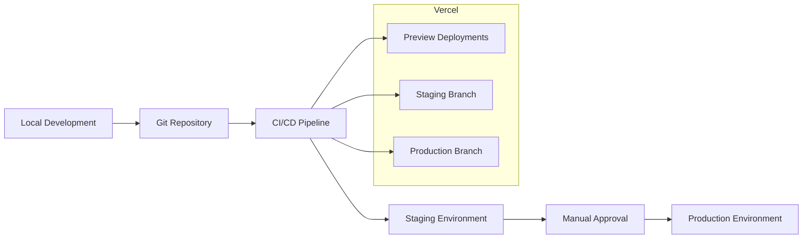

# Bab 14: Panduan Deployment

## Pendahuluan

Deployment adalah proses mengambil aplikasi dari lingkungan pengembangan ke lingkungan produksi agar dapat diakses oleh pengguna akhir. Sistem Validasi Instrumen Model KESAN dirancang untuk di-deploy ke Vercel, platform yang optimal untuk aplikasi Next.js. Bab ini akan menjelaskan strategi dan proses deployment ke lingkungan staging dan produksi, termasuk konfigurasi CI/CD dan troubleshooting.

## Strategi Deployment

### 14.1 Lingkungan Deployment

Sistem menggunakan tiga lingkungan utama:

1. **Development**: Lingkungan pengembangan lokal
2. **Staging**: Lingkungan pengujian pra-produksi
3. **Production**: Lingkungan produksi yang dapat diakses publik



### 14.2 Alur Deployment

1. **Development**: Pengembangan fitur di lingkungan lokal
2. **Commit**: Push changes ke Git repository
3. **CI/CD**: Automatic build dan test
4. **Preview**: Preview deployment untuk setiap PR
5. **Staging**: Merge ke staging branch untuk testing
6. **Production**: Merge ke main branch untuk production

## 14.3 Persiapan Deployment

### 14.3.1 Build Optimization

Konfigurasi Next.js untuk produksi:

```typescript
// next.config.ts
const nextConfig: NextConfig = {
  // Optimasi build
  compress: true,
  poweredByHeader: false,
  
  // Optimasi gambar
  images: {
    remotePatterns: [
      {
        protocol: 'https',
        hostname: 'lkuksddrbsoutwboyhon.supabase.co',
      },
    ],
    formats: ['image/webp', 'image/avif'],
  },
  
  // Security headers
  async headers() {
    return [
      {
        source: '/(.*)',
        headers: [
          {
            key: 'X-Frame-Options',
            value: 'DENY',
          },
          {
            key: 'X-Content-Type-Options',
            value: 'nosniff',
          },
          {
            key: 'Referrer-Policy',
            value: 'origin-when-cross-origin',
          },
        ],
      },
    ];
  },
  
  // Redirects
  async redirects() {
    return [
      {
        source: '/home',
        destination: '/',
        permanent: true,
      },
    ];
  },
};

export default nextConfig;
```

### 14.3.2 Environment Variables untuk Production

```env
# Production Environment Variables
NEXT_PUBLIC_SUPABASE_URL=https://your-project-id.supabase.co
NEXT_PUBLIC_SUPABASE_ANON_KEY=your-production-anon-key
SUPABASE_SERVICE_ROLE_KEY=your-production-service-role-key
NEXT_PUBLIC_APP_URL=https://validasi-v3.vercel.app
NODE_ENV=production
```

### 14.3.3 Package Scripts untuk Build

```json
// package.json
{
  "scripts": {
    "dev": "next dev",
    "build": "next build",
    "start": "next start",
    "lint": "next lint",
    "type-check": "tsc --noEmit",
    "build:analyze": "ANALYZE=true next build"
  }
}
```

## 14.4 Deployment ke Vercel

### 14.4.1 Setup Awal Vercel

1. **Buat Akun Vercel**:
   - Kunjungi [vercel.com](https://vercel.com)
   - Sign up dengan GitHub account

2. **Import Project**:
   - Klik "Add New" → "Project"
   - Pilih repository GitHub
   - Klik "Import"

3. **Konfigurasi Project**:
   - **Framework Preset**: Next.js (otomatis terdeteksi)
   - **Root Directory**: `./` (default)
   - **Build Command**: `npm run build` (default)
   - **Output Directory**: `.next` (default)
   - **Install Command**: `npm install` (default)

### 14.4.2 Konfigurasi Environment Variables

1. **Tambahkan Environment Variables**:
   - Navigasi ke Settings → Environment Variables
   - Tambahkan variabel berikut:
     ```
     NEXT_PUBLIC_SUPABASE_URL=https://your-project-id.supabase.co
     NEXT_PUBLIC_SUPABASE_ANON_KEY=your-production-anon-key
     SUPABASE_SERVICE_ROLE_KEY=your-production-service-role-key
     ```

2. **Pilih Environment**:
   - Pilih "Production", "Preview", dan "Development"
   - Klik "Save"

### 14.4.3 Konfigurasi Domain

1. **Domain Default**:
   - Vercel akan memberikan domain default: `your-project-name.vercel.app`

2. **Custom Domain** (opsional):
   - Navigasi ke Settings → Domains
   - Tambahkan custom domain
   - Konfigurasi DNS records

### 14.4.4 Deploy Pertama

1. **Trigger Deployment**:
   - Klik "Deploy" atau push ke main branch
   - Tunggu proses build selesai (2-5 menit)

2. **Verifikasi Deployment**:
   - Buka URL yang diberikan Vercel
   - Test semua halaman dan fungsionalitas

## 14.5 CI/CD dengan Vercel

### 14.5.1 Automatic Deployment

Vercel secara otomatis mendeploy saat:

1. **Push ke Main Branch**: Deploy ke production
2. **Push ke Branch Lain**: Deploy ke preview
3. **Pull Request**: Preview deployment untuk review

### 14.5.2 GitHub Actions untuk Testing

```yaml
# .github/workflows/test.yml
name: Test

on: [push, pull_request]

jobs:
  test:
    runs-on: ubuntu-latest
    
    steps:
      - uses: actions/checkout@v3
      
      - name: Setup Node.js
        uses: actions/setup-node@v3
        with:
          node-version: '20'
          cache: 'npm'
      
      - name: Install dependencies
        run: npm ci
      
      - name: Run linting
        run: npm run lint
      
      - name: Run type checking
        run: npm run type-check
      
      - name: Run tests
        run: npm test
```

### 14.5.3 Konfigurasi vercel.json

```json
// vercel.json
{
  "version": 2,
  "builds": [
    {
      "src": "package.json",
      "use": "@vercel/next"
    }
  ],
  "env": {
    "NEXT_PUBLIC_SUPABASE_URL": "@supabase-url",
    "NEXT_PUBLIC_SUPABASE_ANON_KEY": "@supabase-anon-key",
    "SUPABASE_SERVICE_ROLE_KEY": "@supabase-service-role-key"
  },
  "functions": {
    "app/api/**/*.ts": {
      "maxDuration": 30
    }
  },
  "headers": [
    {
      "source": "/(.*)",
      "headers": [
        {
          "key": "X-Frame-Options",
          "value": "DENY"
        },
        {
          "key": "X-Content-Type-Options",
          "value": "nosniff"
        }
      ]
    }
  ]
}
```

## 14.6 Deployment ke Staging

### 14.6.1 Setup Staging Environment

1. **Buat Staging Branch**:
   ```bash
   git checkout -b staging
   git push -u origin staging
   ```

2. **Konfigurasi Staging di Vercel**:
   - Navigasi ke project settings
   - Tambahkan environment variables untuk staging
   - Hubungkan dengan staging branch

3. **Deploy ke Staging**:
   ```bash
   git checkout staging
   git merge develop
   git push origin staging
   ```

### 14.6.2 Testing di Staging

1. **Functional Testing**:
   - Test semua form validasi
   - Test submit data
   - Test tanda tangan digital

2. **Integration Testing**:
   - Test koneksi ke Supabase
   - Test upload file
   - Test API endpoints

3. **Performance Testing**:
   - Test load time
   - Test responsiveness
   - Test API response time

## 14.7 Production Deployment

### 14.7.1 Production Checklist

Sebelum deploy ke production:

- [ ] Semua tests pass
- [ ] Staging testing complete
- [ ] Environment variables terkonfigurasi
- [ ] Database backup terbaru
- [ ] Performance optimization selesai
- [ ] Security audit selesai

### 14.7.2 Production Deployment Process

1. **Merge ke Main Branch**:
   ```bash
   git checkout main
   git merge staging
   git push origin main
   ```

2. **Monitor Deployment**:
   - Buka Vercel dashboard
   - Monitor build progress
   - Check untuk error

3. **Post-Deployment Verification**:
   - Test production URL
   - Test critical functionality
   - Monitor error logs

## 14.8 Monitoring dan Maintenance

### 14.8.1 Vercel Analytics

1. **Setup Analytics**:
   - Navigasi ke Analytics tab
   - Install Vercel Analytics script

2. **Monitor Metrics**:
   - Page views
   - Web Vitals
   - API routes performance

### 14.8.2 Error Monitoring

1. **Vercel Logs**:
   - Real-time log streaming
   - Function logs
   - Build logs

2. **Error Tracking**:
   - Monitor 4xx dan 5xx errors
   - Track API errors
   - Set up alerts

### 14.8.3 Performance Monitoring

```typescript
// lib/performance.ts
export const reportWebVitals = (metric: any) => {
  // Send to Vercel Analytics
  if (window.gtag) {
    window.gtag('event', metric.name, {
      value: Math.round(metric.value),
      event_category: 'Web Vitals',
    });
  }
  
  // Log to console for debugging
  console.log('Web Vital:', metric);
};
```

## 14.9 Deployment Alternatif

### 14.9.1 Docker Deployment

Dockerfile untuk containerization:

```dockerfile
# Dockerfile
FROM node:20-alpine AS base

# Install dependencies only when needed
FROM base AS deps
RUN apk add --no-cache libc6-compat
WORKDIR /app

COPY package.json package-lock.json ./
RUN npm ci

# Rebuild the source code only when needed
FROM base AS builder
WORKDIR /app
COPY --from=deps /app/node_modules ./node_modules
COPY . .

RUN npm run build

# Production image, copy all the files and run next
FROM base AS runner
WORKDIR /app

ENV NODE_ENV production

RUN addgroup --system --gid 1001 nodejs
RUN adduser --system --uid 1001 nextjs

COPY --from=builder /app/public ./public

# Set the correct permission for prerender cache
RUN mkdir .next
RUN chown nextjs:nodejs .next

COPY --from=builder --chown=nextjs:nodejs /app/.next/standalone ./
COPY --from=builder --chown=nextjs:nodejs /app/.next/static ./

USER nextjs

EXPOSE 3000

ENV PORT 3000

CMD ["node", "server.js"]
```

### 14.9.2 Self-Hosted Deployment

Untuk deployment ke server sendiri:

1. **Build Application**:
   ```bash
   npm run build
   ```

2. **Start Production Server**:
   ```bash
   npm start
   ```

3. **Setup Process Manager**:
   ```bash
   # Install PM2
   npm install -g pm2
   
   # Start application
   pm2 start npm --name "validasi-app" -- start
   ```

## 14.10 Troubleshooting Deployment

### 14.10.1 Build Errors

#### Common Issues:

1. **Memory Limit Exceeded**:
   ```
   Error: JavaScript heap out of memory
   ```
   **Solusi**:
   - Increase Node.js memory limit
   ```bash
   NODE_OPTIONS="--max-old-space-size=4096" npm run build
   ```

2. **TypeScript Compilation Error**:
   ```
   Error: Type 'string' is not assignable to type 'number'
   ```
   **Solusi**:
   - Fix type errors in code
   - Run `npm run type-check` locally

3. **Module Not Found**:
   ```
   Error: Cannot find module 'package-name'
   ```
   **Solusi**:
   - Check package.json dependencies
   - Run `npm install`

### 14.10.2 Runtime Errors

#### Common Issues:

1. **Environment Variables Missing**:
   ```
   Error: NEXT_PUBLIC_SUPABASE_URL is not defined
   ```
   **Solusi**:
   - Check environment variables in Vercel
   - Redeploy with correct variables

2. **Database Connection Error**:
   ```
   Error: fetch failed
   ```
   **Solusi**:
   - Check Supabase URL and keys
   - Verify Supabase project is active

3. **CORS Error**:
   ```
   Error: Access to fetch at '...' from origin '...' has been blocked by CORS policy
   ```
   **Solusi**:
   - Check CORS configuration in Next.js
   - Verify API endpoints

### 14.10.3 Performance Issues

#### Common Issues:

1. **Slow Page Load**:
   - Check bundle size with `npm run build:analyze`
   - Optimize images and assets
   - Implement code splitting

2. **API Timeout**:
   - Increase function timeout in vercel.json
   - Optimize database queries
   - Implement caching

## Best Practices Deployment

### 14.11 Deployment Checklist

1. **Pre-Deployment**:
   - [ ] Code review completed
   - [ ] All tests passing
   - [ ] Security audit passed
   - [ ] Performance optimization done

2. **Deployment**:
   - [ ] Backup current production
   - [ ] Deploy to staging first
   - [ ] Test thoroughly in staging
   - [ ] Deploy to production

3. **Post-Deployment**:
   - [ ] Monitor application health
   - [ ] Check error logs
   - [ ] Verify all functionality
   - [ ] Communicate deployment to stakeholders

### 14.12 Rollback Strategy

1. **Quick Rollback**:
   ```bash
   git revert HEAD~1
   git push origin main
   ```

2. **Full Rollback**:
   ```bash
   git checkout previous-stable-tag
   git push -f origin main
   ```

3. **Database Rollback**:
   - Use Supabase point-in-time recovery
   - Restore from backup if needed

## Rangkuman

Deployment Sistem Validasi Instrumen Model KESAN ke Vercel dirancang untuk menjadi proses yang otomatis dan andal. Dengan menggunakan CI/CD pipeline, preview deployments, dan environment yang terpisah, tim dapat mengirimkan update dengan percaya diri sambil menjaga kualitas dan stabilitas aplikasi. Monitoring dan maintenance yang tepat memastikan aplikasi berjalan optimal di lingkungan produksi.

Pada bab berikutnya, kita akan membahas tentang pemantauan dan logging untuk sistem.
