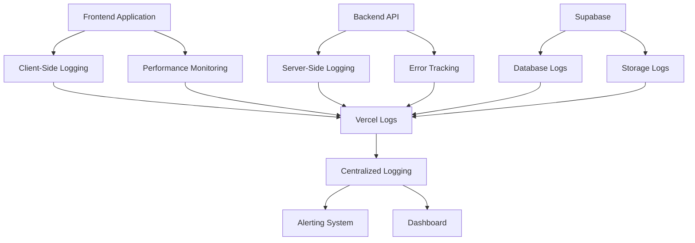

# Bab 15: Pemantauan dan Logging

## Pendahuluan

Pemantauan dan logging adalah aspek krusial untuk menjaga kesehatan, performa, dan keandalan Sistem Validasi Instrumen Model KESAN di lingkungan produksi. Sistem ini mengimplementasikan berbagai mekanisme monitoring dan logging untuk membantu tim pengembang dalam mengidentifikasi masalah, menganalisis perilaku pengguna, dan mengoptimalkan performa aplikasi. Bab ini akan menjelaskan cara memantau kesehatan aplikasi, metrik-metrik penting, dan cara menganalisis log untuk debugging dan audit.

## Arsitektur Pemantauan



## 15.1 Logging Strategy

### 15.1.1 Log Levels

Sistem menggunakan log levels yang berbeda untuk klasifikasi pesan:

| Level | Keterangan | Penggunaan |
|-------|------------|------------|
| `error` | Error yang menghentikan operasi | Kegagalan kritis, exception tidak tertangani |
| `warn` | Peringatan tentang masalah potensial | Deprecation, penggunaan API yang tidak tepat |
| `info` | Informasi tentang alur aplikasi | Submit form, login, navigasi |
| `debug` | Informasi detail untuk debugging | State changes, API calls |

### 15.1.2 Client-Side Logging

Implementasi logging di client-side:

```typescript
// lib/logger.ts
export enum LogLevel {
  ERROR = 'error',
  WARN = 'warn',
  INFO = 'info',
  DEBUG = 'debug',
}

interface LogEntry {
  level: LogLevel;
  message: string;
  data?: any;
  timestamp: string;
  url?: string;
  userAgent?: string;
}

class Logger {
  private static instance: Logger;
  private logBuffer: LogEntry[] = [];
  private maxBufferSize = 100;

  private constructor() {}

  static getInstance(): Logger {
    if (!Logger.instance) {
      Logger.instance = new Logger();
    }
    return Logger.instance;
  }

  private createLogEntry(level: LogLevel, message: string, data?: any): LogEntry {
    return {
      level,
      message,
      data,
      timestamp: new Date().toISOString(),
      url: typeof window !== 'undefined' ? window.location.href : undefined,
      userAgent: typeof navigator !== 'undefined' ? navigator.userAgent : undefined,
    };
  }

  private log(entry: LogEntry): void {
    // Add to buffer
    this.logBuffer.push(entry);
    
    // Keep buffer size under limit
    if (this.logBuffer.length > this.maxBufferSize) {
      this.logBuffer.shift();
    }
    
    // Log to console
    console[entry.level](`[${entry.timestamp}] ${entry.message}`, entry.data || '');
    
    // Send to external service in production
    if (process.env.NODE_ENV === 'production') {
      this.sendToExternalService(entry);
    }
  }

  error(message: string, data?: any): void {
    const entry = this.createLogEntry(LogLevel.ERROR, message, data);
    this.log(entry);
  }

  warn(message: string, data?: any): void {
    const entry = this.createLogEntry(LogLevel.WARN, message, data);
    this.log(entry);
  }

  info(message: string, data?: any): void {
    const entry = this.createLogEntry(LogLevel.INFO, message, data);
    this.log(entry);
  }

  debug(message: string, data?: any): void {
    const entry = this.createLogEntry(LogLevel.DEBUG, message, data);
    this.log(entry);
  }

  private async sendToExternalService(entry: LogEntry): Promise<void> {
    try {
      // Send to Vercel logs or external logging service
      await fetch('/api/logs', {
        method: 'POST',
        headers: {
          'Content-Type': 'application/json',
        },
        body: JSON.stringify(entry),
      });
    } catch (error) {
      console.error('Failed to send log to external service:', error);
    }
  }

  getLogs(): LogEntry[] {
    return [...this.logBuffer];
  }

  clearLogs(): void {
    this.logBuffer = [];
  }
}

export const logger = Logger.getInstance();
```

### 15.1.3 Server-Side Logging

Implementasi logging di API routes:

```typescript
// app/api/validasi/isi/route.ts
import { NextRequest, NextResponse } from 'next/server';
import { supabase } from '@/lib/supabase';

// Custom logger for server-side
const serverLogger = {
  error: (message: string, data?: any) => {
    console.error(`[ERROR] ${new Date().toISOString()} ${message}`, data);
    // In production, send to external logging service
  },
  info: (message: string, data?: any) => {
    console.log(`[INFO] ${new Date().toISOString()} ${message}`, data);
  },
  warn: (message: string, data?: any) => {
    console.warn(`[WARN] ${new Date().toISOString()} ${message}`, data);
  },
};

export async function POST(request: NextRequest) {
  const startTime = Date.now();
  const requestId = crypto.randomUUID();
  
  try {
    const data = await request.json();
    
    serverLogger.info(`Validation submission started`, {
      requestId,
      validatorName: data.nama,
      institution: data.institusi,
    });
    
    // Process validation...
    
    const endTime = Date.now();
    serverLogger.info(`Validation submission completed`, {
      requestId,
      duration: endTime - startTime,
    });
    
    return NextResponse.json({ success: true, data: validationData });
  } catch (error) {
    const endTime = Date.now();
    serverLogger.error(`Validation submission failed`, {
      requestId,
      duration: endTime - startTime,
      error: error instanceof Error ? error.message : 'Unknown error',
      stack: error instanceof Error ? error.stack : undefined,
    });
    
    return NextResponse.json({ 
      error: 'Internal server error', 
      details: errorMessage 
    }, { status: 500 });
  }
}
```

## 15.2 Performance Monitoring

### 15.2.1 Web Vitals

Implementasi Web Vitals monitoring:

```typescript
// lib/performance.ts
import { Metric } from 'web-vitals';

export const reportWebVitals = (metric: Metric) => {
  // Log to console for debugging
  console.log('Web Vital:', metric);
  
  // Send to analytics service
  if (process.env.NODE_ENV === 'production') {
    // Send to Vercel Analytics
    if (window.gtag) {
      window.gtag('event', metric.name, {
        value: Math.round(metric.value),
        event_category: 'Web Vitals',
        event_label: metric.id,
        non_interaction: true,
      });
    }
    
    // Send to custom logging
    logger.info('Web Vital', {
      name: metric.name,
      value: metric.value,
      id: metric.id,
      delta: metric.delta,
    });
  }
};
```

### 15.2.2 Component Performance

Monitoring performa komponen:

```typescript
// hooks/usePerformanceMonitor.ts
import { useEffect, useRef } from 'react';

export const usePerformanceMonitor = (componentName: string) => {
  const renderStartTime = useRef<number>();
  
  useEffect(() => {
    renderStartTime.current = performance.now();
    
    return () => {
      if (renderStartTime.current) {
        const renderTime = performance.now() - renderStartTime.current;
        
        logger.debug(`Component render time`, {
          component: componentName,
          renderTime,
        });
        
        // Log slow renders
        if (renderTime > 100) {
          logger.warn(`Slow component render detected`, {
            component: componentName,
            renderTime,
          });
        }
      }
    };
  });
};
```

## 15.3 User Behavior Tracking

### 15.3.1 Form Interaction Tracking

Tracking interaksi pengguna dengan form:

```typescript
// hooks/useFormTracking.ts
import { useEffect } from 'react';

export const useFormTracking = (formType: string) => {
  useEffect(() => {
    // Track form view
    logger.info(`Form viewed`, {
      formType,
      timestamp: new Date().toISOString(),
    });
    
    // Track form abandonment
    const handleBeforeUnload = () => {
      logger.info(`Form abandoned`, {
        formType,
        timestamp: new Date().toISOString(),
      });
    };
    
    window.addEventListener('beforeunload', handleBeforeUnload);
    
    return () => {
      window.removeEventListener('beforeunload', handleBeforeUnload);
    };
  }, [formType]);
  
  const trackFieldInteraction = (fieldName: string, value: any) => {
    logger.debug(`Form field interaction`, {
      formType,
      fieldName,
      value: typeof value === 'string' ? value.substring(0, 50) : value,
      timestamp: new Date().toISOString(),
    });
  };
  
  const trackFormSubmit = (formData: any) => {
    logger.info(`Form submitted`, {
      formType,
      timestamp: new Date().toISOString(),
      fields: Object.keys(formData),
    });
  };
  
  return {
    trackFieldInteraction,
    trackFormSubmit,
  };
};
```

### 15.3.2 Validation Completion Tracking

Tracking penyelesaian validasi:

```typescript
// app/validasi-isi/page.tsx
import { useFormTracking } from '@/hooks/useFormTracking';

export default function ValidasiIsiPage() {
  const { trackFieldInteraction, trackFormSubmit } = useFormTracking('validasi-isi');
  
  const [formData, setFormData] = useState({
    // Form data
  });
  
  const handleFieldChange = (fieldName: string, value: any) => {
    setFormData(prev => ({ ...prev, [fieldName]: value }));
    trackFieldInteraction(fieldName, value);
  };
  
  const handleSubmit = async (e: React.FormEvent) => {
    e.preventDefault();
    
    try {
      // Submit logic
      trackFormSubmit(formData);
      
      // Track successful validation
      logger.info(`Validation completed`, {
        type: 'validasi-isi',
        decision: formData.decision,
        timestamp: new Date().toISOString(),
      });
    } catch (error) {
      // Track failed validation
      logger.error(`Validation failed`, {
        type: 'validasi-isi',
        error: error instanceof Error ? error.message : 'Unknown error',
        timestamp: new Date().toISOString(),
      });
    }
  };
  
  return (
    // Form JSX
  );
}
```

## 15.4 Error Monitoring

### 15.4.1 Client-Side Error Handling

Global error handling di client-side:

```typescript
// app/layout.tsx
'use client';

import { useEffect } from 'react';
import { logger } from '@/lib/logger';

export default function ErrorBoundary({
  children,
}: {
  children: React.ReactNode;
}) {
  useEffect(() => {
    // Handle unhandled promise rejections
    const handleUnhandledRejection = (event: PromiseRejectionEvent) => {
      logger.error('Unhandled promise rejection', {
        reason: event.reason,
        stack: event.reason?.stack,
      });
    };
    
    // Handle uncaught errors
    const handleError = (event: ErrorEvent) => {
      logger.error('Uncaught error', {
        message: event.message,
        filename: event.filename,
        lineno: event.lineno,
        colno: event.colno,
        stack: event.error?.stack,
      });
    };
    
    window.addEventListener('unhandledrejection', handleUnhandledRejection);
    window.addEventListener('error', handleError);
    
    return () => {
      window.removeEventListener('unhandledrejection', handleUnhandledRejection);
      window.removeEventListener('error', handleError);
    };
  }, []);
  
  return <>{children}</>;
}
```

### 15.4.2 Server-Side Error Handling

Error handling middleware untuk API routes:

```typescript
// middleware/errorHandler.ts
import { NextRequest, NextResponse } from 'next/server';
import { serverLogger } from '@/lib/logger';

export const withErrorHandler = (handler: Function) => {
  return async (request: NextRequest, ...args: any[]) => {
    try {
      return await handler(request, ...args);
    } catch (error) {
      const requestId = crypto.randomUUID();
      
      serverLogger.error(`API request failed`, {
        requestId,
        method: request.method,
        url: request.url,
        error: error instanceof Error ? error.message : 'Unknown error',
        stack: error instanceof Error ? error.stack : undefined,
      });
      
      return NextResponse.json(
        { 
          error: 'Internal server error',
          requestId 
        }, 
        { status: 500 }
      );
    }
  };
};
```

## 15.5 API Logs Endpoint

### 15.5.1 Client Logs API

Endpoint untuk menerima logs dari client-side:

```typescript
// app/api/logs/route.ts
import { NextRequest, NextResponse } from 'next/server';
import { supabaseAdmin } from '@/lib/supabase';

export async function POST(request: NextRequest) {
  try {
    const logEntry = await request.json();
    
    // Store log in database (optional)
    const { error } = await supabaseAdmin
      .from('application_logs')
      .insert({
        level: logEntry.level,
        message: logEntry.message,
        data: logEntry.data,
        timestamp: logEntry.timestamp,
        url: logEntry.url,
        user_agent: logEntry.userAgent,
      });
    
    if (error) {
      console.error('Failed to store log:', error);
    }
    
    // Send to external logging service (optional)
    // await sendToLoggingService(logEntry);
    
    return NextResponse.json({ success: true });
  } catch (error) {
    console.error('Failed to process log:', error);
    return NextResponse.json(
      { error: 'Failed to process log' },
      { status: 500 }
    );
  }
}
```

### 15.5.2 Debug API

Endpoint untuk debugging dan monitoring:

```typescript
// app/api/debug/route.ts
import { NextResponse } from 'next/server';
import { supabaseAdmin } from '@/lib/supabase';

export async function GET() {
  try {
    // Test database connection
    const { data: isiData, error: isiError } = await supabaseAdmin
      .from('validasi_isi')
      .select('id', { count: 'exact' });
    
    const { data: files, error: storageError } = await supabaseAdmin
      .storage
      .from('signatures')
      .list('', { limit: 100 });
    
    // Get recent logs (if implemented)
    // const { data: logs } = await supabaseAdmin
    //   .from('application_logs')
    //   .select('*')
    //   .order('timestamp', { ascending: false })
    //   .limit(50);
    
    return NextResponse.json({
      status: 'success',
      timestamp: new Date().toISOString(),
      environment: process.env.NODE_ENV,
      database: {
        connected: !isiError,
        tables: {
          validasi_isi: isiData?.length || 0,
          // Add other tables
        }
      },
      storage: {
        connected: !storageError,
        bucket: 'signatures',
        files: files?.length || 0
      },
      version: process.env.npm_package_version || 'Unknown',
    });
  } catch (error) {
    return NextResponse.json({
      status: 'error',
      error: error.message
    }, { status: 500 });
  }
}
```

## 15.6 Dashboard Monitoring

### 15.6.1 Admin Dashboard

Implementasi dashboard untuk monitoring:

```typescript
// app/admin/page.tsx
'use client';

import { useState, useEffect } from 'react';
import { logger } from '@/lib/logger';

export default function AdminDashboard() {
  const [logs, setLogs] = useState([]);
  const [systemStatus, setSystemStatus] = useState({});
  const [loading, setLoading] = useState(true);
  
  useEffect(() => {
    const fetchSystemStatus = async () => {
      try {
        const response = await fetch('/api/debug');
        const data = await response.json();
        setSystemStatus(data);
      } catch (error) {
        logger.error('Failed to fetch system status', { error });
      } finally {
        setLoading(false);
      }
    };
    
    fetchSystemStatus();
    
    // Set up polling for real-time updates
    const interval = setInterval(fetchSystemStatus, 30000); // 30 seconds
    
    return () => clearInterval(interval);
  }, []);
  
  return (
    <div className="min-h-screen bg-gray-50 p-8">
      <h1 className="text-3xl font-bold text-gray-900 mb-8">System Dashboard</h1>
      
      {loading ? (
        <div>Loading...</div>
      ) : (
        <div className="grid grid-cols-1 md:grid-cols-2 lg:grid-cols-3 gap-6">
          {/* System Status Card */}
          <div className="bg-white p-6 rounded-lg shadow">
            <h2 className="text-xl font-semibold mb-4">System Status</h2>
            <div className="space-y-2">
              <div className="flex justify-between">
                <span>Environment:</span>
                <span>{systemStatus.environment}</span>
              </div>
              <div className="flex justify-between">
                <span>Database:</span>
                <span className={systemStatus.database?.connected ? 'text-green-500' : 'text-red-500'}>
                  {systemStatus.database?.connected ? 'Connected' : 'Disconnected'}
                </span>
              </div>
              <div className="flex justify-between">
                <span>Storage:</span>
                <span className={systemStatus.storage?.connected ? 'text-green-500' : 'text-red-500'}>
                  {systemStatus.storage?.connected ? 'Connected' : 'Disconnected'}
                </span>
              </div>
            </div>
          </div>
          
          {/* Database Stats Card */}
          <div className="bg-white p-6 rounded-lg shadow">
            <h2 className="text-xl font-semibold mb-4">Database Statistics</h2>
            <div className="space-y-2">
              <div className="flex justify-between">
                <span>Validasi Isi:</span>
                <span>{systemStatus.database?.tables?.validasi_isi || 0}</span>
              </div>
              <div className="flex justify-between">
                <span>Validasi Konstruk:</span>
                <span>{systemStatus.database?.tables?.validasi_konstruk || 0}</span>
              </div>
              <div className="flex justify-between">
                <span>Validasi Praktikalitas:</span>
                <span>{systemStatus.database?.tables?.validasi_praktikalitas_guru || 0}</span>
              </div>
            </div>
          </div>
          
          {/* Storage Stats Card */}
          <div className="bg-white p-6 rounded-lg shadow">
            <h2 className="text-xl font-semibold mb-4">Storage Statistics</h2>
            <div className="space-y-2">
              <div className="flex justify-between">
                <span>Signatures:</span>
                <span>{systemStatus.storage?.files || 0}</span>
              </div>
              <div className="flex justify-between">
                <span>Bucket:</span>
                <span>{systemStatus.storage?.bucket}</span>
              </div>
            </div>
          </div>
        </div>
      )}
    </div>
  );
}
```

## 15.7 Alerting System

### 15.7.1 Error Alerting

Implementasi sistem alert untuk error kritis:

```typescript
// lib/alerting.ts
export const sendAlert = async (alert: {
  type: 'error' | 'warning' | 'info';
  title: string;
  message: string;
  data?: any;
}) => {
  // In production, send to alerting service
  if (process.env.NODE_ENV === 'production') {
    try {
      // Send to Slack, Discord, or email
      await fetch('/api/alerts', {
        method: 'POST',
        headers: {
          'Content-Type': 'application/json',
        },
        body: JSON.stringify(alert),
      });
    } catch (error) {
      console.error('Failed to send alert:', error);
    }
  } else {
    // Log to console in development
    console.warn(`ALERT [${alert.type.toUpperCase()}] ${alert.title}: ${alert.message}`, alert.data);
  }
};

// API endpoint for alerts
// app/api/alerts/route.ts
export async function POST(request: NextRequest) {
  try {
    const alert = await request.json();
    
    // Send to external alerting service
    // await sendToSlack(alert);
    // await sendToDiscord(alert);
    // await sendEmail(alert);
    
    return NextResponse.json({ success: true });
  } catch (error) {
    console.error('Failed to send alert:', error);
    return NextResponse.json(
      { error: 'Failed to send alert' },
      { status: 500 }
    );
  }
}
```

### 15.7.2 Integration with Alerting

Integrasi alerting dengan error handling:

```typescript
// Enhanced error handling with alerting
export const handleError = (error: Error, context?: any) => {
  // Log error
  logger.error('Application error', {
    message: error.message,
    stack: error.stack,
    context,
  });
  
  // Send alert for critical errors
  if (error.name === 'TypeError' || error.name === 'ReferenceError') {
    sendAlert({
      type: 'error',
      title: 'Critical Application Error',
      message: error.message,
      data: {
        stack: error.stack,
        context,
      },
    });
  }
};
```

## 15.8 Log Analysis

### 15.8.1 Log Query Pattern

Pola untuk query logs:

```typescript
// lib/logAnalyzer.ts
export interface LogFilter {
  level?: string;
  startDate?: string;
  endDate?: string;
  message?: string;
  component?: string;
}

export const analyzeLogs = (logs: any[], filter: LogFilter) => {
  let filteredLogs = logs;
  
  // Filter by level
  if (filter.level) {
    filteredLogs = filteredLogs.filter(log => log.level === filter.level);
  }
  
  // Filter by date range
  if (filter.startDate && filter.endDate) {
    filteredLogs = filteredLogs.filter(log => {
      const logDate = new Date(log.timestamp);
      return logDate >= new Date(filter.startDate) && logDate <= new Date(filter.endDate);
    });
  }
  
  // Filter by message
  if (filter.message) {
    filteredLogs = filteredLogs.filter(log => 
      log.message.toLowerCase().includes(filter.message.toLowerCase())
    );
  }
  
  // Analyze patterns
  const errorCounts = filteredLogs.reduce((acc, log) => {
    acc[log.message] = (acc[log.message] || 0) + 1;
    return acc;
  }, {});
  
  const hourlyDistribution = filteredLogs.reduce((acc, log) => {
    const hour = new Date(log.timestamp).getHours();
    acc[hour] = (acc[hour] || 0) + 1;
    return acc;
  }, {});
  
  return {
    totalLogs: filteredLogs.length,
    errorCounts,
    hourlyDistribution,
    logs: filteredLogs,
  };
};
```

### 15.8.2 Log Visualization

Visualisasi data logs:

```typescript
// components/LogChart.tsx
import { BarChart, Bar, XAxis, YAxis, CartesianGrid, Tooltip, ResponsiveContainer } from 'recharts';

export const LogChart = ({ data }: { data: any[] }) => {
  return (
    <ResponsiveContainer width="100%" height={300}>
      <BarChart data={data}>
        <CartesianGrid strokeDasharray="3 3" />
        <XAxis dataKey="hour" />
        <YAxis />
        <Tooltip />
        <Bar dataKey="count" fill="#8884d8" />
      </BarChart>
    </ResponsiveContainer>
  );
};
```

## Best Practices Pemantauan

### 15.9 Monitoring Checklist

1. **Logging**:
   - [ ] Semua critical paths memiliki logging
   - [ ] Log levels digunakan dengan benar
   - [ ] Sensitive data tidak di-log
   - [ ] Structured logging untuk analisis mudah

2. **Performance**:
   - [ ] Web Vitals dimonitor
   - [ ] Component performance tracking
   - [ ] API response time monitoring
   - [ ] Database query performance tracking

3. **Error Handling**:
   - [ ] Global error handling diimplementasikan
   - [ ] Error alerting untuk masalah kritis
   - [ ] Error context captured
   - [ ] User-friendly error messages

### 15.10 Privacy and Compliance

### 15.10.1 Data Privacy in Logs

```typescript
// Sanitize PII from logs
const sanitizeLogData = (data: any): any => {
  if (typeof data !== 'object' || data === null) {
    return data;
  }
  
  const sanitized = { ...data };
  
  // Mask PII fields
  if (sanitized.nama) {
    sanitized.nama = sanitized.nama.substring(0, 2) + '***';
  }
  
  if (sanitized.email) {
    const [username, domain] = sanitized.email.split('@');
    sanitized.email = `${username.substring(0, 2)}***@${domain}`;
  }
  
  return sanitized;
};
```

## Rangkuman

Pemantauan dan logging adalah komponen penting untuk menjaga kesehatan dan performa Sistem Validasi Instrumen Model KESAN. Dengan implementasi logging yang komprehensif di client-side dan server-side, monitoring performa dengan Web Vitals, dan sistem alerting untuk masalah kritis, tim dapat dengan cepat mengidentifikasi dan menyelesaikan masalah yang muncul. Dashboard monitoring menyediakan visibilitas real-time tentang status sistem, sementara analisis log membantu dalam memahami pola perilaku pengguna dan mengidentifikasi area untuk perbaikan.

Pada bab berikutnya, kita akan membahas tentang strategi pencadangan dan pemulihan data.
