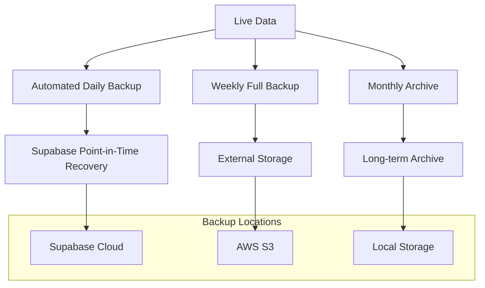

# Bab 16: Pencadangan dan Pemulihan

## Pendahuluan

Pencadangan (backup) dan pemulihan (recovery) adalah aspek krusial dalam manajemen data Sistem Validasi Instrumen Model KESAN. Data validasi yang dikumpulkan dari para validator memiliki nilai penting untuk penelitian, sehingga kehilangan data dapat berdampak serius. Bab ini akan menjelaskan strategi pencadangan yang komprehensif, prosedur pemulihan data, dan rencana disaster recovery untuk memastikan kelangsungan bisnis dan integritas data.

## Strategi Pencadangan

### 16.1 Klasifikasi Data

Data dalam sistem diklasifikasikan berdasarkan tingkat kepentingan:

| Jenis Data | Klasifikasi | Kepentingan | Retensi |
|------------|-------------|------------|---------|
| Data Validasi | Kritis | Sangat Penting | 5 tahun |
| Tanda Tangan Digital | Kritis | Sangat Penting | 5 tahun |
| Database Schema | Penting | Penting | Selama ada |
| Konfigurasi Sistem | Penting | Penting | Selama ada |
| Log Aplikasi | Normal | Sedang | 1 tahun |

### 16.2 Backup Strategy



## 16.3 Supabase Backup

### 16.3.1 Automated Backup

Supabase menyediakan backup otomatis:

1. **Daily Backups**: Backup penuh setiap hari (retention 7 hari)
2. **Point-in-Time Recovery (PITR)**: Restore ke titik waktu tertentu (retention 7 hari)
3. **Physical Backups**: Backup fisik untuk disaster recovery

### 16.3.2 Manajemen Backup di Supabase Dashboard

1. **Buka Supabase Dashboard**
2. **Navigasi ke Settings → Database**
3. **Pilih tab Backups**
4. **Monitor backup schedule dan status**

### 16.3.3 Point-in-Time Recovery

Prosedur PITR:

```sql
-- Query untuk melihat restore point yang tersedia
SELECT * FROM pg_available_backups;

-- Restore ke titik waktu tertentu (melalui Supabase Dashboard)
-- 1. Pilih database
-- 2. Klik "Restore"
-- 3. Pilih timestamp untuk restore
-- 4. Konfirmasi restore
```

## 16.4 Custom Backup Implementation

### 16.4.1 API Endpoint untuk Backup

```typescript
// app/api/admin/backup/route.ts
import { NextRequest, NextResponse } from 'next/server';
import { supabaseAdmin } from '@/lib/supabase';

export async function POST(request: NextRequest) {
  try {
    const { type } = await request.json();
    
    switch (type) {
      case 'validation_data':
        return await backupValidationData();
      case 'signatures':
        return await backupSignatures();
      case 'full':
        return await fullBackup();
      default:
        return NextResponse.json({ error: 'Invalid backup type' }, { status: 400 });
    }
  } catch (error) {
    console.error('Backup failed:', error);
    return NextResponse.json({ 
      error: 'Backup failed', 
      details: error.message 
    }, { status: 500 });
  }
}

async function backupValidationData() {
  const tables = [
    'validasi_isi',
    'validasi_konstruk',
    'validasi_praktikalitas_guru',
    'validasi_praktikalitas_siswa'
  ];
  
  const backupData: any = {};
  
  for (const table of tables) {
    const { data, error } = await supabaseAdmin
      .from(table)
      .select('*');
    
    if (error) {
      throw new Error(`Failed to backup ${table}: ${error.message}`);
    }
    
    backupData[table] = data;
  }
  
  // Save backup to external storage
  const timestamp = new Date().toISOString().replace(/[:.]/g, '-');
  const fileName = `validation-data-backup-${timestamp}.json`;
  
  // Upload to Supabase Storage or external service
  const { error: uploadError } = await supabaseAdmin.storage
    .from('backups')
    .upload(fileName, JSON.stringify(backupData), {
      contentType: 'application/json',
    });
  
  if (uploadError) {
    throw new Error(`Failed to upload backup: ${uploadError.message}`);
  }
  
  return NextResponse.json({ 
    success: true, 
    fileName,
    recordCount: Object.values(backupData).reduce((acc, data) => acc + data.length, 0)
  });
}

async function backupSignatures() {
  // List all signature files
  const { data: files, error } = await supabaseAdmin.storage
    .from('signatures')
    .list('', { limit: 1000 });
  
  if (error) {
    throw new Error(`Failed to list signatures: ${error.message}`);
  }
  
  // Download all signature files
  const signatureData: any[] = [];
  
  for (const file of files) {
    const { data: fileData, error: downloadError } = await supabaseAdmin.storage
      .from('signatures')
      .download(file.name);
    
    if (downloadError) {
      console.error(`Failed to download ${file.name}:`, downloadError);
      continue;
    }
    
    // Convert to base64
    const base64 = await fileToBase64(fileData);
    
    signatureData.push({
      name: file.name,
      data: base64,
      created_at: file.created_at,
    });
  }
  
  // Save backup
  const timestamp = new Date().toISOString().replace(/[:.]/g, '-');
  const fileName = `signatures-backup-${timestamp}.json`;
  
  const { error: uploadError } = await supabaseAdmin.storage
    .from('backups')
    .upload(fileName, JSON.stringify(signatureData), {
      contentType: 'application/json',
    });
  
  if (uploadError) {
    throw new Error(`Failed to upload signatures backup: ${uploadError.message}`);
  }
  
  return NextResponse.json({ 
    success: true, 
    fileName,
    fileCount: signatureData.length
  });
}

async function fullBackup() {
  const validationBackup = await backupValidationData();
  const signaturesBackup = await backupSignatures();
  
  return NextResponse.json({
    success: true,
    validation: await validationBackup.json(),
    signatures: await signaturesBackup.json(),
  });
}

// Helper function to convert file to base64
async function fileToBase64(file: Blob): Promise<string> {
  return new Promise((resolve, reject) => {
    const reader = new FileReader();
    reader.readAsDataURL(file);
    reader.onload = () => {
      const result = reader.result as string;
      // Remove data URL prefix
      const base64 = result.split(',')[1];
      resolve(base64);
    };
    reader.onerror = error => reject(error);
  });
}
```

### 16.4.2 Scheduled Backup dengan Cron Job

```typescript
// app/api/cron/backup/route.ts
import { NextRequest, NextResponse } from 'next/server';

export async function GET(request: NextRequest) {
  // Verify this is a cron request
  const authHeader = request.headers.get('authorization');
  if (authHeader !== `Bearer ${process.env.CRON_SECRET}`) {
    return NextResponse.json({ error: 'Unauthorized' }, { status: 401 });
  }
  
  try {
    // Trigger backup
    const response = await fetch(`${process.env.NEXT_PUBLIC_APP_URL}/api/admin/backup`, {
      method: 'POST',
      headers: {
        'Content-Type': 'application/json',
      },
      body: JSON.stringify({ type: 'full' }),
    });
    
    const result = await response.json();
    
    return NextResponse.json({ 
      success: true, 
      message: 'Scheduled backup completed',
      result 
    });
  } catch (error) {
    console.error('Scheduled backup failed:', error);
    return NextResponse.json({ 
      error: 'Scheduled backup failed', 
      details: error.message 
    }, { status: 500 });
  }
}
```

### 16.4.3 External Backup ke AWS S3

```typescript
// lib/backupStorage.ts
import AWS from 'aws-sdk';

// Configure AWS SDK
const s3 = new AWS.S3({
  accessKeyId: process.env.AWS_ACCESS_KEY_ID,
  secretAccessKey: process.env.AWS_SECRET_ACCESS_KEY,
  region: process.env.AWS_REGION,
});

export const uploadToS3 = async (fileName: string, data: any) => {
  const params = {
    Bucket: process.env.AWS_S3_BUCKET!,
    Key: `backups/${fileName}`,
    Body: JSON.stringify(data),
    ContentType: 'application/json',
  };
  
  try {
    const result = await s3.upload(params).promise();
    console.log('File uploaded successfully:', result.Location);
    return result;
  } catch (error) {
    console.error('Error uploading file:', error);
    throw error;
  }
};

export const downloadFromS3 = async (fileName: string) => {
  const params = {
    Bucket: process.env.AWS_S3_BUCKET!,
    Key: `backups/${fileName}`,
  };
  
  try {
    const result = await s3.getObject(params).promise();
    return result.Body?.toString();
  } catch (error) {
    console.error('Error downloading file:', error);
    throw error;
  }
};
```

## 16.5 Prosedur Pemulihan

### 16.5.1 Restore dari Supabase PITR

1. **Buka Supabase Dashboard**
2. **Navigasi ke Settings → Database**
3. **Pilih tab Backups**
4. **Klik "Restore"**
5. **Pilih timestamp untuk restore**
6. **Konfirmasi restore**
7. **Tunggu proses restore selesai**

### 16.5.2 Restore dari Custom Backup

```typescript
// app/api/admin/restore/route.ts
import { NextRequest, NextResponse } from 'next/server';
import { supabaseAdmin } from '@/lib/supabase';
import { downloadFromS3 } from '@/lib/backupStorage';

export async function POST(request: NextRequest) {
  try {
    const { fileName, source, type } = await request.json();
    
    let backupData: any;
    
    // Download backup data
    if (source === 's3') {
      backupData = await downloadFromS3(fileName);
    } else if (source === 'supabase') {
      const { data } = await supabaseAdmin.storage
        .from('backups')
        .download(fileName);
      
      backupData = await data.text();
    } else {
      return NextResponse.json({ error: 'Invalid source' }, { status: 400 });
    }
    
    // Parse backup data
    const parsedData = JSON.parse(backupData);
    
    switch (type) {
      case 'validation_data':
        return await restoreValidationData(parsedData);
      case 'signatures':
        return await restoreSignatures(parsedData);
      case 'full':
        return await restoreFull(parsedData);
      default:
        return NextResponse.json({ error: 'Invalid restore type' }, { status: 400 });
    }
  } catch (error) {
    console.error('Restore failed:', error);
    return NextResponse.json({ 
      error: 'Restore failed', 
      details: error.message 
    }, { status: 500 });
  }
}

async function restoreValidationData(backupData: any) {
  const results: any = {};
  
  for (const [table, data] of Object.entries(backupData)) {
    // Clear existing data (optional, based on requirements)
    // await supabaseAdmin.from(table).delete().neq('id', '');
    
    // Insert backup data
    const { error } = await supabaseAdmin
      .from(table)
      .insert(data as any[]);
    
    if (error) {
      results[table] = { success: false, error: error.message };
    } else {
      results[table] = { success: true, count: (data as any[]).length };
    }
  }
  
  return NextResponse.json({ 
    success: true, 
    results 
  });
}

async function restoreSignatures(backupData: any[]) {
  const results: any[] = [];
  
  for (const file of backupData) {
    // Convert base64 back to blob
    const byteCharacters = atob(file.data);
    const byteNumbers = new Array(byteCharacters.length);
    for (let i = 0; i < byteCharacters.length; i++) {
      byteNumbers[i] = byteCharacters.charCodeAt(i);
    }
    const byteArray = new Uint8Array(byteNumbers);
    const blob = new Blob([byteArray], { type: 'image/png' });
    
    // Upload to Supabase Storage
    const { error } = await supabaseAdmin.storage
      .from('signatures')
      .upload(file.name, blob, {
        contentType: 'image/png',
        upsert: true,
      });
    
    if (error) {
      results.push({ name: file.name, success: false, error: error.message });
    } else {
      results.push({ name: file.name, success: true });
    }
  }
  
  return NextResponse.json({ 
    success: true, 
    results 
  });
}
```

## 16.6 Disaster Recovery Plan

### 16.6.1 Disaster Scenarios

1. **Data Corruption**:
   - Deteksi: Error saat membaca data
   - Response: Restore dari backup terakhir
   - Recovery Time: 1-2 jam

2. **Database Outage**:
   - Deteksi: Koneksi database gagal
   - Response: Switch ke read-only mode, restore dari backup
   - Recovery Time: 2-4 jam

3. **Complete System Failure**:
   - Deteksi: Sistem tidak dapat diakses
   - Response: Deploy ke infrastruktur cadangan, restore dari backup
   - Recovery Time: 4-8 jam

### 16.6.2 Recovery Checklist

1. **Assessment**:
   - [ ] Identifikasi scope masalah
   - [ ] Tentukan severity level
   - [ ] Notify stakeholders

2. **Preparation**:
   - [ ] Siapkan environment recovery
   - [ ] Verifikasi backup availability
   - [ ] Document recovery plan

3. **Execution**:
   - [ ] Implementasi recovery
   - [ ] Verifikasi data integrity
   - [ ] Test functionality

4. **Post-Recovery**:
   - [ ] Monitor system stability
   - [ ] Document lessons learned
   - [ ] Update prevention measures

## 16.7 Backup Verification

### 16.7.1 Automated Backup Verification

```typescript
// app/api/admin/verify-backup/route.ts
import { NextRequest, NextResponse } from 'next/server';
import { supabaseAdmin } from '@/lib/supabase';

export async function POST(request: NextRequest) {
  try {
    const { fileName } = await request.json();
    
    // Download backup
    const { data, error } = await supabaseAdmin.storage
      .from('backups')
      .download(fileName);
    
    if (error) {
      return NextResponse.json({ 
        success: false, 
        error: 'Failed to download backup' 
      }, { status: 500 });
    }
    
    // Parse backup data
    const backupData = JSON.parse(await data.text());
    
    // Verify backup integrity
    const verificationResults: any = {};
    
    for (const [table, data] of Object.entries(backupData)) {
      // Check if data structure is valid
      if (!Array.isArray(data)) {
        verificationResults[table] = { 
          valid: false, 
          reason: 'Data is not an array' 
        };
        continue;
      }
      
      // Check if records have required fields
      const sampleRecord = (data as any[])[0];
      if (table.includes('validasi')) {
        const requiredFields = ['id', 'validator_nama', 'ratings', 'decision', 'signature_url'];
        const missingFields = requiredFields.filter(field => !(field in sampleRecord));
        
        if (missingFields.length > 0) {
          verificationResults[table] = { 
            valid: false, 
            reason: `Missing required fields: ${missingFields.join(', ')}` 
          };
          continue;
        }
      }
      
      verificationResults[table] = { 
        valid: true, 
        recordCount: (data as any[]).length 
      };
    }
    
    return NextResponse.json({ 
      success: true, 
      verificationResults 
    });
  } catch (error) {
    console.error('Backup verification failed:', error);
    return NextResponse.json({ 
      success: false, 
      error: 'Backup verification failed' 
    }, { status: 500 });
  }
}
```

### 16.7.2 Manual Backup Testing

Prosedur testing manual:

1. **Download backup dari Supabase Storage**
2. **Extract dan periksa struktur data**
3. **Verifikasi integritas data**
4. **Test restore di environment staging**
5. **Validasi fungsionalitas setelah restore**

## 16.8 Backup Retention Policy

### 16.8.1 Retention Schedule

| Jenis Backup | Retensi | Lokasi |
|--------------|---------|---------|
| Daily Backups | 7 hari | Supabase Cloud |
| Weekly Backups | 4 minggu | AWS S3 |
| Monthly Backups | 12 bulan | AWS S3 |
| Annual Backups | 5 tahun | AWS S3 Glacier |

### 16.8.2 Automated Cleanup

```typescript
// app/api/admin/cleanup-backups/route.ts
import { NextRequest, NextResponse } from 'next/server';
import { supabaseAdmin } from '@/lib/supabase';

export async function POST(request: NextRequest) {
  try {
    const { type, retention } = await request.json();
    
    // List all backup files
    const { data: files, error } = await supabaseAdmin.storage
      .from('backups')
      .list('', { limit: 1000 });
    
    if (error) {
      return NextResponse.json({ 
        success: false, 
        error: 'Failed to list backup files' 
      }, { status: 500 });
    }
    
    // Calculate cutoff date
    const cutoffDate = new Date();
    cutoffDate.setDate(cutoffDate.getDate() - retention);
    
    // Delete old backups
    const deleteResults: any[] = [];
    
    for (const file of files) {
      const fileDate = new Date(file.created_at);
      
      if (fileDate < cutoffDate) {
        const { error } = await supabaseAdmin.storage
          .from('backups')
          .remove([file.name]);
        
        if (error) {
          deleteResults.push({ 
            name: file.name, 
            success: false, 
            error: error.message 
          });
        } else {
          deleteResults.push({ 
            name: file.name, 
            success: true 
          });
        }
      }
    }
    
    return NextResponse.json({ 
      success: true, 
      deletedFiles: deleteResults 
    });
  } catch (error) {
    console.error('Backup cleanup failed:', error);
    return NextResponse.json({ 
      success: false, 
      error: 'Backup cleanup failed' 
    }, { status: 500 });
  }
}
```

## 16.9 Compliance and Legal Considerations

### 16.9.1 Data Privacy in Backups

```typescript
// Sanitize PII from backups
const sanitizeBackupData = (data: any[]): any[] => {
  return data.map(record => {
    const sanitized = { ...record };
    
    // Mask PII fields
    if (sanitized.validator_nama) {
      sanitized.validator_nama = sanitized.validator_nama.substring(0, 2) + '***';
    }
    
    if (sanitized.validator_institusi) {
      sanitized.validator_institusi = sanitized.validator_institusi.substring(0, 3) + '***';
    }
    
    return sanitized;
  });
};
```

### 16.9.2 Backup Encryption

```typescript
// Encrypt backup data
const encryptBackupData = (data: string): string => {
  const crypto = require('crypto');
  const algorithm = 'aes-256-cbc';
  const key = Buffer.from(process.env.BACKUP_ENCRYPTION_KEY!, 'hex');
  const iv = crypto.randomBytes(16);
  
  const cipher = crypto.createCipher(algorithm, key);
  cipher.setAutoPadding(true);
  
  let encrypted = cipher.update(data, 'utf8', 'hex');
  encrypted += cipher.final('hex');
  
  return iv.toString('hex') + ':' + encrypted;
};
```

## Best Practices Pencadangan

### 16.10 Backup Checklist

1. **Automation**:
   - [ ] Backup di-otomatisasi
   - [ ] Backup terjadwal reguler
   - [ ] Notifikasi untuk backup gagal

2. **Verification**:
   - [ ] Backup integrity terverifikasi
   - [ ] Restore testing reguler
   - [ ] Backup dokumentasi terupdate

3. **Security**:
   - [ ] Backup dienkripsi
   - [ ] Akses backup dibatasi
   - [ ] PII data di-sanitize

4. **Storage**:
   - [ ] Backup di multiple lokasi
   - [ ] Retention policy diterapkan
   - [ ] Old backup di-cleanup

## Rangkuman

Strategi pencadangan dan pemulihan yang komprehensif sangat penting untuk melindungi data validasi dalam Sistem Validasi Instrumen Model KESAN. Dengan menggabungkan backup otomatis dari Supabase, custom backup implementation, dan rencana disaster recovery yang jelas, sistem dapat pulih dari berbagai skenario kegagalan dengan waktu recovery yang minimal. Verifikasi reguler dan testing prosedur pemulihan memastikan bahwa backup dapat diandalkan saat dibutuhkan.

Pada bab berikutnya, kita akan membahas tentang panduan kontribusi untuk pengembang yang ingin berpartisipasi dalam pengembangan sistem.
