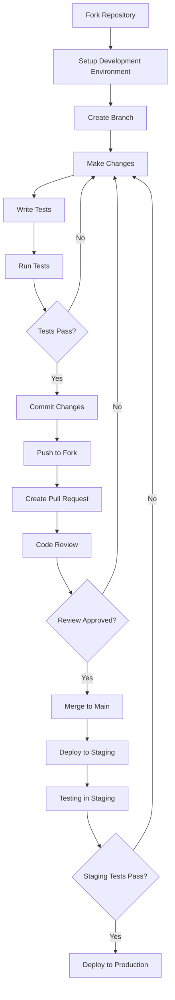

# Bab 17: Panduan Kontribusi

## Pendahuluan

Kontribusi dari komunitas pengembang sangat berharga untuk pengembangan dan perbaikan Sistem Validasi Instrumen Model KESAN. Bab ini akan memberikan panduan lengkap untuk calon kontributor, termasuk cara setup lingkungan pengembangan, proses kontribusi, standar kode yang diharapkan, dan pedoman untuk menulis dan menguji kode. Dengan mengikuti panduan ini, kontributor dapat berpartisipasi secara efektif dalam pengembangan sistem.

## Cara Berkontribusi

### 17.1 Jenis Kontribusi

Kami menyambut berbagai jenis kontribusi:

| Jenis Kontribusi | Deskripsi |
|------------------|-----------|
| 🐛 Bug Reports | Melaporkan bug atau masalah |
| 💡 Feature Requests | Mengusulkan fitur baru |
| 📝 Documentation | Memperbaiki atau menambah dokumentasi |
| 🔧 Code Contributions | Memperbaiki bug atau menambah fitur |
| 🎨 UI/UX Improvements | Meningkatkan desain dan pengalaman pengguna |
| 🧪 Testing | Menulis atau meningkatkan tes |
| 📊 Analytics | Menganalisis data dan memberikan insight |

### 17.2 Alur Kontribusi



## 17.3 Setup Lingkungan Pengembangan

### 17.3.1 Prasyarat

Sebelum memulai, pastikan Anda telah menginstal:

- **Node.js** versi 18.17.0 atau lebih tinggi
- **npm** versi 9.0.0 atau lebih tinggi
- **Git** versi 2.20.0 atau lebih tinggi
- **Code Editor** (direkomendasikan Visual Studio Code)

### 17.3.2 Fork dan Clone Repository

1. **Fork Repository**:
   - Buka [GitHub repository](https://github.com/username/validasi-app)
   - Klik tombol "Fork" di pojok kanan atas
   - Tunggu proses fork selesai

2. **Clone Forked Repository**:
   ```bash
   git clone https://github.com/YOUR_USERNAME/validasi-app.git
   cd validasi-app
   ```

3. **Tambahkan Remote Upstream**:
   ```bash
   git remote add upstream https://github.com/ORIGINAL_OWNER/validasi-app.git
   ```

### 17.3.3 Install Dependencies

```bash
# Install dependencies
npm install

# Copy environment file template
cp .env.example .env.local
```

### 17.3.4 Konfigurasi Environment Variables

Edit file `.env.local` dan tambahkan konfigurasi Supabase Anda:

```env
# Supabase Configuration
NEXT_PUBLIC_SUPABASE_URL=https://your-project-id.supabase.co
NEXT_PUBLIC_SUPABASE_ANON_KEY=your-anon-key
SUPABASE_SERVICE_ROLE_KEY=your-service-role-key
```

### 17.3.5 Jalankan Development Server

```bash
# Start development server
npm run dev
```

Buka [http://localhost:3000](http://localhost:3000) di browser untuk memastikan aplikasi berjalan dengan benar.

## 17.4 Standar Kode

### 17.4.1 TypeScript

Sistem menggunakan TypeScript untuk type safety. Pastikan:

- Semua fungsi memiliki tipe parameter dan return value
- Gunakan interface untuk struktur data kompleks
- Hindari penggunaan `any` sebisa mungkin

```typescript
// Good
interface ValidatorData {
  nama: string;
  institusi: string;
  keahlian: string;
}

function processValidator(data: ValidatorData): boolean {
  // Implementation
  return true;
}

// Bad
function processValidator(data: any): any {
  // Implementation
  return true;
}
```

### 17.4.2 React Components

Gunakan pola berikut untuk React components:

```typescript
// components/ExampleComponent.tsx
'use client';

import React, { useState, useEffect } from 'react';

interface ExampleComponentProps {
  title: string;
  onSave: (data: any) => void;
}

export default function ExampleComponent({ title, onSave }: ExampleComponentProps) {
  const [data, setData] = useState<any>(null);
  
  useEffect(() => {
    // Component did mount logic
  }, []);
  
  const handleSubmit = () => {
    onSave(data);
  };
  
  return (
    <div className="p-4">
      <h2 className="text-xl font-bold">{title}</h2>
      {/* Component JSX */}
    </div>
  );
}
```

### 17.4.3 API Routes

Gunakan pola berikut untuk API routes:

```typescript
// app/api/example/route.ts
import { NextRequest, NextResponse } from 'next/server';
import { supabase } from '@/lib/supabase';

export async function GET(request: NextRequest) {
  try {
    // Implementation
    return NextResponse.json({ success: true, data });
  } catch (error) {
    console.error('API Error:', error);
    return NextResponse.json({ 
      error: 'Internal server error' 
    }, { status: 500 });
  }
}

export async function POST(request: NextRequest) {
  try {
    const data = await request.json();
    
    // Validation
    if (!data.field) {
      return NextResponse.json({ 
        error: 'Missing required field' 
      }, { status: 400 });
    }
    
    // Implementation
    return NextResponse.json({ success: true, data });
  } catch (error) {
    console.error('API Error:', error);
    return NextResponse.json({ 
      error: 'Internal server error' 
    }, { status: 500 });
  }
}
```

### 17.4.4 Styling

Gunakan Tailwind CSS untuk styling:

```typescript
// Good
<div className="bg-white p-4 rounded-lg shadow-md hover:shadow-lg transition-shadow">
  <h3 className="text-lg font-semibold text-gray-800 mb-2">Title</h3>
  <p className="text-gray-600">Description</p>
</div>

// Bad
<div style={{ backgroundColor: 'white', padding: '16px', borderRadius: '8px' }}>
  <h3 style={{ fontSize: '18px', fontWeight: 'bold' }}>Title</h3>
  <p>Description</p>
</div>
```

## 17.5 Proses Pull Request

### 17.5.1 Branch Naming

Gunakan konvensi penamaan branch:

- `feature/nama-fitur`: Untuk fitur baru
- `fix/nama-bug`: Untuk perbaikan bug
- `docs/nama-dokumentasi`: Untuk perubahan dokumentasi
- `refactor/nama-refactor`: Untuk refactor kode

### 17.5.2 Commit Messages

Gunakan format commit messages yang jelas:

```
type(scope): description

[optional body]

[optional footer]
```

Contoh:

```
feat(validation): add email validation for validators

- Add regex validation for email field
- Show error message for invalid email
- Prevent form submission with invalid email

Closes #123
```

### 17.5.3 Pull Request Template

Gunakan template PR berikut:

```markdown
## Description
Brief description of changes

## Type of Change
- [ ] Bug fix
- [ ] New feature
- [ ] Breaking change
- [ ] Documentation update

## Testing
- [ ] Unit tests pass
- [ ] Integration tests pass
- [ ] Manual testing completed

## Checklist
- [ ] Code follows project style guidelines
- [ ] Self-review completed
- [ ] Documentation updated
- [ ] Tests added/updated
```

## 17.6 Testing

### 17.6.1 Unit Testing

Gunakan Jest dan React Testing Library untuk unit testing:

```typescript
// __tests__/components/ExampleComponent.test.tsx
import { render, screen, fireEvent } from '@testing-library/react';
import ExampleComponent from '@/components/ExampleComponent';

describe('ExampleComponent', () => {
  it('renders correctly', () => {
    const mockOnSave = jest.fn();
    render(<ExampleComponent title="Test Title" onSave={mockOnSave} />);
    
    expect(screen.getByText('Test Title')).toBeInTheDocument();
  });
  
  it('calls onSave when submitted', () => {
    const mockOnSave = jest.fn();
    render(<ExampleComponent title="Test Title" onSave={mockOnSave} />);
    
    fireEvent.click(screen.getByText('Submit'));
    
    expect(mockOnSave).toHaveBeenCalled();
  });
});
```

### 17.6.2 Integration Testing

Gunakan Playwright untuk integration testing:

```typescript
// tests/integration/validation-form.spec.ts
import { test, expect } from '@playwright/test';

test('validation form submission', async ({ page }) => {
  await page.goto('/validasi-isi');
  
  // Fill form
  await page.fill('[name="nama"]', 'Test Validator');
  await page.fill('[name="institusi"]', 'Test Institution');
  await page.fill('[name="keahlian"]', 'Test Expertise');
  
  // Select ratings
  await page.click('[data-rating="a1"][data-value="5"]');
  
  // Submit form
  await page.click('[type="submit"]');
  
  // Verify success
  await expect(page.locator('.success-message')).toBeVisible();
});
```

### 17.6.3 Running Tests

```bash
# Run unit tests
npm test

# Run integration tests
npm run test:integration

# Run all tests
npm run test:all

# Run tests with coverage
npm run test:coverage
```

## 17.7 Code Review

### 17.7.1 Review Checklist

Saat melakukan code review, periksa:

- **Functionality**: Apakah kode berfungsi seperti yang diharapkan?
- **Type Safety**: Apakah tipe TypeScript digunakan dengan benar?
- **Performance**: Apakah ada potensi masalah performa?
- **Security**: Apakah ada potensi vulnerability keamanan?
- **Testing**: Apakah tes mencakup kasus yang relevan?
- **Documentation**: Apakah kode didokumentasikan dengan baik?

### 17.7.2 Review Best Practices

1. **Konstruktif**: Berikan feedback yang konstruktif dan spesifik
2. **Polite**: Gunakan bahasa yang sopan dan profesional
3. **Thorough**: Periksa kode secara menyeluruh
4. **Responsive**: Tanggapi review dengan cepat

## 17.8 Documentation

### 17.8.1 Code Documentation

Gunakan JSDoc untuk dokumentasi fungsi:

```typescript
/**
 * Validates form data for validation submission
 * @param data - Form data to validate
 * @returns Array of error messages, empty if valid
 */
function validateFormData(data: FormData): string[] {
  // Implementation
}
```

### 17.8.2 API Documentation

Dokumentasikan API endpoints:

```typescript
/**
 * POST /api/validasi/isi
 * Submit validation data for instrument validation
 * 
 * @param {Object} body - Request body
 * @param {string} body.nama - Validator name
 * @param {string} body.institusi - Validator institution
 * @param {string} body.keahlian - Validator expertise
 * @param {Object} body.ratings - Rating values (1-5)
 * @param {string} body.decision - Validation decision
 * @param {string} body.signature - Base64 encoded signature
 * 
 * @returns {Object} Response
 * @returns {boolean} success - Whether operation was successful
 * @returns {Object} data - Saved validation data
 * @returns {string} error - Error message (if failed)
 */
```

### 17.8.3 README Documentation

Perbarui README.md untuk:

- **Fitur baru**: Dokumentasikan fitur yang ditambahkan
- **Perubahan API**: Perbarui dokumentasi API
- **Perubahan setup**: Perbarui instruksi setup
- **Dependencies**: Perbarui dependensi yang diperlukan

## 17.9 Troubleshooting

### 17.9.1 Common Issues

#### Issue: Environment variables not working

**Solution**:
1. Pastikan file `.env.local` ada di root directory
2. Restart development server
3. Verifikasi nama variabel sudah benar

#### Issue: TypeScript compilation errors

**Solution**:
1. Periksa `tsconfig.json`
2. Clear Next.js cache: `rm -rf .next`
3. Restart development server

#### Issue: Supabase connection errors

**Solution**:
1. Verifikasi URL dan keys di `.env.local`
2. Pastikan Supabase project aktif
3. Check RLS policies

### 17.9.2 Getting Help

Jika Anda mengalami masalah:

1. **Check Documentation**: Baca dokumentasi yang relevan
2. **Search Issues**: Cari di GitHub issues
3. **Ask for Help**: Buat issue dengan label "question"
4. **Join Discussion**: Ikuti diskusi di repository

## 17.10 Recognition for Contributors

### 17.10.1 Contributor Recognition

Kami menghargai kontribusi Anda dengan:

- **Contributor List**: Nama Anda akan ditambahkan ke CONTRIBUTORS.md
- **Release Notes**: Kontribusi Anda akan disebutkan di release notes
- **Special Badges**: Badge khusus untuk kontributor rutin

### 17.10.2 Becoming a Maintainer

Untuk menjadi maintainer:

1. **Kontribusi Rutin**: Berkontribusi secara rutin selama 3+ bulan
2. **Kualitas Kode**: Menunjukkan konsistensi dalam kualitas kode
3. **Review Aktif**: Aktif dalam code review
4. **Komunikasi**: Komunikasi yang baik dengan komunitas

## Best Practices Kontribusi

### 17.11 Kontribusi Checklist

1. **Pre-Kontribusi**:
   - [ ] Baca panduan kontribusi
   - [ ] Setup lingkungan pengembangan
   - [ ] Pahami arsitektur dan kode
   - [ ] Diskusikan perubahan besar terlebih dahulu

2. **Selama Kontribusi**:
   - [ ] Ikuti standar kode
   - [ ] Tulis tes untuk perubahan
   - [ ] Perbarui dokumentasi
   - [ ] Buat commit yang jelas

3. **Pasca-Kontribusi**:
   - [ ] Buat pull request dengan deskripsi jelas
   - [ ] Respon review dengan cepat
   - [ ] Perbaiki issue yang disampaikan
   - [ ] Monitor setelah merge

## Rangkuman

Kontribusi dari komunitas sangat penting untuk pertumbuhan Sistem Validasi Instrumen Model KESAN. Dengan mengikuti panduan kontribusi ini, pengembang dapat berpartisipasi secara efektif dalam pengembangan sistem, memastikan kode berkualitas tinggi, dan mempertahankan standar yang konsisten. Kami menghargai semua kontribusi, dari laporan bug hingga pengembangan fitur baru, dan berkomitmen untuk menciptakan lingkungan yang inklusif dan kolaboratif untuk semua kontributor.

Pada bab berikutnya, kita akan membahas tentang strategi pengujian untuk memastikan kualitas dan keandalan sistem.
