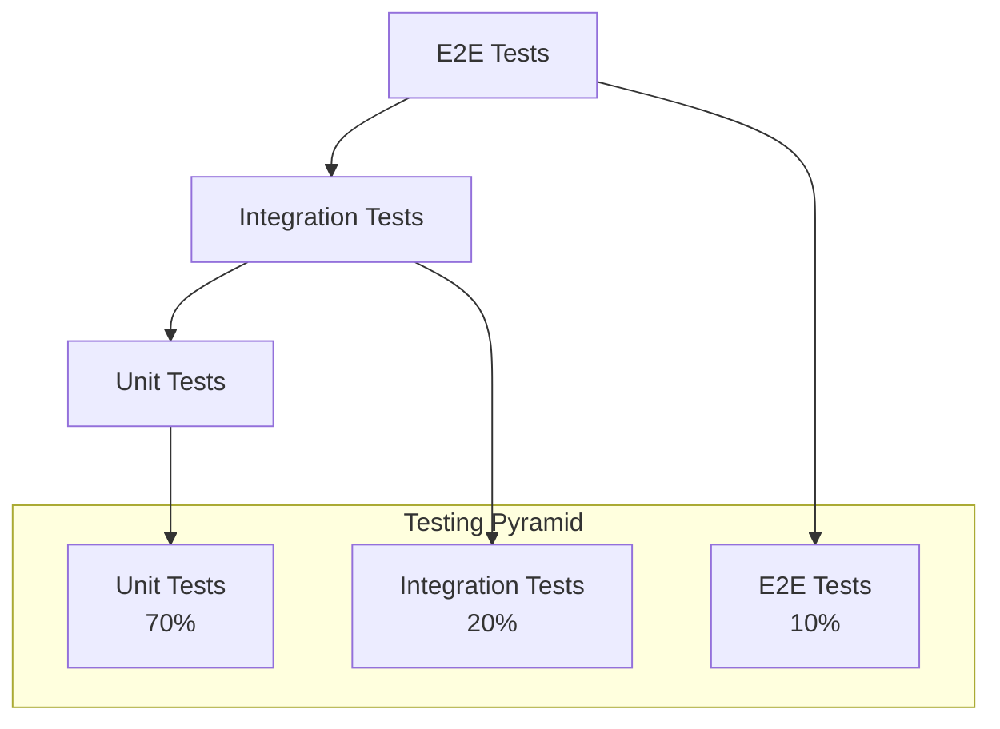

# Bab 18: Pengujian

## Pendahuluan

Pengujian (testing) adalah aspek fundamental dalam pengembangan Sistem Validasi Instrumen Model KESAN untuk memastikan kualitas, keandalan, dan performa aplikasi. Bab ini akan menjelaskan strategi pengujian yang komprehensif, berbagai jenis tes yang diimplementasikan, tools yang digunakan, dan best practices untuk menulis dan menjalankan tes. Dengan pendekatan pengujian yang terstruktur, kita dapat mendeteksi bug lebih awal, memastikan fitur baru tidak merusak fungsionalitas yang ada, dan memberikan keyakinan bahwa aplikasi berfungsi seperti yang diharapkan.

## Strategi Pengujian

### 18.1 Testing Pyramid



Sistem mengikuti testing pyramid dengan distribusi:

1. **Unit Tests (70%)**: Tes untuk fungsi dan komponen individual
2. **Integration Tests (20%)**: Tes untuk interaksi antar komponen
3. **End-to-End Tests (10%)**: Tes untuk alur pengguna lengkap

## 18.2 Unit Testing

### 18.2.1 Tools untuk Unit Testing

- **Jest**: Framework testing utama
- **React Testing Library**: Untuk testing komponen React
- **MSW (Mock Service Worker)**: Untuk mocking API calls

### 18.2.2 Konfigurasi Jest

```javascript
// jest.config.js
const nextJest = require('next/jest');

const createJestConfig = nextJest({
  // Provide the path to your Next.js app to load next.config.js and .env files
  dir: './',
});

// Add any custom config to be passed to Jest
const customJestConfig = {
  setupFilesAfterEnv: ['<rootDir>/jest.setup.js'],
  moduleNameMapping: {
    '^@/(.*)$': '<rootDir>/$1',
  },
  testEnvironment: 'jest-environment-jsdom',
  collectCoverageFrom: [
    'components/**/*.{js,jsx,ts,tsx}',
    'app/**/*.{js,jsx,ts,tsx}',
    'lib/**/*.{js,jsx,ts,tsx}',
    '!**/*.d.ts',
    '!**/node_modules/**',
  ],
  coverageThreshold: {
    global: {
      branches: 80,
      functions: 80,
      lines: 80,
      statements: 80,
    },
  },
};

// createJestConfig is exported this way to ensure that next/jest can load the Next.js config which is async
module.exports = createJestConfig(customJestConfig);
```

### 18.2.3 Setup File

```javascript
// jest.setup.js
import '@testing-library/jest-dom';
import { server } from './src/mocks/server';

// Establish API mocking before all tests
beforeAll(() => server.listen());

// Reset any request handlers that we may add during the tests,
// so they don't affect other tests.
afterEach(() => server.resetHandlers());

// Clean up after the tests are finished
afterAll(() => server.close());
```

### 18.2.4 Contoh Unit Test untuk Komponen

```typescript
// __tests__/components/RatingScale.test.tsx
import { render, screen, fireEvent } from '@testing-library/react';
import RatingScale from '@/components/RatingScale';

describe('RatingScale Component', () => {
  const mockOnChange = jest.fn();
  
  beforeEach(() => {
    mockOnChange.mockClear();
  });
  
  it('renders correctly with label', () => {
    render(
      <RatingScale
        id="test-scale"
        label="Test Scale"
        value={0}
        onChange={mockOnChange}
      />
    );
    
    expect(screen.getByText('Test Scale')).toBeInTheDocument();
    expect(screen.getByText('1 = Sangat Tidak Layak')).toBeInTheDocument();
    expect(screen.getByText('5 = Sangat Layak')).toBeInTheDocument();
  });
  
  it('calls onChange when rating is selected', () => {
    render(
      <RatingScale
        id="test-scale"
        label="Test Scale"
        value={0}
        onChange={mockOnChange}
      />
    );
    
    // Click rating 4
    fireEvent.click(screen.getByText('4'));
    
    expect(mockOnChange).toHaveBeenCalledWith(4);
  });
  
  it('displays selected rating correctly', () => {
    render(
      <RatingScale
        id="test-scale"
        label="Test Scale"
        value={3}
        onChange={mockOnChange}
      />
    );
    
    // Check if rating 3 is selected
    const rating3 = screen.getByText('3');
    expect(rating3.closest('button')).toHaveClass('border-yellow-500');
  });
  
  it('shows required indicator when required is true', () => {
    render(
      <RatingScale
        id="test-scale"
        label="Test Scale"
        value={0}
        onChange={mockOnChange}
        required={true}
      />
    );
    
    expect(screen.getByText('*')).toBeInTheDocument();
  });
});
```

### 18.2.5 Contoh Unit Test untuk API

```typescript
// __tests__/api/validasi-isi.test.ts
import { POST } from '@/app/api/validasi-isi/route';
import { createMocks } from 'node-mocks-http';
import { supabaseAdmin } from '@/lib/supabase';

// Mock Supabase
jest.mock('@/lib/supabase', () => ({
  supabaseAdmin: {
    storage: {
      from: jest.fn(() => ({
        upload: jest.fn().mockResolvedValue({ error: null }),
        getPublicUrl: jest.fn().mockReturnValue({
          data: { publicUrl: 'https://example.com/signature.png' }
        })
      }))
    },
    from: jest.fn(() => ({
      insert: jest.fn().mockResolvedValue({
        data: [{ id: 'test-id' }],
        error: null
      })
    }))
  }
}));

describe('/api/validasi/isi', () => {
  it('returns success response for valid data', async () => {
    const { req } = createMocks({
      method: 'POST',
      body: {
        nama: 'Test Validator',
        institusi: 'Test Institution',
        keahlian: 'Test Expertise',
        a1: 5,
        a2: 4,
        b1: 4,
        b2: 5,
        c1: 4,
        c2: 5,
        c3: 4,
        d1: 5,
        d2: 4,
        comments: 'Test comments',
        suggestions: 'Test suggestions',
        decision: 'layak-revisi-kecil',
        signature: 'data:image/png;base64,test'
      }
    });
    
    const response = await POST(req);
    const data = await response.json();
    
    expect(response.status).toBe(200);
    expect(data.success).toBe(true);
    expect(data.data).toBeDefined();
  });
  
  it('returns error for missing required fields', async () => {
    const { req } = createMocks({
      method: 'POST',
      body: {
        nama: '',
        institusi: 'Test Institution',
        keahlian: 'Test Expertise',
        a1: 5,
        a2: 4,
        b1: 4,
        b2: 5,
        c1: 4,
        c2: 5,
        c3: 4,
        d1: 5,
        d2: 4,
        comments: 'Test comments',
        suggestions: 'Test suggestions',
        decision: 'layak-revisi-kecil',
        signature: 'data:image/png;base64,test'
      }
    });
    
    const response = await POST(req);
    const data = await response.json();
    
    expect(response.status).toBe(400);
    expect(data.error).toBe('Validation failed');
  });
  
  it('returns error for invalid ratings', async () => {
    const { req } = createMocks({
      method: 'POST',
      body: {
        nama: 'Test Validator',
        institusi: 'Test Institution',
        keahlian: 'Test Expertise',
        a1: 0, // Invalid rating
        a2: 4,
        b1: 4,
        b2: 5,
        c1: 4,
        c2: 5,
        c3: 4,
        d1: 5,
        d2: 4,
        comments: 'Test comments',
        suggestions: 'Test suggestions',
        decision: 'layak-revisi-kecil',
        signature: 'data:image/png;base64,test'
      }
    });
    
    const response = await POST(req);
    const data = await response.json();
    
    expect(response.status).toBe(400);
    expect(data.error).toBe('Validation failed');
  });
});
```

## 18.3 Integration Testing

### 18.3.1 Tools untuk Integration Testing

- **Jest**: Framework testing utama
- **Supabase Test Helpers**: Untuk testing database
- **Test Database**: Database terpisah untuk testing

### 18.3.2 Setup Test Database

```typescript
// lib/testDb.ts
import { createClient } from '@supabase/supabase-js';

const supabaseUrl = process.env.NEXT_PUBLIC_SUPABASE_URL!;
const supabaseServiceKey = process.env.SUPABASE_SERVICE_ROLE_KEY!;

export const testDb = createClient(supabaseUrl, supabaseServiceKey, {
  db: {
    schema: 'test_schema'
  }
});

// Setup and teardown functions
export const setupTestDb = async () => {
  // Clean up test data
  await testDb.from('validasi_isi').delete().neq('id', '');
  await testDb.from('validasi_konstruk').delete().neq('id', '');
  await testDb.from('validasi_praktikalitas_guru').delete().neq('id', '');
  await testDb.from('validasi_praktikalitas_siswa').delete().neq('id', '');
};

export const teardownTestDb = async () => {
  // Clean up test data
  await testDb.from('validasi_isi').delete().neq('id', '');
  await testDb.from('validasi_konstruk').delete().neq('id', '');
  await testDb.from('validasi_praktikalitas_guru').delete().neq('id', '');
  await testDb.from('validasi_praktikalitas_siswa').delete().neq('id', '');
};
```

### 18.3.3 Contoh Integration Test

```typescript
// __tests__/integration/validation-flow.test.ts
import { render, screen, fireEvent, waitFor } from '@testing-library/react';
import { setupTestDb, teardownTestDb } from '@/lib/testDb';
import ValidasiIsiPage from '@/app/validasi-isi/page';

// Mock fetch for API calls
global.fetch = jest.fn();

describe('Validation Flow Integration', () => {
  beforeAll(async () => {
    await setupTestDb();
  });
  
  afterAll(async () => {
    await teardownTestDb();
  });
  
  beforeEach(() => {
    (fetch as jest.Mock).mockClear();
  });
  
  it('completes validation flow successfully', async () => {
    // Mock successful API response
    (fetch as jest.Mock).mockResolvedValue({
      ok: true,
      json: async () => ({
        success: true,
        data: [{ id: 'test-id' }]
      })
    });
    
    render(<ValidasiIsiPage />);
    
    // Fill form
    fireEvent.change(screen.getByLabelText(/Nama/i), {
      target: { value: 'Test Validator' }
    });
    
    fireEvent.change(screen.getByLabelText(/Institusi/i), {
      target: { value: 'Test Institution' }
    });
    
    fireEvent.change(screen.getByLabelText(/Keahlian/i), {
      target: { value: 'Test Expertise' }
    });
    
    // Select ratings
    fireEvent.click(screen.getByText('5'));
    fireEvent.click(screen.getByText('4'));
    
    // Fill comments
    fireEvent.change(screen.getByLabelText(/Komentar Umum/i), {
      target: { value: 'Test comments' }
    });
    
    // Select decision
    fireEvent.click(screen.getByLabelText(/Layak dengan Revisi Kecil/i));
    
    // Mock signature
    const signaturePad = screen.getByLabelText(/Tanda Tangan/i);
    fireEvent.mouseDown(signaturePad);
    fireEvent.mouseMove(signaturePad);
    fireEvent.mouseUp(signaturePad);
    
    // Submit form
    fireEvent.click(screen.getByRole('button', { name: /Simpan Data Validasi/i }));
    
    // Wait for success message
    await waitFor(() => {
      expect(screen.getByText(/Berhasil!/i)).toBeInTheDocument();
    });
    
    // Verify API was called
    expect(fetch).toHaveBeenCalledWith('/api/validasi/isi', {
      method: 'POST',
      headers: {
        'Content-Type': 'application/json',
      },
      body: expect.stringContaining('Test Validator'),
    });
  });
  
  it('shows validation errors for incomplete form', async () => {
    render(<ValidasiIsiPage />);
    
    // Submit without filling form
    fireEvent.click(screen.getByRole('button', { name: /Simpan Data Validasi/i }));
    
    // Check for validation error
    expect(screen.getByText(/Mohon lengkapi identitas validator!/i)).toBeInTheDocument();
  });
});
```

## 18.4 End-to-End (E2E) Testing

### 18.4.1 Tools untuk E2E Testing

- **Playwright**: Framework E2E testing
- **Playwright Test**: Runner untuk Playwright tests
- **@playwright/test**: Library untuk testing

### 18.4.2 Konfigurasi Playwright

```typescript
// playwright.config.ts
import { defineConfig, devices } from '@playwright/test';

export default defineConfig({
  testDir: './tests/e2e',
  fullyParallel: true,
  forbidOnly: !!process.env.CI,
  retries: process.env.CI ? 2 : 0,
  workers: process.env.CI ? 1 : undefined,
  reporter: 'html',
  use: {
    baseURL: 'http://localhost:3000',
    trace: 'on-first-retry',
    screenshot: 'only-on-failure',
  },
  projects: [
    {
      name: 'chromium',
      use: { ...devices['Desktop Chrome'] },
    },
    {
      name: 'firefox',
      use: { ...devices['Desktop Firefox'] },
    },
    {
      name: 'webkit',
      use: { ...devices['Desktop Safari'] },
    },
    {
      name: 'Mobile Chrome',
      use: { ...devices['Pixel 5'] },
    },
    {
      name: 'Mobile Safari',
      use: { ...devices['iPhone 12'] },
    },
  ],
  webServer: {
    command: 'npm run dev',
    url: 'http://localhost:3000',
    reuseExistingServer: !process.env.CI,
  },
});
```

### 18.4.3 Contoh E2E Test

```typescript
// tests/e2e/validation-isi.spec.ts
import { test, expect } from '@playwright/test';

test.describe('Validasi Isi Form', () => {
  test.beforeEach(async ({ page }) => {
    await page.goto('/validasi-isi');
  });
  
  test('should display page correctly', async ({ page }) => {
    await expect(page.locator('h1')).toContainText('Validasi Instrumen Isi');
    await expect(page.locator('iframe')).toBeVisible();
    await expect(page.locator('form')).toBeVisible();
  });
  
  test('should show validation errors for empty form', async ({ page }) => {
    await page.click('button[type="submit"]');
    
    await expect(page.locator('text=Mohon lengkapi identitas validator!')).toBeVisible();
  });
  
  test('should complete validation flow', async ({ page }) => {
    // Fill form
    await page.fill('[name="nama"]', 'Test Validator');
    await page.fill('[name="institusi"]', 'Test Institution');
    await page.fill('[name="keahlian"]', 'Test Expertise');
    
    // Select ratings
    await page.click('[data-rating="a1"][data-value="5"]');
    await page.click('[data-rating="a2"][data-value="4"]');
    await page.click('[data-rating="b1"][data-value="4"]');
    await page.click('[data-rating="b2"][data-value="5"]');
    await page.click('[data-rating="c1"][data-value="4"]');
    await page.click('[data-rating="c2"][data-value="5"]');
    await page.click('[data-rating="c3"][data-value="4"]');
    await page.click('[data-rating="d1"][data-value="5"]');
    await page.click('[data-rating="d2"][data-value="4"]');
    
    // Fill comments
    await page.fill('[name="comments"]', 'Test comments');
    await page.fill('[name="suggestions"]', 'Test suggestions');
    
    // Select decision
    await page.click('input[value="layak-revisi-kecil"]');
    
    // Add signature
    const canvas = page.locator('.signature-canvas');
    await canvas.hover();
    await page.mouse.down();
    await page.mouse.move(100, 100);
    await page.mouse.up();
    
    // Submit form
    await page.click('button[type="submit"]');
    
    // Wait for success message
    await expect(page.locator('text=Berhasil!')).toBeVisible();
  });
  
  test('should navigate between pages', async ({ page }) => {
    // Go back to dashboard
    await page.click('a[href="/"]');
    
    await expect(page.locator('h1')).toContainText('Dashboard Validasi Instrumen');
    
    // Navigate to validation konstruk
    await page.click('a[href="/validasi-konstruk"]');
    
    await expect(page.locator('h1')).toContainText('Validasi Instrumen Konstruk');
  });
});
```

### 18.4.4 E2E Test untuk Responsivitas

```typescript
// tests/e2e/responsiveness.spec.ts
import { test, devices } from '@playwright/test';

test.describe('Responsiveness', () => {
  const pages = [
    { name: 'Dashboard', url: '/' },
    { name: 'Validasi Isi', url: '/validasi-isi' },
    { name: 'Validasi Konstruk', url: '/validasi-konstruk' },
  ];
  
  pages.forEach(({ name, url }) => {
    test(`${name} page should be responsive on desktop`, async ({ page }) => {
      await page.goto(url);
      
      // Check desktop layout
      await expect(page.locator('body')).toHaveCSS('display', 'block');
    });
    
    test(`${name} page should be responsive on mobile`, async ({ page }) => {
      await page.goto(url);
      
      // Emulate mobile device
      await page.setViewportSize({ width: 375, height: 667 });
      
      // Check mobile layout
      await expect(page.locator('body')).toHaveCSS('display', 'block');
    });
  });
});
```

## 18.5 Performance Testing

### 18.5.1 Tools untuk Performance Testing

- **Lighthouse**: Automated performance testing
- **Web Vitals**: Core web vitals measurement
- **Bundle Analyzer**: Bundle size analysis

### 18.5.2 Lighthouse CI

```yaml
# .github/workflows/lighthouse.yml
name: Lighthouse CI

on:
  push:
    branches: [ main ]
  pull_request:
    branches: [ main ]

jobs:
  lighthouse:
    runs-on: ubuntu-latest
    steps:
      - uses: actions/checkout@v3
      - uses: actions/setup-node@v3
        with:
          node-version: '20'
      - run: npm ci
      - run: npm run build
      
      - name: Run Lighthouse
        uses: treosh/lighthouse-ci-action@v9
        with:
          configPath: '.lighthouserc.json'
          uploadArtifacts: true
          temporaryPublicStorage: true
```

### 18.5.3 Lighthouse Configuration

```json
// .lighthouserc.json
{
  "ci": {
    "collect": {
      "numberOfRuns": 3,
      "settings": {
        "chromeFlags": "--no-sandbox --headless"
      }
    },
    "assert": {
      "assertions": {
        "categories:performance": ["warn", {"minScore": 0.8}],
        "categories:accessibility": ["error", {"minScore": 0.9}],
        "categories:best-practices": ["warn", {"minScore": 0.8}],
        "categories:seo": ["warn", {"minScore": 0.8}]
      }
    },
    "upload": {
      "target": "temporary-public-storage"
    }
  }
}
```

## 18.6 Security Testing

### 18.6.1 Tools untuk Security Testing

- **OWASP ZAP**: Automated security scanning
- **Axe**: Accessibility testing
- **Custom Security Tests**: Input validation tests

### 18.6.2 Security Test Examples

```typescript
// __tests__/security/input-validation.test.ts
import { POST } from '@/app/api/validasi-isi/route';
import { createMocks } from 'node-mocks-http';

describe('Input Validation Security', () => {
  it('should reject XSS attempts', async () => {
    const { req } = createMocks({
      method: 'POST',
      body: {
        nama: '<script>alert("XSS")</script>',
        institusi: 'Test Institution',
        keahlian: 'Test Expertise',
        a1: 5,
        a2: 4,
        b1: 4,
        b2: 5,
        c1: 4,
        c2: 5,
        c3: 4,
        d1: 5,
        d2: 4,
        comments: '',
        suggestions: 'Test suggestions',
        decision: 'layak-revisi-kecil',
        signature: 'data:image/png;base64,test'
      }
    });
    
    const response = await POST(req);
    const data = await response.json();
    
    expect(response.status).toBe(200);
    
    // Check that XSS is sanitized
    expect(data.data.validator_nama).not.toContain('<script>');
    expect(data.data.general_comments).not.toContain(' {
    const { req } = createMocks({
      method: 'POST',
      body: {
        nama: "'; DROP TABLE validasi_isi; --",
        institusi: 'Test Institution',
        keahlian: 'Test Expertise',
        a1: 5,
        a2: 4,
        b1: 4,
        b2: 5,
        c1: 4,
        c2: 5,
        c3: 4,
        d1: 5,
        d2: 4,
        comments: 'Test comments',
        suggestions: 'Test suggestions',
        decision: 'layak-revisi-kecil',
        signature: 'data:image/png;base64,test'
      }
    });
    
    const response = await POST(req);
    
    // Should not cause database error
    expect(response.status).not.toBe(500);
  });
});
```

## 18.7 Test Execution

### 18.7.1 Running Tests

```bash
# Run unit tests
npm test

# Run integration tests
npm run test:integration

# Run E2E tests
npm run test:e2e

# Run all tests
npm run test:all

# Run tests with coverage
npm run test:coverage

# Run specific test file
npm test RatingScale.test.tsx
```

### 18.7.2 Package Scripts

```json
// package.json
{
  "scripts": {
    "test": "jest",
    "test:watch": "jest --watch",
    "test:coverage": "jest --coverage",
    "test:integration": "jest --testPathPattern=integration",
    "test:e2e": "playwright test",
    "test:e2e:headed": "playwright test --headed",
    "test:all": "npm run test && npm run test:integration && npm run test:e2e",
    "test:ci": "npm run test --ci && npm run test:integration --ci"
  }
}
```

## 18.8 Continuous Integration Testing

### 18.8.1 GitHub Actions Workflow

```yaml
# .github/workflows/test.yml
name: Tests

on:
  push:
    branches: [ main ]
  pull_request:
    branches: [ main ]

jobs:
  unit-tests:
    runs-on: ubuntu-latest
    
    steps:
      - uses: actions/checkout@v3
      - uses: actions/setup-node@v3
        with:
          node-version: '20'
          cache: 'npm'
      
      - run: npm ci
      - run: npm run test:ci
      
      - name: Upload coverage reports
        uses: codecov/codecov-action@v3

  e2e-tests:
    runs-on: ubuntu-latest
    
    steps:
      - uses: actions/checkout@v3
      - uses: actions/setup-node@v3
        with:
          node-version: '20'
          cache: 'npm'
      
      - run: npm ci
      - run: npm run build
      
      - name: Install Playwright
        run: npx playwright install --with-deps
      
      - name: Run Playwright tests
        run: npx playwright test
      
      - uses: actions/upload-artifact@v3
        if: always()
        with:
          name: playwright-report
          path: playwright-report/
```

## 18.9 Test Data Management

### 18.9.1 Test Data Factory

```typescript
// __tests__/factories/validationFactory.ts
export const createValidationData = (overrides = {}) => ({
  nama: 'Test Validator',
  institusi: 'Test Institution',
  keahlian: 'Test Expertise',
  a1: 5,
  a2: 4,
  b1: 4,
  b2: 5,
  c1: 4,
  c2: 5,
  c3: 4,
  d1: 5,
  d2: 4,
  comments: 'Test comments',
  suggestions: 'Test suggestions',
  decision: 'layak-revisi-kecil',
  signature: 'data:image/png;base64,test',
  ...overrides
});

export const createInvalidValidationData = () => ({
  nama: '', // Invalid
  institusi: 'Test Institution',
  keahlian: 'Test Expertise',
  a1: 0, // Invalid
  a2: 6, // Invalid
  b1: 4,
  b2: 5,
  c1: 4,
  c2: 5,
  c3: 4,
  d1: 5,
  d2: 4,
  comments: 'Test comments',
  suggestions: 'Test suggestions',
  decision: 'invalid-decision', // Invalid
  signature: 'data:image/png;base64,test',
});
```

### 18.9.2 Test Fixtures

```typescript
// __tests__/fixtures/validationFixtures.ts
import { createValidationData } from '../factories/validationFactory';

export const validValidationData = createValidationData();
export const invalidValidationData = createValidationData({
  nama: '',
  a1: 0,
  decision: 'invalid-decision'
});
```

## Best Practices Pengujian

### 18.10 Testing Checklist

1. **Test Coverage**:
   - [ ] Unit tests untuk semua fungsi penting
   - [ ] Integration tests untuk API endpoints
   - [ ] E2E tests untuk critical user paths
   - [ ] Coverage rate > 80%

2. **Test Quality**:
   - [ ] Tests independent dari satu sama lain
   - [ ] Tests memiliki deskripsi yang jelas
   - [ ] Tests mengikuti AAA pattern (Arrange, Act, Assert)
   - [ ] Tests memiliki assertions yang spesifik

3. **Test Maintenance**:
   - [ ] Tests diperbarui saat kode berubah
   - [ ] Tests dijalankan secara otomatis di CI/CD
   - [ ] Test failures ditangani dengan cepat
   - [ ] Test dokumentasi diperbarui

## Rangkuman

Strategi pengujian yang komprehensif sangat penting untuk memastikan kualitas dan keandalan Sistem Validasi Instrumen Model KESAN. Dengan kombinasi unit tests, integration tests, dan E2E tests, kita dapat mendeteksi bug di berbagai tingkatan, dari fungsi individual hingga alur pengguna lengkap. Continuous integration testing memastikan bahwa setiap perubahan kode diuji secara otomatis, membantu mencegah regressi dan memastikan kualitas kode yang konsisten.

Pada bab berikutnya, kita akan membahas tentang debugging dan pemecahan masalah untuk membantu pengembang dalam mengidentifikasi dan menyelesaikan issue.
