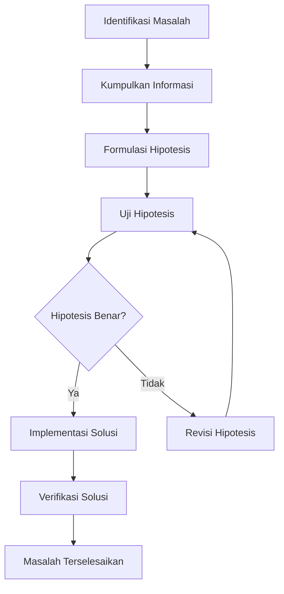

# Bab 19: Debugging dan Pemecahan Masalah

## Pendahuluan

Debugging dan pemecahan masalah adalah keterampilan esensial untuk pengembang Sistem Validasi Instrumen Model KESAN. Tidak peduli seberapa baik kita merancang sistem, masalah pasti akan muncul, baik selama pengembangan maupun di lingkungan produksi. Bab ini akan menyediakan panduan komprehensif untuk mengidentifikasi, mendiagnosis, dan menyelesaikan berbagai masalah yang mungkin terjadi, dengan fokus pada tools, teknik, dan strategi yang efektif.

## Strategi Debugging

### 19.1 Metodologi Debugging



### 19.2 Prinsip Debugging

1. **Reproduksi Masalah**: Pastikan masalah dapat direproduksi secara konsisten
2. **Isolasi Variabel**: Identifikasi perubahan yang menyebabkan masalah
3. **Divide and Conquer**: Bagi masalah menjadi bagian yang lebih kecil
4. **Verifikasi Solusi**: Pastikan solusi benar-benar memperbaiki masalah
5. **Document Findings**: Dokumentasikan masalah dan solusi untuk referensi masa depan

## 19.3 Tools untuk Debugging

### 19.3.1 Browser Developer Tools

#### Chrome DevTools

- **Elements Panel**: Inspect dan modifikasi DOM
- **Console Panel**: Eksekusi JavaScript dan logging
- **Network Panel**: Monitor network requests
- **Sources Panel**: Debug JavaScript code
- **Application Panel**: Inspect storage, cookies, dan cache

#### Firefox Developer Tools

- **Inspector**: Inspect dan modifikasi DOM
- **Web Console**: Eksekusi JavaScript dan logging
- **Network Monitor**: Monitor network requests
- **Debugger**: Debug JavaScript code
- **Storage**: Inspect storage, cookies, dan cache

### 19.3.2 VS Code Debugging

#### Launch Configuration

```json
// .vscode/launch.json
{
  "version": "0.2.0",
  "configurations": [
    {
      "name": "Next.js: debug server-side",
      "type": "node-terminal",
      "request": "launch",
      "command": "npm run dev",
      "env": {
        "NODE_OPTIONS": "--inspect"
      }
    },
    {
      "name": "Next.js: debug client-side",
      "type": "chrome",
      "request": "launch",
      "url": "http://localhost:3000"
    },
    {
      "name": "Next.js: debug full stack",
      "type": "node-terminal",
      "request": "launch",
      "command": "npm run dev",
      "env": {
        "NODE_OPTIONS": "--inspect"
      },
      "console": "integratedTerminal",
      "serverReadyAction": {
        "action": "debugWithChrome",
        "pattern": "ready in",
        "uri": "http://localhost:3000"
      }
    }
  ]
}
```

### 19.3.3 React Developer Tools

- **Component Tree**: Inspect React component hierarchy
- **Props and State**: Inspect component props dan state
- **Profiler**: Profile component performance

## 19.4 Common Issues dan Solusi

### 19.4.1 Environment Variables

#### Issue: Environment variables tidak terbaca

**Symptoms**:
- Error: `NEXT_PUBLIC_SUPABASE_URL is not defined`
- Koneksi ke Supabase gagal

**Debugging Steps**:
1. Periksa apakah file `.env.local` ada
2. Verifikasi nama variabel sudah benar
3. Restart development server
4. Periksa apakah variabel di-commit ke Git

**Solution**:
```bash
# Jangan commit .env.local ke Git
echo ".env.local" >> .gitignore

# Buat file .env.local jika belum ada
touch .env.local

# Tambahkan variabel ke .env.local
echo "NEXT_PUBLIC_SUPABASE_URL=https://your-project-id.supabase.co" >> .env.local
echo "NEXT_PUBLIC_SUPABASE_ANON_KEY=your-anon-key" >> .env.local

# Restart development server
npm run dev
```

### 19.4.2 Supabase Connection

#### Issue: Koneksi ke Supabase gagal

**Symptoms**:
- Error: `fetch failed`
- Network error saat mengakses API

**Debugging Steps**:
1. Verifikasi URL Supabase benar
2. Periksa API keys
3. Pastikan project Supabase aktif
4. Cek RLS policies

**Solution**:
```typescript
// lib/supabase.ts
// Debug koneksi Supabase
import { createClient } from '@supabase/supabase-js';

const supabaseUrl = process.env.NEXT_PUBLIC_SUPABASE_URL;
const supabaseAnonKey = process.env.NEXT_PUBLIC_SUPABASE_ANON_KEY;

// Debug log
console.log('Supabase URL:', supabaseUrl);
console.log('Supabase Anon Key:', supabaseAnonKey ? 'Set' : 'Not set');

if (!supabaseUrl || !supabaseAnonKey) {
  throw new Error('Missing Supabase environment variables');
}

export const supabase = createClient(supabaseUrl, supabaseAnonKey);

// Test koneksi
export const testConnection = async () => {
  try {
    const { data, error } = await supabase.from('validasi_isi').select('count');
    if (error) throw error;
    console.log('Supabase connection successful');
    return true;
  } catch (error) {
    console.error('Supabase connection failed:', error);
    return false;
  }
};
```

### 19.4.3 TypeScript Compilation

#### Issue: TypeScript compilation error

**Symptoms**:
- Error: `Type 'string' is not assignable to type 'number'`
- Build process gagal

**Debugging Steps**:
1. Periksa pesan error detail
2. Identifikasi file dan baris yang bermasalah
3. Verifikasi tipe data yang diharapkan
4. Periksa type definitions

**Solution**:
```typescript
// types/validation.ts
// Definisikan tipe dengan jelas
export interface ValidationData {
  nama: string;
  institusi: string;
  keahlian: string;
  ratings: Record<string, number>; // Pastikan tipe number
  decision: 'tidak-layak' | 'layak-revisi-besar' | 'layak-revisi-kecil' | 'layak-tanpa-revisi';
  signature: string;
}

// app/validasi-isi/page.tsx
// Gunakan tipe yang benar
const [formData, setFormData] = useState<ValidationData>({
  nama: '',
  institusi: '',
  keahlian: '',
  ratings: {}, // Inisialisasi dengan objek kosong
  decision: '',
  signature: '',
});

// Handle perubahan dengan tipe yang benar
const handleRatingChange = (field: string, value: number) => {
  setFormData(prev => ({
    ...prev,
    ratings: {
      ...prev.ratings,
      [field]: value
    }
  }));
};
```

### 19.4.4 Component Rendering

#### Issue: Component tidak render atau error

**Symptoms**:
- Component tidak muncul di halaman
- Error: "Cannot read property of undefined"
- React error boundary

**Debugging Steps**:
1. Periksa console untuk error
2. Verifikasi component import
3. Periksa props yang diterima
4. Gunakan React DevTools

**Solution**:
```typescript
// components/ExampleComponent.tsx
import React from 'react';

interface ExampleComponentProps {
  title: string;
  data?: any;
}

export default function ExampleComponent({ title, data }: ExampleComponentProps) {
  // Debug props
  console.log('ExampleComponent props:', { title, data });
  
  // Handle null/undefined data
  if (!title) {
    console.error('ExampleComponent: title is required');
    return null;
  }
  
  try {
    return (
      <div className="p-4">
        <h2 className="text-xl font-bold">{title}</h2>
        {data && (
          <pre>{JSON.stringify(data, null, 2)}</pre>
        )}
      </div>
    );
  } catch (error) {
    console.error('ExampleComponent error:', error);
    return <div>Something went wrong</div>;
  }
}
```

### 19.4.5 API Routes

#### Issue: API route tidak berfungsi

**Symptoms**:
- Error: 404 Not Found
- Error: 500 Internal Server Error
- Response tidak sesuai harapan

**Debugging Steps**:
1. Periksa route path
2. Verifikasi HTTP method
3. Periksa request body
4. Inspect server logs

**Solution**:
```typescript
// app/api/example/route.ts
import { NextRequest, NextResponse } from 'next/server';

export async function GET(request: NextRequest) {
  // Debug request
  console.log('API route called:', request.url);
  
  try {
    // Process request
    const data = { message: 'Hello from API' };
    
    // Debug response
    console.log('API response:', data);
    
    return NextResponse.json(data);
  } catch (error) {
    // Debug error
    console.error('API error:', error);
    
    return NextResponse.json(
      { error: 'Internal server error' },
      { status: 500 }
    );
  }
}

export async function POST(request: NextRequest) {
  try {
    // Debug request body
    const body = await request.json();
    console.log('API request body:', body);
    
    // Validate request
    if (!body.field) {
      return NextResponse.json(
        { error: 'Missing required field' },
        { status: 400 }
      );
    }
    
    // Process request
    const data = { ...body, processed: true };
    
    return NextResponse.json(data);
  } catch (error) {
    console.error('API error:', error);
    
    return NextResponse.json(
      { error: 'Internal server error' },
      { status: 500 }
    );
  }
}
```

### 19.4.6 CSS dan Styling

#### Issue: Styles tidak berfungsi

**Symptoms**:
- Tailwind classes tidak diterapkan
- Layout responsif tidak berfungsi
- CSS conflicts

**Debugging Steps**:
1. Periksa browser DevTools
2. Verifikasi Tailwind configuration
3. Periksa CSS imports
4. Inspect applied styles

**Solution**:
```typescript
// app/globals.css
/* Pastikan Tailwind directives ada */
@tailwind base;
@tailwind components;
@tailwind utilities;

/* Custom styles */
@layer components {
  .btn-primary {
    @apply bg-blue-500 text-white px-4 py-2 rounded;
  }
}
```

```javascript
// tailwind.config.js
/** @type {import('tailwindcss').Config} */
module.exports = {
  content: [
    './pages/**/*.{js,ts,jsx,tsx,mdx}',
    './components/**/*.{js,ts,jsx,tsx,mdx}',
    './app/**/*.{js,ts,jsx,tsx,mdx}',
  ],
  theme: {
    extend: {},
  },
  plugins: [],
};
```

## 19.5 Advanced Debugging Techniques

### 19.5.1 Logging dan Monitoring

#### Custom Logger

```typescript
// lib/logger.ts
export enum LogLevel {
  DEBUG = 0,
  INFO = 1,
  WARN = 2,
  ERROR = 3,
}

class Logger {
  private level: LogLevel;
  
  constructor(level: LogLevel = LogLevel.INFO) {
    this.level = level;
  }
  
  private shouldLog(level: LogLevel): boolean {
    return level >= this.level;
  }
  
  private formatMessage(level: string, message: string, data?: any): string {
    const timestamp = new Date().toISOString();
    const dataStr = data ? ` | Data: ${JSON.stringify(data)}` : '';
    return `[${timestamp}] [${level}] ${message}${dataStr}`;
  }
  
  debug(message: string, data?: any): void {
    if (this.shouldLog(LogLevel.DEBUG)) {
      console.log(this.formatMessage('DEBUG', message, data));
    }
  }
  
  info(message: string, data?: any): void {
    if (this.shouldLog(LogLevel.INFO)) {
      console.info(this.formatMessage('INFO', message, data));
    }
  }
  
  warn(message: string, data?: any): void {
    if (this.shouldLog(LogLevel.WARN)) {
      console.warn(this.formatMessage('WARN', message, data));
    }
  }
  
  error(message: string, data?: any): void {
    if (this.shouldLog(LogLevel.ERROR)) {
      console.error(this.formatMessage('ERROR', message, data));
    }
  }
}

export const logger = new Logger(LogLevel.DEBUG);
```

### 19.5.2 Error Boundaries

#### React Error Boundary

```typescript
// components/ErrorBoundary.tsx
import React, { Component, ErrorInfo, ReactNode } from 'react';

interface Props {
  children: ReactNode;
  fallback?: ReactNode;
}

interface State {
  hasError: boolean;
  error?: Error;
}

export default class ErrorBoundary extends Component<Props, State> {
  public state: State = {
    hasError: false
  };
  
  public static getDerivedStateFromError(error: Error): State {
    return { hasError: true, error };
  }
  
  public componentDidCatch(error: Error, errorInfo: ErrorInfo) {
    console.error('Uncaught error:', error, errorInfo);
  }
  
  public render() {
    if (this.state.hasError) {
      return (
        this.props.fallback || (
          <div className="min-h-screen flex items-center justify-center bg-gray-50">
            <div className="max-w-md w-full bg-white shadow-lg rounded-lg p-6">
              <h1 className="text-2xl font-bold text-red-600 mb-4">Something went wrong</h1>
              <p className="text-gray-600 mb-4">
                An unexpected error occurred. Please refresh the page and try again.
              </p>
              <button
                onClick={() => window.location.reload()}
                className="w-full bg-blue-500 text-white py-2 px-4 rounded hover:bg-blue-600"
              >
                Refresh Page
              </button>
            </div>
          </div>
        )
      );
    }
    
    return this.props.children;
  }
}
```

### 19.5.3 Performance Debugging

#### Performance Monitoring

```typescript
// lib/performance.ts
export const measurePerformance = (name: string, fn: () => void | Promise<void>) => {
  return async () => {
    const start = performance.now();
    await fn();
    const end = performance.now();
    console.log(`${name} took ${end - start} milliseconds`);
  };
};

export const measureAsync = async <T>(name: string, fn: () => Promise<T>): Promise<T> => {
  const start = performance.now();
  const result = await fn();
  const end = performance.now();
  console.log(`${name} took ${end - start} milliseconds`);
  return result;
};

// Usage
const handleSubmit = measurePerformance('form submission', async () => {
  // Form submission logic
});
```

## 19.6 Debugging di Lingkungan Produksi

### 19.6.1 Remote Debugging

#### Vercel Logs

1. Buka Vercel Dashboard
2. Pilih project
3. Navigasi ke Logs tab
4. Filter berdasarkan waktu atau status code
5. Inspect log entries

#### Vercel Function Logs

```typescript
// app/api/validasi/isi/route.ts
export async function POST(request: NextRequest) {
  const requestId = crypto.randomUUID();
  const startTime = Date.now();
  
  console.log(`[${requestId}] Validation submission started`);
  
  try {
    const data = await request.json();
    console.log(`[${requestId}] Received data:`, { 
      nama: data.nama, 
      institusi: data.institusi 
    });
    
    // Process validation
    
    const endTime = Date.now();
    console.log(`[${requestId}] Validation completed in ${endTime - startTime}ms`);
    
    return NextResponse.json({ success: true, data: validationData });
  } catch (error) {
    const endTime = Date.now();
    console.error(`[${requestId}] Validation failed after ${endTime - startTime}ms:`, error);
    
    return NextResponse.json({ 
      error: 'Internal server error',
      requestId 
    }, { status: 500 });
  }
}
```

### 19.6.2 Error Tracking Services

#### Sentry Integration

```typescript
// lib/sentry.ts
import * as Sentry from '@sentry/nextjs';

export function initSentry() {
  if (process.env.NODE_ENV === 'production') {
    Sentry.init({
      dsn: process.env.SENTRY_DSN,
      environment: process.env.NODE_ENV,
    });
  }
}

// app/layout.tsx
import { initSentry } from '@/lib/sentry';

initSentry();

export default function RootLayout({
  children,
}: {
  children: React.ReactNode;
}) {
  return (
    <html lang="id">
      <body>{children}</body>
    </html>
  );
}
```

## 19.7 Troubleshooting Checklist

### 19.7.1 Pre-Debugging Checklist

- [ ] Reproduksi masalah secara konsisten
- [ ] Periksa browser console untuk error
- [ ] Periksa network tab untuk failed requests
- [ ] Verifikasi environment variables
- [ ] Restart development server

### 19.7.2 Debugging Checklist

- [ ] Identifikasi akar masalah
- [ ] Isolasi variabel yang menyebabkan masalah
- [ ] Buat minimal reproduction case
- [ ] Test solusi di lingkungan terisolasi
- [ ] Verifikasi solusi tidak menimbulkan masalah baru

### 19.7.3 Post-Debugging Checklist

- [ ] Dokumentasikan masalah dan solusi
- [ ] Tambahkan test untuk mencegah regresi
- [ ] Review code untuk masalah serupa
- [ ] Update dokumentasi jika perlu

## 19.8 Debugging Best Practices

### 19.8.1 General Practices

1. **Start with the Obvious**: Periksa masalah sederhana terlebih dahulu
2. **Use Systematic Approach**: Ikuti metodologi debugging yang terstruktur
3. **Document Everything**: Dokumentasikan langkah-langkah dan temuan
4. **Ask for Help**: Jangan ragu meminta bantuan jika ter stuck

### 19.8.2 Code Practices

1. **Write Debuggable Code**: Kode yang mudah dibaca dan di-debug
2. **Add Logging**: Tambahkan logging untuk fungsi kompleks
3. **Use TypeScript**: Manfaatkan type safety untuk mencegah error
4. **Handle Errors Gracefully**: Implement error handling yang baik

### 19.8.3 Tool Practices

1. **Master Your Tools**: Pelajari tools debugging secara mendalam
2. **Customize Configuration**: Sesuaikan konfigurasi dengan kebutuhan
3. **Use Extensions**: Gunakan ekstensi untuk meningkatkan produktivitas
4. **Stay Updated**: Update tools dan ekstensi secara reguler

## Rangkuman

Debugging dan pemecahan masalah adalah keterampilan yang penting untuk setiap pengembang Sistem Validasi Instrumen Model KESAN. Dengan menggunakan metodologi yang terstruktur, tools yang tepat, dan praktik terbaik, kita dapat mengidentifikasi dan menyelesaikan masalah dengan lebih efisien. Dokumentasi yang baik untuk masalah dan solusi juga membantu dalam mencegah masalah serupa di masa depan dan mempercepat proses debugging.

Pada bab berikutnya, kita akan menyediakan glosarium istilah teknis yang digunakan dalam sistem ini.
